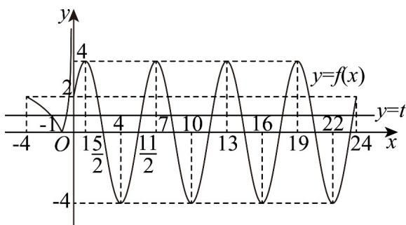

> [!faq]- 《高一数学上学期期末模拟卷_人教A版2019_高效培优_提升卷_》官方解析
>
> > [!success]- **【答案】** ABD
>
> > [!note]- **【解析】**
> > 将函数 $y = \log_2 x (0 < x \leq 4)$ 的图形关于 $y$ 轴对称过去，
> >
> > 并将 $x$ 轴下方部分的图像翻折到 $x$ 轴上方，即可得到 $y = \left|\log_2(-x)\right|(-4\leq x < 0)$ 的图像， $y = 4\sin \left(\frac{\pi}{3} x + \frac{\pi}{6}\right)(0\leq x\leq 24)$ 的最小正周期 $T = \frac{2\pi}{\frac{\pi}{3}} = 6$ ，故在[0,24]上有4个周期，设 $\frac{\pi}{3} x + \frac{\pi}{6} = k\pi +\frac{\pi}{2}(k\in \mathbb{Z})$ ，解得 $x = 1 + 3k(k\in \mathbb{Z})$ ，故 $y = 4\sin \left(\frac{\pi}{3} x + \frac{\pi}{6}\right)$ 的图像的对称轴方程为 $x = 1 + 3k(k\in \mathbb{Z})$ ，由此作出函数 $f(x) = \begin{cases} \left|\log_2(-x)\right|, - 4\leq x < 0\\ 4\sin \left(\frac{\pi}{3} x + \frac{\pi}{6}\right),0\leq x\leq 24 \end{cases}$ 的图像，如图：
> >
> > 
> >
> > $$
> > g (x) = f (x) - t (t > 0)
> > $$
> >
> > 的零点个数问题，
> >
> > 转化为 $f(x)$ 的图像与直线 $y = t(t > 0)$ 的交点个数问题，
> >
> > 由 $g(x)=f(x)-t(t>0)$ 有 $2n(n\in\mathbb{N}^{*})$ 个零点，
> >
> > 可知函数 $f(x)$ 的图像与直线 $y = t(t > 0)$ 有 $2n(n \in \mathbb{N}^*)$ 个交点，即偶数个交点，
> >
> > 由图像可知，当 $t > 4$ 时， $f(x)$ 的图像与直线 $y = t(t > 0)$ 有1个交点，不合题意；
> >
> > 当 $t = 4$ 时， $f(x)$ 的图像与直线 $y = t(t > 0)$ 有5个交点，不合题意；
> >
> > 当 $2 < t < 4$ 时， $f(x)$ 的图像与直线 $y = t(t > 0)$ 有9个交点，不合题意；
> >
> > 当 t=2 时， $f(x)$ 的图像与直线 $y=t(t>0)$ 有 11 个交点，不合题意；
> >
> > 当 $0 < t < 2$ 时， $f(x)$ 的图像与直线 $y = t(t > 0)$ 有10个交点，符合题意；
> >
> > 故选项A正确；
> >
> > 由题意可知， $-4 < x_{1} < -1 < x_{2} < 0$ ，则 $\log_{2}(-x_{1}) = -\log_{2}(-x_{2})$
> >
> > 即 $\log_{2}(-x_{1})+\log_{2}(-x_{2})=\log_{2}\left[(-x_{1})(-x_{2})\right]=0$
> >
> > $$
> > (- x _ {1}) (- x _ {2}) = 1 \quad \because - 4 <   x _ {1} <   - 1 <   x _ {2} <   0 \quad \therefore - x _ {1} > 0, - x _ {2} > 0, - x _ {1} \neq - x _ {2}
> > $$
> >
> > $$
> > \therefore (- x _ {1}) + (- x _ {2}) > 2 \sqrt {(- x _ {1}) (- x _ {2})} = 2
> > $$
> >
> > $\therefore x_{1}+x_{2}<-2$ ，故选项 B 正确；
> >
> > $$
> > f (x) = 4 \sin \left(\frac {\pi}{3} x + \frac {\pi}{6}\right) = 2 \text {   时   }, \quad \frac {\pi}{3} x + \frac {\pi}{6} = 2 k \pi + \frac {\pi}{6} \text {   或   } \frac {\pi}{3} x + \frac {\pi}{6} = 2 k \pi + \frac {5 \pi}{6} (k \in Z)
> > $$
> >
> > 解得 $x = 6k$ 或 $x = 2 + 6k (k \in \mathbb{Z})$ ，从图中可知 $2 < x_3 < \frac{5}{2}$ ， $\frac{11}{2} < x_4 < 6$ ，故 $11 < x_3x_4 < 15$ ，故选项C错误；
> >
> > 由选项A中的分析可知 $2n = 10$ ，故 $n = 5$ 从图像可知 $x_{3}, x_{4}$ 关于直线 $x = 4$ 对称，
> >
> > 故 $x_{3} + x_{4} = 8$ ，同理， $x_{4} + x_{5} = 14$ ， $x_{5} + x_{6} = 20$ ， $x_{6} + x_{7} = 26$ ， $x_{7} + x_{8} = 32$
> >
> > $$
> > x _ {8} + x _ {9} = 3 8 \quad , \quad x _ {9} + x _ {1 0} = 4 4 \quad , \text {故} \quad x _ {3} + 2 (x _ {4} + x _ {5} + x _ {6} + \dots + x _ {2 n - 1}) + x _ {2 n} = x _ {3} + 2 (x _ {4} + x _ {5} + x _ {6} + \dots + x _ {9}) + x _ {1 0}
> > $$
> >
> > $$
> > = 8 + 1 4 + 2 0 + 2 6 + 3 2 + 3 8 + 4 4 = 1 8 2
> > $$
> >
> > ，故选项D正确；
> >
> > 故选 **ABD**.
