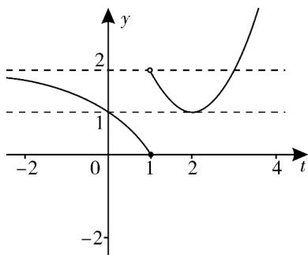

> [!faq]- 《高一数学上学期期末模拟卷_人教A版2019_高效培优_提升卷_》官方解析
>
> > [!success]- **【答案】** (1,2)
>
> > [!note]- **【解析】**
> > $f(f(x)) = a$ 设 $t = f(x)$ ， $f(t) = a$ ，则 $y = f(t)$ 的图象如图所示：
> >
> > 当 $a < 0$ 时，显然不成立；
> >
> > 当 $0 \leq a < 1$ 时， $f(t) = a$ 有一个解，设为 $t_1$ ，由图可知 $0 < t_1 \leq 1$ ，当 $t_1 = f(x)$ 时，显然无四个解，不成立。
> >
> > 当 $1 < a < 2$ 时， $f(t) = a$ 有三解，设为 $t_1 < 0 < t_2 < 2 < t_3$ ，由图可知 $1 < t_2 < 2$
> >
> > $\therefore t_{1} = f(x)$ 无解， $t_2 = f(x)$ 有三解， $t_3 = f(x)$ 有一解，故满足题意.
> >
> > 当 $a = 2$ 或 $a = 1$ 时，显然不满足题意.
> >
> > 综上所得，实数 a 的取值范围为： $(1,2)$ .
> >
> > 故答案为： $(1,2)$ .
> >
> > 
> >
> > 四、解答题：本题共5小题，共77分。解答应写出文字说明、证明过程或演算步骤。
