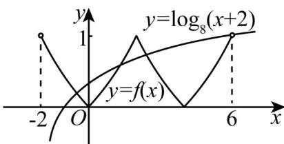

> [!faq]- 《高一数学上学期期末模拟卷（必修第一册，高效培优·强化卷）》官方解析
>
> > [!success]- **【答案】** C
>
> > [!note]- **【解析】**
> > 解：∵函数 $f(x)$ 是定义在 R 上的函数， $f(x+2)=f(2-x)$ ，∴ $f(x)$ 的对称轴为 x=2，
> > 又当 $x \in [-2, 2]$ 时， $f(x) = (\sqrt{2})^{|x|} - 1$ ，∴ $f(-2) = f(2) = f(6) = 1$ ， $f(0) = f(4) = 0$ ，
> > 当 x = -1 时， $\log_{8}(-1+2)=0$ ，当 x=6 时， $\log_{8}(6+2)=1$ .
> > 故函数 $f(x)$ 与 $y=\log_{8}(x+2)$ 在区间 $(-2,6)$ 内的图象如图所示：
> >
> > 
> >
> > 根据图象可得函数 $f(x)$ 与 $y = \log_8 (x + 2)$ 在区间 $(-2, 6)$ 上有3个不同的交点，故在区间 $(-2, 6)$ 内，关于 $x$ 的方程 $f(x) - \log_8 (x + 2) = 0$ 解的个数为3.
> >
> > 故选：C
> >
> > 7. 将函数 $f(x)=\sin\left(2x+\frac{\pi}{4}\right)$ 的图象向右平移 $m(m>0)$ 个单位，所得函数图象关于 y 轴对称，则 m 的最小值为（）
> >
> > 【答案】
> >
> > A. $\frac{\pi}{4}$ B. $\frac{3\pi}{4}$ C. $\frac{\pi}{8}$ D. $\frac{3\pi}{8}$
> >
> > 【答案】D
> >
> > 【详解】将函数 $f(x)=\sin\left(2x+\frac{\pi}{4}\right)$ 的图象向右平移 $m(m>0)$ 个单位，
> >
> > 所得函数解析式为 $y = \sin \left[2(x - m) + \frac{\pi}{4}\right]$ ，即 $y = \sin \left(2x - 2m + \frac{\pi}{4}\right)$
> >
> > $y=\sin\left(2x-2m+\frac{\pi}{4}\right)$ 的图象关于 y 轴对称，
> >
> > $y = \sin \left(2x - 2m + \frac{\pi}{4}\right)$ 为偶函数，
> >
> > $\therefore -2m + \frac{\pi}{4} = \frac{\pi}{2} + k\pi, k \in \mathbf{Z}$ 故 $m = -\frac{\pi}{8} - \frac{k}{2}\pi, k \in \mathbf{Z}$ ,
> >
> > $\because m>0,\therefore$ 当 $k=-1$ 时， $m_{\min}=-\frac{\pi}{8}+\frac{\pi}{2}=\frac{3\pi}{8}$
> >
> > 故选 **D**.
