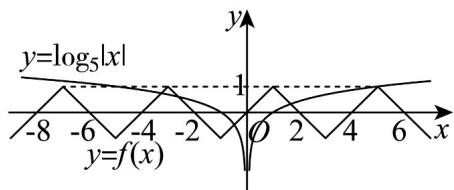

> [!faq]- 《高一数学上学期期末模拟卷（必修第一册，高效培优·提升卷）》官方解析
>
> > [!success]- **【答案】** BC
>
> > [!note]- **【解析】**
> > 对于 A，因为当 $x \in [-1,1]$ 时， $f(x) = x$
> >
> > 所以 $f(-1) = -1, f(1) = 1$ ，故 $f(-1) \neq f(1)$ ，故A错误；
> >
> > 对于 B，定义在实数集 R 上的奇函数 $f(x)$ 满足 $f(x+2)=-f(x)$
> >
> > 所以 $f(x+2)=-f(x)=-f(x)$ ，则 $f(x)$ 关于 x=1 对称，
> >
> > 又 $f(x + 4) = -f(x + 2) = f(x)$ ，即 $f(x)$ 的最小正周期为4，
> >
> > 则函数 $f(x)$ 在[2023,2024]上的单调性与[-1,0]单调性相同，
> >
> > 由 $f(x)$ 在 $[-1,0]$ 上单调递增知，函数 $f(x)$ 在 $[2023,2024]$ 上递增，故B正确；
> >
> > 又当 $x \in [-1, 1]$ 时， $f(x) = x$ ，结合对称性与周期性作出函数 $f(x)$ 的图象，如图，
> >
> > 
> >
> > 由图可知函数 $f(x)$ 的值域为 $[-1, 1]$ ，故选项 C 正确；
> >
> > 作出 $y = \log_5 |x|$ 的图象，由图知两函数共有 5 个交点，可得方程 $f(x) = \log_5 |x|$ 有 5 个根，则 D 错误；
> >
> > 故选 **BC**
