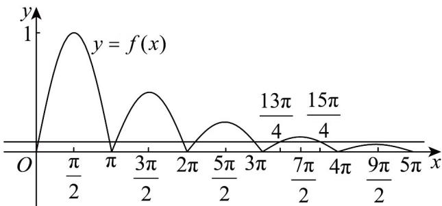

> [!faq]- 《高一数学上学期期末模拟卷（必修第一册，高效培优·提升卷）》官方解析
>
> > [!success]- **【答案】** $\frac{\sqrt{2}}{4} / \frac{1}{4}\sqrt{2}$ 12
>
> > [!note]- **【解析】**
> > 因为 $\frac{5}{4}\pi \in [\pi, +\infty)$ ，所以 $\left(\frac{5}{4}\pi\right) = \frac{1}{2} f\left(\frac{5}{4}\pi -\pi\right) = \frac{1}{2} f\left(\frac{\pi}{4}\right)$
> >
> > 因为 $\frac{\pi}{4} \in [0, \pi), f\left(\frac{\pi}{4}\right) = \sin \frac{\pi}{4} = \frac{\sqrt{2}}{2}$
> >
> > 所以 $f\left(\frac{5}{4}\pi\right)=\frac{1}{2}f\left(\frac{\pi}{4}\right)=\frac{1}{2}\times\frac{\sqrt{2}}{2}=\frac{\sqrt{2}}{4}$
> >
> > $f(x)$ 图象如图：
> >
> > 
> >
> > 则 $f(m + n\pi) = f(m)\times \left(\frac{1}{2}\right)^n,m\in [0,\pi),n\quad 0$
> >
> > 当 n=4 时， $f(m+4\pi)=\frac{1}{16}f(m)<\frac{\sqrt{2}}{16}$ ;
> >
> > 当 $n = 3$ 时， $f(m + 3\pi) = \frac{1}{8} f(m) = \frac{\sqrt{2}}{16}, m = \frac{\pi}{4}$ 或 $\frac{3}{4}\pi$
> >
> > 当 $m > \frac{3}{4}\pi$ 时， $f(m + n\pi) < \frac{\sqrt{2}}{16}$
> >
> > 所以 $x > \frac{3}{4}\pi + 3\pi = \frac{15}{4}\pi$ 时， $f(x) < \frac{\sqrt{2}}{16}$ 恒成立，整数 t 的最小值为 12
> >
> > 故答案为： $\frac{\sqrt{2}}{4}$ ; 12.
