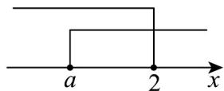

> [!faq]- 《专题03集合的基本运算五大常考题型_高效培优专项训练_》官方解析
>
> > [!success]- **【答案】** $\{a|a\leq 2\}$
>
> > [!note]- **【分析】**
> > 利用集合并集的定义，再结合数轴可得·
>
> > [!note]- **【解析】**
> > 根据 $A \cup B = \mathbf{R}$ ，结合数轴（如图）可知， $a$ 在 $2$ 的左侧或与 $2$ 重合，故 $a \leq 2$
> >
> > 即实数 $a$ 的取值范围是 $\{a\mid a\leq 2\}$
> >
> > 
> >
> > 故答案为： $\left\{a\mid a\leq2\right\}$
