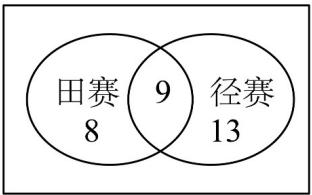
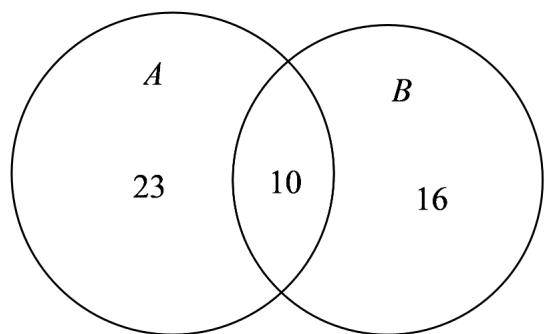
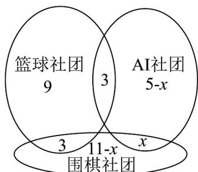

> [!faq]- 《专题03集合的基本运算五大常考题型_高效培优专项训练_》官方解析
>
> > [!success]- **【答案】** 25
>
> > [!note]- **【分析】**
> > 根据题意画出 Venn 图，再进行求解即可。
>
> > [!note]- **【解析】**
> > 根据题意，画出 Venn 图如下：
> >
> > 
> >
> > 所以该班学生中田赛和径赛都没有参加的人数为 $55-(8+9+13)=25$ .
> >
> > 故答案为：25.
> >
> > 43. 二十大报告中提出加强青少年体育工作，促进群众体育和竞技体育全面发展，加快建设体育强国的要求·某校体育课开设“足球”、“篮球”两门选修课程，假设某班每位学生最少选修一门课程，其中有 $^{33}$ 位学生选修了“足球”课程，有26位学生选修了“篮球”课程，有10位学生同时选修了这两门课程，则该班学生的人数为（）
> >
> > 【答案】
> >
> > A. 39    B. 49    C. 59    D. 69
> >
> > 【答案】B
> >
> > 【分析】设选修“足球”课程的学生构成的集合为 A，选修“篮球”课程的学生构成的集合为 B，作出韦恩图，可得出该班学生人数·
> >
> > 【详解】设选修“足球”课程的学生构成的集合为 A，选修“篮球”课程的学生构成的集合为 B，如下图所示：
> >
> > 
> >
> > 由图可知，该班学生人数为 $23 + 10 + 16 = 49$ .
> >
> > 故选：B.
> >
> > 44. 为了丰富学生的课余生活，某校开设了篮球社团、AI社团、围棋社团，高一某班学生共有30人参加了学校社团，其中有15人参加篮球社团，有8人参加AI社团，有14人参加围棋社团，同时参加篮球社团和 $^{AI}$ 社团的有 $^{3}$ 人，同时参加篮球社团和围棋社团的有 $^{3}$ 人，没有人同时参加三个社团，只参加围棋社团的人数为( ). A. 10 B. 9 C. 7 D. 4
> >
> > 【答案】A
> >
> > 【分析】由题意，根据容斥原理，结合集合的运算即可求解·
> >
> > 【详解】有 $^{15}$ 人参加篮球社团，同时参加篮球社团和 $^{AI}$ 社团的有 $^{3}$ 人，同时参加篮球社团和围棋社团的有 $^{3}$ 人，没有人同时参加三个社团，所以只参加篮球社团的 $^{9}$ 人；
> >
> > 设同时参加 $^{AI}$ 社团和围棋社团有x人，因为有 $^{8}$ 人参加 $^{AI}$ 社团，
> >
> > 同时参加篮球社团和 $^{AI}$ 社团的有 $^{3}$ 人，所以只参加 $^{AI}$ 社团的有8-3-x=5-x人；
> >
> > 又因为有 $^{14}$ 人参加围棋社团，同时参加篮球社团和围棋社团的有 $^{3}$ 人，
> >
> > 所以只参加围棋社团的有14-3-x=11-x人·综上所述，共有 $^{30}$ 人参加了学校社团，
> >
> > 所以 $9+3+3+(5-x)+x+(11-x)=30$ ，解得x=1，
> >
> > 故选：A.
> >
> > 
