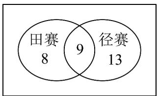
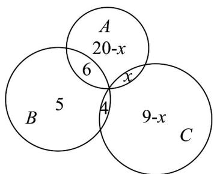

> [!faq]- 《专题03集合的基本运算五大常考题型_高效培优专项训练_》官方解析
>
> > [!success]- **【答案】** A. 25 B. 30 C. 24 D. 23
>
> > [!note]- **【分析】**
> > 根据题意画出Venn图，再进行求解即可.
>
> > [!note]- **【解析】**
> > 根据题意，画出Venn图如下：
> >
> > 
> >
> > 所以该班学生中田赛和径赛都没有参加的人数为 $55-(8+9+13)=25$ .
> >
> > 故选：A.
> >
> > 49. 为丰富校园文化活动，某学校举行了“棋类竞技”活动，某班共有 $^{28}$ 名同学参加比赛，有 $^{15}$ 人参加象棋，有 $^{8}$ 人参加军棋，有 $^{14}$ 人参加跳棋比赛，同时参加军棋和象棋的有 $^{3}$ 人，同时参加象棋和跳棋比赛的有 $^{3}$ 人，同时参加三项比赛的同学有 $^{1}$ 人，则同时参加军棋和跳棋比赛的有\_\_\_\_人。
> >
> > 【答案】4
> >
> > 【分析】设同时参加军棋和跳棋比赛的有 $x$ 人，参加象棋的同学组成集合A，参加军棋的同学组成集合B，参加跳棋比赛的同学组成集合C，再根据题意列式求解即可。
> >
> > 【详解】解：设同时参加军棋和跳棋比赛的有 $x$ 人，参加跳棋比赛的同学组成集合 $C$ ，参加军棋的同学组成集合 $B$ ，参加象棋的同学组成集合A，
> >
> > 所以集合 C 中有 $^{14}$ 个元素，B 中有 $^{8}$ 个元素，A 中有 $^{15}$ 个元素，
> >
> > 由题意可知 $A \cap C$ 中有 3 个元素， $A \cap B \cap C$ 有 1 个元素， $A \cap B$ 由 3 个元素，
> >
> > 所以 $15 + 8 + 14 - 3 - 3 - x + 1 = 28$ ，解得，所以同时参加军棋和跳棋比赛的有 $^4$ 人，
> >
> > 故答案为：4.
> >
> > 50. 学校举办运动会时，高一（1）班共有36名同学参加比赛，有26人参加游泳比赛，有15人参加田径比赛，有13人参加球类比赛，同时参加游泳比赛和田径比赛的有6人，同时参加田径比赛和球类比赛的有4人，没有人同时参加三项比赛·同时参加游泳和球类比赛的有\_\_\_\_人·
> >
> > 【答案】8
> >
> > 【分析】设高一（ $^{1}$ ）班参加游泳、田径、球类比赛的学生分别构成集合A、B、C，设同时参加游泳和球
> >
> > 类比赛的学生人数为 $x$ 人，作出韦恩图，根据题意可得出关于 $x$ 的方程，解出 $x$ 的值即可
> >
> > 【详解】设高一（ $^{1}$ ）班参加游泳、田径、球类比赛的学生分别构成集合A、B、C，
> >
> > 设同时参加游泳和球类比赛的学生人数为 $x$ 人，由题意作出如下韦恩图，
> >
> > 
> >
> > 由题意可得 $26 + 5 + 4 + 9 - x = 44 - x = 36$ ，解得 x = 8。
> >
> > 因此，同时参加游泳和球类比赛的有8人·
> >
> > 故答案为：8·
