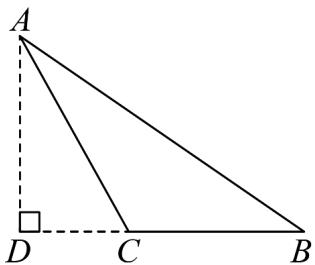
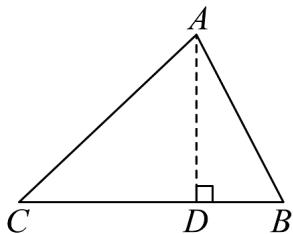

> [!faq]- 《专题04_充分条件与必要条件五大常考题型_高效培优专项训练_》官方解析
>
> > [!success]- **【答案】** $\triangle ABC$ 为锐角三角形的充要条件为 $a^{2}+b^{2}>c^{2}$ 。证明见解析
>
> > [!note]- **【分析】**
> > 根据勾股定理易得 $\triangle ABC$ 为锐角三角形的充要条件是 $a^2 + b^2 > c^2$ 。再分别证明充分与必要性即可。
>
> > [!note]- **【解析】**
> > 设 $a, b, c$ 分别是 $\triangle ABC$ 的三条边，且 $a \leq b \leq c$ ， $\triangle ABC$ 为锐角三角形的充要条件是 $a^2 + b^2 > c^2$
> >
> > 充分性：在 $\triangle ABC$ 中，若 $a^2 + b^2 > c^2$ ，则 $\angle C$ 不是直角，
> >
> > 假设 $\angle C$ 为钝角，如图①，作 $AD \perp BC$ ，交 $BC$ 延长线于点 $D$ ，
> >
> > 则由勾股定理得，
> >
> > $$
> > A B ^ {2} = A D ^ {2} + B D ^ {2}
> > $$
> >
> > $$
> > = A C ^ {2} - C D ^ {2} + (B C + C D) ^ {2}
> > $$
> >
> > $$
> > = A C ^ {2} - C D ^ {2} + B C ^ {2} + C D ^ {2} + 2 B C \cdot C D
> > $$
> >
> > $$
> > = A C ^ {2} + B C ^ {2} + 2 B C \cdot C D > A C ^ {2} + B C ^ {2}
> > $$
> >
> > 即 $c^{2}>b^{2}+a^{2}$ ，与“ $a^{2}+b^{2}>c^{2}$ ”矛盾，
> >
> > 故 $\angle C$ 为锐角，即 $\triangle ABC$ 为锐角三角形，故充分性成立；
> >
> > 必要性：在 $\triangle ABC$ ， $\angle C$ 是锐角，作 $AD\perp BC$ ， $D$ 为垂足，如图②，
> >
> > 则由勾股定理得，
> >
> > $$
> > A B ^ {2} = A D ^ {2} + D B ^ {2}
> > $$
> >
> > $$
> > = A C ^ {2} - C D ^ {2} + (C B - C D) ^ {2}
> > $$
> >
> > $$
> > = A C ^ {2} - C D ^ {2} + C B ^ {2} + C D ^ {2} - 2 C B \cdot C D
> > $$
> >
> > $$
> > = A C ^ {2} + C B ^ {2} - 2 C B \cdot C D <   A C ^ {2} + C B ^ {2}
> > $$
> >
> > 即 $c^2 < a^2 + b^2$ ，故必要性成立.
> >
> > 故 $\triangle ABC$ 为锐角三角形的充要条件为 $a^{2}+b^{2}>c^{2}$
> >
> > 
> > 图①
> >
> > 
> > 图②
