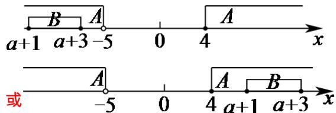

> [!faq]- 《专题02 集合间的基本关系四大常考题型（高效培优专项训练）》官方解析
>
> > [!success]- **【答案】** （1） $\left\{\begin{aligned}a=0&或\\ b=1\end{aligned}\right.$ ；（2）或
>
> > [!note]- **【分析】**
> > （1）根据相等集合的概念可得 $\left\{ \begin{array}{l}a = 2a\\ b = b^2 \end{array} \right.$ 或 $\left\{ \begin{array}{l}a = b^{2}\\ b = 2a \end{array} \right.$ ，解之，结合集合元素的性质即可求解；
> >
> > (2) 易知 $B \neq \emptyset$ ，根据集合间的包含关系画出数轴，结合数轴建立不等式，解之即可求解。
>
> > [!note]- **【解析】**
> > （1）由已知 $A = B$ ，得 $\left\{ \begin{array}{l}a = 2a\\ b = b^2 \end{array} \right.$ 或 $\left\{ \begin{array}{l}a = b^{2}\\ b = 2a \end{array} \right.$
> >
> > 当 $\left\{ \begin{array}{l}a = 2a\\ b = b^2 \end{array} \right.$ 时，解得 $\left\{ \begin{array}{ll}a = 0\\ b = 0 \end{array} \right.$ 或 $\left\{ \begin{array}{ll}a = 0\\ b = 1 \end{array} \right.$
> >
> > 当 $\left\{ \begin{array}{l}a = b^{2}\\ b = 2a \end{array} \right.$ 时，解得 $\left\{ \begin{array}{l}a = 0\\ b = 0 \end{array} \right.$ 或 $\left\{ \begin{array}{l}a = \frac{1}{4}\\ b = \frac{1}{2} \end{array} \right.$
> >
> > 又由集合中元素的互异性，得 $\left\{ \begin{array}{l}a = 0\\ b = 1 \end{array} \right.$ 或 $\left\{ \begin{array}{l}a = \frac{1}{4}\\ b = \frac{1}{2} \end{array} \right.$
> >
> > (2) 因为 $a + 3 > a + 1$ ，所以 $B \neq \emptyset$ ，利用数轴表示 $B \subseteq A$ ，如图所示，
> >
> > 
> >
> > 则 $a + 3 < -5$ 或 $a + 1 \quad 4$ ，解得 $a < -8$ 或 $a \quad 3$
> >
> > 所以 a 的取值范围是 $\{a \mid a < -8$ 或 $a \quad 3\}$ .
