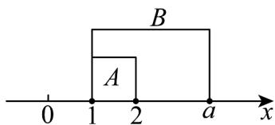
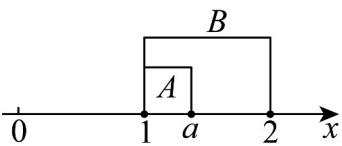

> [!faq]- 《专题02 集合间的基本关系四大常考题型（高效培优专项训练）》官方解析
>
> > [!success]- **【答案】** (1) $(2,+\infty)$ (2) $[1,2]$ (3) $_{2}$
>
> > [!note]- **【分析】**
> > （ $^{1}$ ）由真子集的定义，确定a的取值范围；
> >
> > (2) 由子集的定义，确定 a 的取值范围；
> >
> > (3) 由集合相等求出 $a$ 的值.
>
> > [!note]- **【解析】**
> > （1）
> >
> > 
> >
> > 若 A 是 B 的真子集，则由图知，a > 2，
> >
> > 故 a 的取值范围为 $(2, +\infty)$ .
> >
> > (2)
> >
> > 
> >
> > 若 B 是 A 的子集，已知 a 1，则 $B \neq \varnothing$ ，
> >
> > 则由图知， $1 \leq a \leq 2$
> >
> > 故 $a$ 的取值范围为 $[1,2]$ .
> >
> > (3) 若 A = B ，则 a = 2 .
