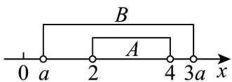
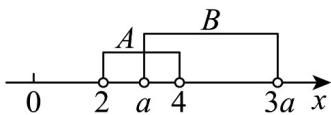

> [!faq]- 《专题03 集合的基本运算五大常考题型（高效培优专项训练）》官方解析
>
> > [!success]- **【答案】** (1) $\left\{a\left|\frac{4}{3}\leq a\leq2\right.\right\}$ (2) $a = 3$ (3) $\left\{a \mid a \quad 4 \text{或} 0 < a \leq \frac{2}{3}\right\}$ (4) $\left\{a\left| -\frac{1}{2} \leq a \leq 2 \text{或} a > 3 \right. \right\}$
>
> > [!note]- **【分析】**
> > （1）由 $A \subseteq B$ ，结合数轴即可求解；
> >
> > (2) 结合数轴即可求解；
> >
> > (3) 由条件得到 $a \leq 2$ 或 $3a \leq 2$ ，进而可求解；
> >
> > (4) 由 $A = \emptyset$ 和 $A \neq \emptyset$ 两种情况讨论即可.
>
> > [!note]- **【解析】**
> > （1）因为 $A \cup B = B$ ，所以 $A \subseteq B$ ，画出数轴如图：
> >
> > 
> >
> > 所以 $\left\{ \begin{array}{ll}2 & a\\ 4\leqslant 3a\\ a > 0 \end{array} \right.$ ，解得 $\frac{4}{3}\leqslant a\leqslant 2$ ，故实数的取值范围是 $\left\{a\mid \frac{4}{3}\leqslant a\leqslant 2\right\}$
> >
> > (2) 画出数轴如图，因为 $A \cap B = \{x \mid 3 < x < 4\}$
> >
> > 
> >
> > 所以 $\left\{\begin{aligned}a&=3\\ 3a&=4\\ a&>0\end{aligned}\right.$ ，解得 a=3
> >
> > (3) 因为 $A \cap B = \varnothing$ ，所以 $a = 4$ 或 $3a \leq 2$
> >
> > 又因为 $a > 0$ ，所以 $a = 4$ 或 $0 < a \leq \frac{2}{3}$
> >
> > 故实数 $a$ 的取值范围是 $\left\{a \mid a \quad 4 \text{或} 0 < a \leq \frac{2}{3}\right\}$
> >
> > (4) ①若 $A = \varnothing$ ，则 $2a > a + 3$ ，所以 $a > 3$ 。
> > - **②**：若 $\quad A \neq \emptyset$ ，因为 $\quad A \cap B = \emptyset$ ，所以 $\left\{ \begin{array}{ll} 2a & -1 \\ a + 3 \leq 5 \\ 2a \leq a + 3 \end{array} \right.$ ，解得 $-\frac{1}{2} \leq a \leq 2$ 。
> >
> > 综上所述，实数 $a$ 的取值范围是 $\left\{a\left| -\frac{1}{2} \leq a \leq 2 \text{或} a > 3 \right. \right\}$
