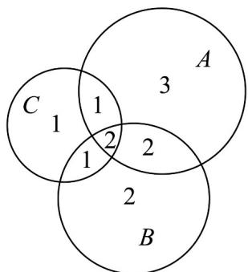
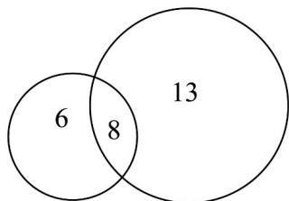

> [!faq]- 《专题03 集合的基本运算五大常考题型（高效培优专项训练）》官方解析
>
> > [!success]- **【答案】** BC
>
> > [!note]- **【分析】**
> > 应用容斥原理求出三项都参加的同学人数，即可得答案·
>
> > [!note]- **【解析】**
> > 根据题意，设 $A=\{x \mid x$ 是参加拔河的同学 } ， $B=\{x \mid x$ 是参加 4 人足球的同学 } ， $C=\{x \mid x$ 是参加羽毛球的同学 } ，
> >
> > 则 $\operatorname{card}(A) = 8$ ， $\operatorname{card}(B) = 7$ ， $\operatorname{card}(C) = 5$
> >
> > $$
> > \operatorname{card} (A \cap B) = 4 \quad \operatorname{card} (A \cap C) = \operatorname{card} (B \cap C) = 3
> > $$
> >
> > 所以 $\operatorname{card}\left(A\cap B\cap C\right)=12-\left[\left(8+7+5\right)-\left(4+3+3\right)\right]=2$
> >
> > 
> >
> > 所以三项比赛都参加的有 $^{2}$ 人，只参加拔河的有 $^{3}$ 人，只参加 $^{4}$ 人足球的有 $^{2}$ 人，只参加羽毛球的有 $^{1}$ 人。故选：BC
> >
> > 46. 高中学生运动会，某班 $^{54}$ 名学生中有一半的学生没有参加比赛，参加比赛的学生中，参加田赛的有
> >
> > $^{14}$ 人，参加径赛的有 $^{21}$ 人，则田赛和径赛都参加的学生人数为（）
> > A.7 B.8 C.10 D.12
> >
> > 【答案】B
> >
> > 【分析】参加田赛的有 $^{14}$ 人，参加径赛的有 $^{21}$ 人，总共有 $^{35}$ 人，而参加比赛的人数为 $^{27}$ 人，则多出来的人数为田赛和径赛都参加的人数·
> >
> > 【详解】 $^{54}$ 名学生中有一半的学生没有参加比赛，参加比赛的有 $^{27}$ 名学生，
> >
> > 参加田赛的有 $^{14}$ 人，参加径赛的有 $^{21}$ 人，
> >
> > 则田赛和径赛都参加的学生人数为 $14 + 21 - 27 = 8$ 人，
> >
> > 故选：B
> >
> > 
