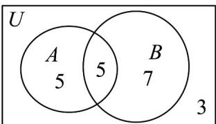

## 题型五：韦恩图在集合运算中的应用

41. 为提升学生学习双语的热情“G11•四市十一校”教学联盟计划在2025年4月举行“语文情境默写”、“英语读后续写”两项竞赛，我校计划派出20人的代表队，据了解其中擅长语文的有10名同学，擅长英语的有12名同学，两项都擅长的有5名同学，请问该代表队误选了几名均不擅长的同学？（）

【答案】
A. 1    B. 2    C. 3    D. 5

【答案】C

【分析】利用 venn 图，结合集合的运算求解·

【详解】设擅长语文的同学构成集合A，擅长英语的同学构成集合B， $^{20}$ 人代表队构成全集U

则 $\operatorname{card}(A) = 10$ ， $\operatorname{card}(B) = 12$ ， $\operatorname{card}(A \cap B) = 5$ ， $\operatorname{card}(U) = 20$

$$
\therefore \operatorname{card} (A \cup B) = \operatorname{card} (A) + \operatorname{card} (B) - \operatorname{card} (A \cap B) = 1 0 + 1 2 - 5 = 1 7
$$

$$
\therefore \operatorname{card} \left(\tilde {\mathfrak {Q}} _ {U} (A \cup B)\right) = 2 0 - 1 7 = 3
$$

所以语文和英语均不擅长的同学人数为 20 - 17 = 3 人·

故选：C.

![[高中/课堂同步/题库/人教A版高中数学同步讲义(2026)/01_必修第一册/第一章 集合与常用逻辑用语/专题03 集合的基本运算五大常考题型（高效培优专项训练）/题型五_韦恩图在集合运算中的应用/questions/Q00073146.md]]
![[高中/课堂同步/题库/人教A版高中数学同步讲义(2026)/01_必修第一册/第一章 集合与常用逻辑用语/专题03 集合的基本运算五大常考题型（高效培优专项训练）/题型五_韦恩图在集合运算中的应用/questions/Q00073147.md]]
![[高中/课堂同步/题库/人教A版高中数学同步讲义(2026)/01_必修第一册/第一章 集合与常用逻辑用语/专题03 集合的基本运算五大常考题型（高效培优专项训练）/题型五_韦恩图在集合运算中的应用/questions/Q00073148.md]]
![[高中/课堂同步/题库/人教A版高中数学同步讲义(2026)/01_必修第一册/第一章 集合与常用逻辑用语/专题03 集合的基本运算五大常考题型（高效培优专项训练）/题型五_韦恩图在集合运算中的应用/questions/Q00073149.md]]
