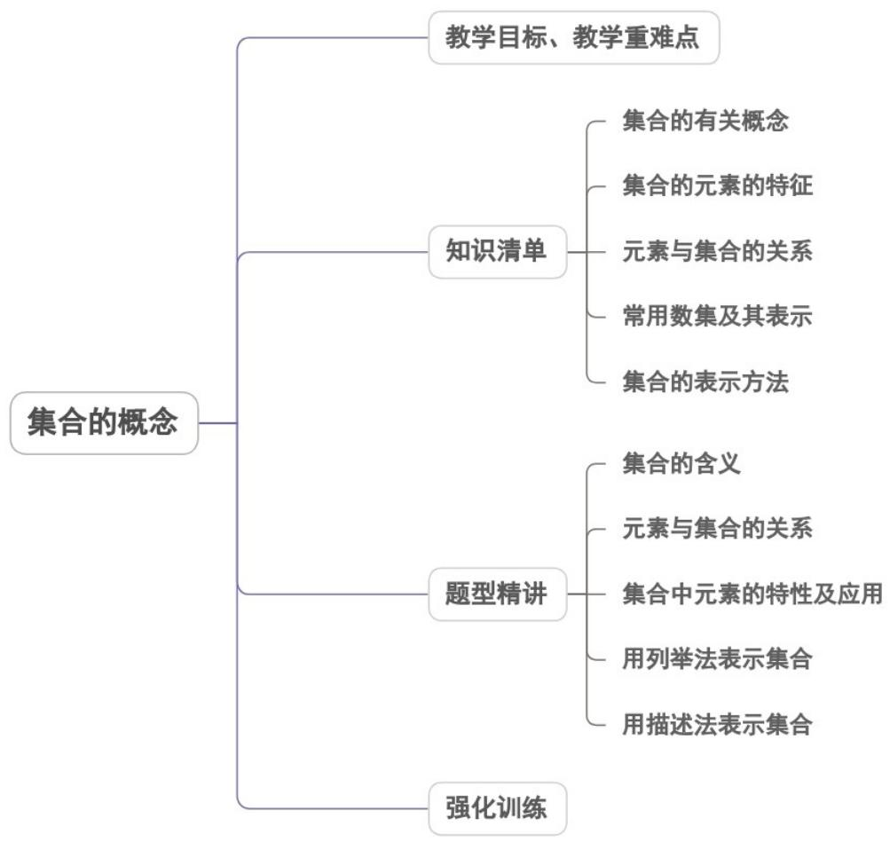

<!-- source-part:1 pages:1-31 -->

专题1.1 集合的概念

## 内容概览

教学目标、教学重难点

<table><tr><td>教学目标</td><td>1.了解集合的含义,体会元素与集合的“属于”关系,记住常用数集的表示符号并会应用.2.理解集合中元素的基本属性,初步掌握集合的两种表示方法——列举法、描述法,会用集合的两种表示方法表示一些简单集合.3.感知数学知识与实际生活的密切联系,培养学生解决实际的能力;</td></tr><tr><td>教学重难点</td><td>1.重点</td></tr></table>

元素与集合的“属于”关系，用符号语言刻画集合.

2.难点

集合中元素的特性及应用.

## 知识清单

## 知识点 01 集合的有关概念

元素与集合的概念及表示

(1)元素：一般地，把研究对象统称为元素，元素常用小写的拉丁字母 $a, b, c$ ...表示.

(2)集合：把一些元素组成的总体叫做集合(简称为集)，集合通常用大写的拉丁字母 $A,B,C$ …表示.

【即学即练】

下面给出的四类对象中，构成集合的是（ ）A．某班视力较好的同学 B．长寿的人C．π的近似值 D．倒数等于它本身的数

【答案】D

【详解】对于 A，视力较好不是一个明确的定义，故不能构成集合；

对于 B，长寿也不是一个明确的定义，故不能构成集合；

对于 $\mathrm{C}$ ， $\pi$ 的近似值没有明确近似到小数点后面几位，

不是明确的定义，故不能构成集合；

对于 D，倒数等于自身的数很明确，只有 1 和 -1，故可以构成集合；

故选：D.

知识点 02 集合的元素特征

## 元素的特性

(1)确定性：给定的集合，它的元素必须是确定的．也就是说，给定一个集合，那么任何一个元素在不在这个集合中就确定了．简记为“确定性”．

(2)互异性：一个给定集合中的元素是互不相同的．也就是说，集合中的元素是不重复出现的．简记为“互异性”.

(3)无序性：给定集合中的元素是不分先后，没有顺序的．简记为“无序性”．

【即学即练】

已知集合 $A = \{0,1,2\}$ ， $B = \{(x,y)|x\in A,y\in A,x + y\in A,x - y\in A\}$ ，则集合 $B$ 中元素的个数是（ ）A.6 B.3 C.4 D.5

【答案】C

【详解】集合 B 中的元素有 $(0,0)$ ， $(1,0)$ ， $(2,0)$ ， $(1,1)$ 共 4 个，故选：C.

## 知识点 03 元素与集合的关系

元素与集合的关系

(1)属于：如果 $a$ 是集合 $A$ 的元素，就说 $a$ 属于集合 $A$ ，记作 $a \in A$ ：

(2)不属于：如果 $a$ 不是集合 $A$ 的元素，就说 $a$ 不属于集合 $A$ ，记作 $a \notin A$ 【即学即练】

1. 已知集合 $A = \left\{1, x, x^{2} + 3\right\}$ ，若 $2 \in A$ ，则 x = ( )

【答案】

A. -1    B. 0    C. 2    D. 3

【答案】C

【详解】因为 $2 \in A$ ，所以 x = 2 或 $x^{2} + 3 = 2$ ，而 $x^{2} + 3 = 2$ 无实数解，所以 x = 2。故选：C.

2. 已知集合 $A = \{1, a - 2, a^2 - a - 1\}$ ，若 $-1 \in A$ ，则实数 $a$ 的值为（）

【答案】

A.1 B.1或0 C.0 D.-1或0

【答案】C

【详解】∵ $-1 \in A$ 若 a - 2 = -1 ，即 a = 1 时， $A = \{1, -1, -1\}$ ，不符合集合元素的互异性，舍去；

若 $a^2 - a - 1 = -1$ ，即 $a = 1$ （舍去）或 $a = 0$ 时， $A = \{1, -2, -1\}$ ，故 $a = 0$ 。故选：C.

知识点 04 常用集合及其表示

常用数集及其表示

非负整数集(或自然数集)，记作 $\mathbf{N}$ 正整数集，记作 $\mathbf{N}^{*}$ 或 $\mathbf{N}_{+}$ 整数集，记作 $\mathbf{Z}$ 有理数集，记作 $\mathbf{Q}$

实数集，记作 $\underline{\mathbf{R}}$

【即学即练】

1. 用符号“∈”和“∉”填空：

(1) $\frac{1}{2}$ \_\_\_\_ N; (2) 1\_\_\_\_ Z $_{-}$ ; (3) -2\_\_\_\_ R;

(4) $\pi$ \_\_\_\_ $Q_{+}$ ; (5) $3^{2}$ \_\_\_\_ N; (6) 0 \_\_\_\_ ∅.

【答案】 $\notin\notin\in\notin\in\notin$

【详解】由 $N, Z_{-}, R, Q_{+}, \varnothing$ 所表示的集合，由元素与集合的关系可判断

(1) $\notin(2) \notin(3) \in(4) \notin(5) \in(6) \notin.$ 故答案为：(1) $\notin(2) \notin(3) \in(4) \notin(5) \in(6) \notin.$

2.下列关系中正确的个数是（ ）

【答案】
① $\frac{1}{3}\in Z$ ，② $\sqrt{2}\in R$ ，③ $0\in N^{*}$ ，④ $\pi\notin Q$ A. 1 B. 2 C. 3 D. 4

【答案】B

【详解】① $\frac{1}{3}\in Z$ 错误② $\sqrt{2}\in R$ 正确③ $0\in N^{*}$ 错误④ $\pi\notin Q$ 正确 故选：B

## 知识点 05 集合的表示方法

## 1. 列举法

把集合的所有元素一一列举出来，并用花括号“{ }”括起来表示集合的方法叫做列举法。

注意：(1)元素与元素之间必须用“，”隔开．(2)集合中的元素必须是明确的．(3)集合中的元素不能重复．

(4)集合中的元素可以是任何事物.

2. 描述法

(1)定义：一般地，设 $A$ 表示一个集合，把集合 $A$ 中所有具有共同特征 $P(x)$ 的元素 $x$ 所组成的集合表示为 $\{x\in A|P(x)\}$ ，这种表示集合的方法称为描述法。有时也用冒号或分号代替竖线。

(2)具体方法：在花括号内先写上表示这个集合元素的一般符号及取值(或变化)范围，再画一条竖线，在竖线后写出这个集合中元素所具有的共同特征。

【即学即练】

1. 用列举法法表示下列集合：（1） $B=\{(x,y)\mid x+y=4,x\in N^{*},y\in N^{*}\}$ ；（2）不小于1且不大于17的质数组

成的集合 $A$ ；(3)绝对值不大于3的所有整数组成的集合 $C$ ；

【解析】（1） $B=\left\{(x,y)\mid x+y=4,x\in N^{*},y\in N^{*}\right\}=\left\{(1,3),(2,2),(3,1)\right\}$ ．(2) $A=\left\{2,3,5,7,11,13,17\right\}$

(3)绝对值不大于 3 的所有整数只有 -3, -2, -1, 0, 1, 2, 3，用列举法表示： $C = \left\{-3, -2, -1, 0, 1, 2, 3\right\}$

2. 直角坐标平面中除去两点 $A(1,1)$ 、 $B(2,-2)$ 可用集合表示为（）

【答案】
A. $\{(x,y)\mid x\neq1,y\neq1,x\neq2,y\neq-2\}$ B. $\{(x,y)\mid\left\{\begin{aligned}&x\neq1\\ &y\neq1\end{aligned}\right.\text{或}\left\{\begin{aligned}&x\neq2\\ &y\neq-2\end{aligned}\right\}$

C. $\{(x,y) | [(x - 1)^2 + (y - 1)^2] [(x - 2)^2 + (y + 2)^2] \neq 0\}$

D. $\{(x,y) | [(x - 1)^2 + (y - 1)^2] + [(x - 2)^2 + (y + 2)^2] \neq 0\}$

【答案】C

【详解】直角坐标平面中除去两点 $A(1,1)$ 、 $B(2, - 2)$ ，其余的点全部在集合中，

A 选项中除去的是四条线 $x = 1, y = 1, x = 2, y = -2$

$B$ 选项中除去的是 $A(1,1)$ 或除去 $B(2,-2)$ 或者同时除去两个点，共有三种情况，不符合题意；

$C$ 选项 $\{(x,y) | [(x - 1)^2 + (y - 1)^2] [(x - 2)^2 + (y + 2)^2] \neq 0\}$ ，则 $(x - 1)^2 + (y - 1)^2 \neq 0$ 且 $(x - 2)^2 + (y + 2)^2 \neq 0$ ，即除去两

点 $A(1,1)$ 、 $B(2, - 2)$ ，符合题意；

$$
D _ {\text {选项}} \{(x, y) \mid [ (x - 1) ^ {2} + (y - 1) ^ {2} ] + [ (x - 2) ^ {2} + (y + 2) ^ {2} ] \neq 0 \}, \text {则任意点} (x, y) \text {都不能}
$$

$\left[(x - 1)^2 +(y - 1)^2\right] + \left[(x - 2)^2 +(y + 2)^2\right] = 0$ 即不能同时排除A，B两点．故选：C

## 题型精讲

![[高中/课堂同步/题库/人教A版高中数学同步讲义(2026)/01_必修第一册/第一章 集合与常用逻辑用语/专题1.1 集合的概念（高效培优讲义）/题型01_集合的含义/题型01_集合的含义.md]]
![[高中/课堂同步/题库/人教A版高中数学同步讲义(2026)/01_必修第一册/第一章 集合与常用逻辑用语/专题1.1 集合的概念（高效培优讲义）/题型02_元素与集合的关系/题型02_元素与集合的关系.md]]
![[高中/课堂同步/题库/人教A版高中数学同步讲义(2026)/01_必修第一册/第一章 集合与常用逻辑用语/专题1.1 集合的概念（高效培优讲义）/题型03_集合中元素的特性及应用/题型03_集合中元素的特性及应用.md]]
![[高中/课堂同步/题库/人教A版高中数学同步讲义(2026)/01_必修第一册/第一章 集合与常用逻辑用语/专题1.1 集合的概念（高效培优讲义）/题型04_用列举法表示集合/题型04_用列举法表示集合.md]]
![[高中/课堂同步/题库/人教A版高中数学同步讲义(2026)/01_必修第一册/第一章 集合与常用逻辑用语/专题1.1 集合的概念（高效培优讲义）/题型05_用描述法表示集合/题型05_用描述法表示集合.md]]
![[高中/课堂同步/题库/人教A版高中数学同步讲义(2026)/01_必修第一册/第一章 集合与常用逻辑用语/专题1.1 集合的概念（高效培优讲义）/强化训练/强化训练.md]]
