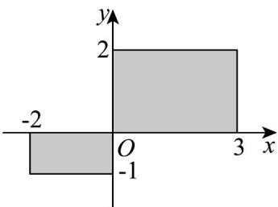

> [!faq]- 《专题1.1 集合的概念（高效培优讲义）》官方解析
>
> > [!success]- **【答案】** 
>
> > [!note]- **【分析】**
> > 根据描述法的定义求解.
>
> > [!note]- **【解析】**
> > 用描述法表示图中阴影部分（包括边界）为： $\left\{(x,y)\mid-2\leq x\leq3,-1\leq y\leq2\quad xy\quad0\right\}$ 且
> >
> > 故答案为： $\left\{(x,y)\mid-2\leq x\leq3,-1\leq y\leq2\quad xy\quad0\right\}$
