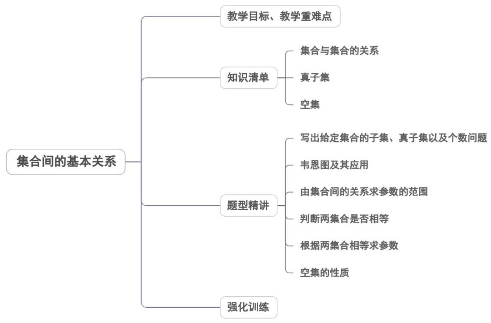

<!-- source-part:1 pages:1-40 -->

## 专题1.2 集合间的基本关系

## 内容概览

## 教学目标、教学重难点

<table><tr><td>教学目标</td><td>1、理解集合之间包含与相等的含义;2、理解子集、真子集的概念;3、能利用韦恩图表达集合间的关系;4、了解空集的含义.</td></tr><tr><td>教学重难点</td><td>1.重点</td></tr></table>

集合间的包含与相等关系，子集与其子集的概念.

2.难点

属于关系与包含关系的区别.

## 知识清单

## 知识点 01 集合与集合的关系

(1) 一般地，对于两个集合 $A, B$ ，如果集合 $A$ 中任意一个元素都是集合 $B$ 中的元素，我们就说这两个集合有包含关系，称集合 $A$ 为 $B$ 的子集。记作： $A \subseteq B$ （或 $B \supseteq A$ ) 读作： $A$ 包含于 $B$ （或 $B$ 包含 $A$ ).

(2) 如果两个集合所含的元素完全相同 ( $A \subseteq B$ 且 $B \subseteq A$ )，那么我们称这两个集合相等.

记作： $A = B$ 读作： $A$ 等于 $B$

(1) “ $A$ 是 $B$ 的子集”的含义是： $A$ 的任何一个元素都是 $B$ 的元素，即由任意的 $x \in A$ ，能推出 $x \in B$

(2) 当 $A$ 不是 $B$ 的子集时，我们记作“ $A \not\subseteq B$ (或 $B \not\supseteq A$ )”，读作：“ $A$ 不包含于 $B$ ”（或“ $B$ 不包含 $A$ ”）.

## 【即学即练】

1．已知集合 $A=\{0,1\}, B=\{0,a+1,a-1\}$ ，若 $A \subseteq B$ ，则 $a = (\quad)$ A.2 B.0 C.0或2 D.1或2

【答案】C

【分析】根据包含关系，讨论 a=0 、 a=2 并结合集合的性质求参数值·

【详解】当 $a+1=1$ ，则 a=0，此时 $B=\{0,1,-1\}$ ，满足；

当 $a - 1 = 1$ ，则 $a = 2$ ，此时 $B = \{0,3,1\}$ ，满足；

所以 a = 0 或 a = 2 .

故选：C

2. 已知集合 $A = \left\{ \nmid 0 \leq x \leq 3 \right\}$ , $B = \left\{ \nmid m - 1 \leq x \leq m + 1 \right\}$ , 且 $B \subseteq A$ , 则 $m$ 的取值范围是 ( )

【答案】

A. [1,2] B. $(- \infty, 1] \cup [2, +\infty)$ C. (1,2) D. $[2, +\infty)$

【答案】A

【分析】根据 $B \subseteq A$ ，由此列出满足题意的不等式组，求解出 m 的取值范围。

【详解】因为 $B \subseteq A$ ，所以 $\left\{ \begin{array}{ll} m - 1 & 0 \\ m + 1 \leq 3 \end{array} \right.$ ，解得 $1 \leq m \leq 2$ 。所以 $m$ 的取值范围是 $[1,2]$ 。

故选：A.

## 知识点 02 真子集

若集合 $\mathrm{A} \subseteq \mathrm{B}$ ，存在元素 $x \in B$ 且 $x \notin A$ ，则称集合 $A$ 是集合 $B$ 的真子集。

记作： $A \neq B$ （或 $B \neq A$ ）读作：A 真包含于 B（或 B 真包含 A）

【即学即练】

1．已知集合 $A=\left\{1,2,3,4,5\right\}$ ， $B=\left\{x\left|\frac{x-1}{2}\in Z,x\in A\right.\right\}$ ，则集合 B 的真子集个数为 \_\_\_\_。

【答案】7

【分析】由 $\frac{x - 1}{2} \in \mathbb{Z}$ ，即 $x$ 为奇数，求得集合 $B$ ，即可得真子集的个数·

【详解】 $\because \frac{x-1}{2} \in Z$ ， $\therefore x$ 为奇数， $\therefore B = \{1,3,5\}$ ， $\therefore$ 集合 $B$ 中有 $^{3}$ 个元素， $\therefore$ 集合 $B$ 的真子集个数为：

$2^{3} - 1 = 7$

故答案为：7.

2. 已知集合 $A = \{1, 2, 3, 4, 5, 6\}$ ， $B = \left\{x \mid \frac{6}{x - 1} \in \mathbb{N}, x \in A\right\}$ ，则集合 $B$ 的所有真子集的个数（）A.7 B.4 C.8 D.15

【答案】A

【分析】先求出集合 B，再根据子集的定义即可求解·

【详解】依题意 $B = \{2,3,4\}$ ，所以集合 $B$ 的真子集的个数为 $2^{3} - 1 = 7$ .

故选：A.

## 知识点 03 空集

不含有任何元素的集合称为空集，记作：∅.规定：空集是任何集合的子集。

结论：（1） $A \subseteq A$ （类比 $a \leq a$ ）（2）空集是任何集合的子集，是任何非空集合的真子集。

(3) 若 $A \subseteq B, B \subseteq C$ , 则 $A \subseteq C$ (类比 $a \leq b$ , $b \leq c$ 则 $a \leq c$ )

（4）一般地，一个集合元素若为 $n$ 个，则其子集数为 $2^{n}$ 个，其真子集数为 $2^{n} - 1$ 个，特别地，空集的子集个

数为 1，真子集个数为 0。

【即学即练】

1. 下列结论错误的是（）

【答案】
A．任何一个集合至少有两个子集
B．空集是任何集合的真子集

C. 若 $a \in A$ 且 $A \subseteq B$ , 则 $a \in B$

D. 若 $A \subseteq B$ 且 $A \subseteq C$ , 则 $B = C$

【答案】ABD

【分析】AB选项，根据空集的性质判断；CD选项，根据子集的定义判断·

【详解】空集只有一个子集，故 $^{A}$ 错；

空集时任何非空集合的真子集，故 $^{B}$ 错；

因为 $A \subseteq B$ ，所以集合 A 中所有元素都属于集合 B，则 $a \in B$ ，故 C 正确；

例如 $A = \{1\}$ ， $B = \{1,2\}$ ， $C = \{1,3\}$ ，满足 $A \subseteq B$ 且 $A \subseteq C$ ，此时 $B \neq C$ ，故 D 错·

故选：ABD.

2．若集合 $A=\left\{x\mid ax^{2}-ax+2=0\right\}=\varnothing$ ，则实数 a 的取值范围是 \_\_\_\_。

【答案】 $0 \leq a < 8$

【分析】利用空集的意义，结合方程根的情况列式求解即得·

【详解】当 a=0 时，2=0 不成立，即 $A=\varnothing$ ，则 a=0；

当 $a \neq 0$ 时，由 $A = \emptyset$ ，得 $\Delta = a^2 - 8a < 0$ ，解得 $0 < a < 8$ ，

所以实数 a 的取值范围是 $0 \leq a < 8$ .

故答案为： $0 \leq a < 8$

题型精讲

![[高中/课堂同步/题库/人教A版高中数学同步讲义(2026)/01_必修第一册/第一章 集合与常用逻辑用语/专题1.2 集合间的基本关系（高效培优讲义）/题型01_写出给定集合的子集_真子集以及个数问题/题型01_写出给定集合的子集_真子集以及个数问题.md]]
![[高中/课堂同步/题库/人教A版高中数学同步讲义(2026)/01_必修第一册/第一章 集合与常用逻辑用语/专题1.2 集合间的基本关系（高效培优讲义）/题型02_韦恩图及其应用/题型02_韦恩图及其应用.md]]
![[高中/课堂同步/题库/人教A版高中数学同步讲义(2026)/01_必修第一册/第一章 集合与常用逻辑用语/专题1.2 集合间的基本关系（高效培优讲义）/题型03_由集合间的关系求参数的范围/题型03_由集合间的关系求参数的范围.md]]
![[高中/课堂同步/题库/人教A版高中数学同步讲义(2026)/01_必修第一册/第一章 集合与常用逻辑用语/专题1.2 集合间的基本关系（高效培优讲义）/题型04_判断两集合是否相等/题型04_判断两集合是否相等.md]]
![[高中/课堂同步/题库/人教A版高中数学同步讲义(2026)/01_必修第一册/第一章 集合与常用逻辑用语/专题1.2 集合间的基本关系（高效培优讲义）/题型05_根据两集合相等求参数/题型05_根据两集合相等求参数.md]]
![[高中/课堂同步/题库/人教A版高中数学同步讲义(2026)/01_必修第一册/第一章 集合与常用逻辑用语/专题1.2 集合间的基本关系（高效培优讲义）/题型06_空集的性质/题型06_空集的性质.md]]
![[高中/课堂同步/题库/人教A版高中数学同步讲义(2026)/01_必修第一册/第一章 集合与常用逻辑用语/专题1.2 集合间的基本关系（高效培优讲义）/强化训练/强化训练.md]]
