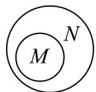

<!-- question-source:start -->
【典例1】下列Venn图能正确表示集合 $M = \{0,1,2\}$ 和 $N = \{x|x^2 - 2x = 0\}$ 关系的是（）A. N M B. N M C. N M D. M N

<!-- question-source:end -->

![[高中/课堂同步/题库/人教A版高中数学同步讲义(2026)/01_必修第一册/第一章 集合与常用逻辑用语/专题1.2 集合间的基本关系（高效培优讲义）/题型02_韦恩图及其应用/questions/answers/Q00073422A1.md]]
