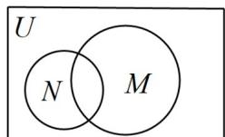
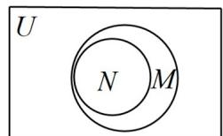
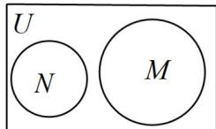
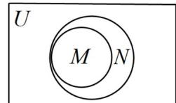

> [!faq]- 《专题1.2 集合间的基本关系（高效培优讲义）》官方解析
>
> > [!success]- **【答案】** ( ) A  B  C  D 
>
> > [!note]- **【解析】**
> > 试题分析：先化简集合 $N$ ，得 $N = \{-1,0\}$ ，再看集合 $M$ ，可发现集合 $N$ 是 $M$ 的真子集，对照韦恩
> >
> > ( Venn ) 图即可选出答案.
> >
> > 解：由 $N=\{x \mid x^{2}+x=0\}$
> >
> > 得 $N=\{-1,0\}$ .
> >
> > $$
> > \because M = \{- 1, 0, 1 \}
> > $$
> >
> > ∴N⊂M
> >
> > 故选 **B**.
