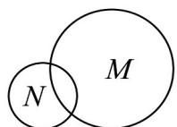

## 题型02 韦恩图及其应用

![[高中/课堂同步/题库/人教A版高中数学同步讲义(2026)/01_必修第一册/第一章 集合与常用逻辑用语/专题1.2 集合间的基本关系（高效培优讲义）/题型02_韦恩图及其应用/questions/Q00073422.md]]
![[高中/课堂同步/题库/人教A版高中数学同步讲义(2026)/01_必修第一册/第一章 集合与常用逻辑用语/专题1.2 集合间的基本关系（高效培优讲义）/题型02_韦恩图及其应用/questions/Q00073423.md]]
![[高中/课堂同步/题库/人教A版高中数学同步讲义(2026)/01_必修第一册/第一章 集合与常用逻辑用语/专题1.2 集合间的基本关系（高效培优讲义）/题型02_韦恩图及其应用/questions/Q00073424.md]]
![[高中/课堂同步/题库/人教A版高中数学同步讲义(2026)/01_必修第一册/第一章 集合与常用逻辑用语/专题1.2 集合间的基本关系（高效培优讲义）/题型02_韦恩图及其应用/questions/Q00073425.md]]
