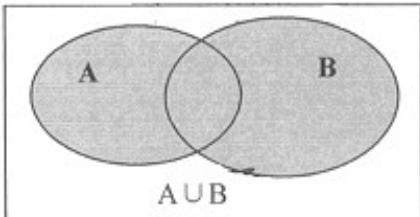
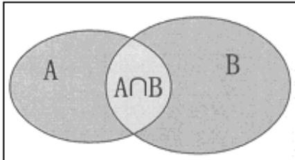

<!-- source-part:1 pages:1-40 -->

## 专题1.3 集合的基本运算

## 内容概览

## 教学目标、教学重难点

<table><tr><td>教学目标</td><td>1.理解并、交集全集的含义,会求简单的并、交集补集;2.借助Venn图理解、掌握并、交补集的运算性质;3.根据并、交集运算的性质求参数问题.4.理解给定集合中一个子集的补集的含义,并会求给定子集的补集.</td></tr><tr><td>教学重难点</td><td>1.重点</td></tr></table>

会用 Venn 图、数轴进行集合的运算．

## 知识清单

## 知识点 01 集合的运算之并集

一般地，由所有属于集合 $A$ 或属于集合 $B$ 的元素所组成的集合，称为集合 $A$ 与 $B$ 的并集，记作： $A \cup B$ 读作：

“A 并 B”，即： $A \cup B = \{x \mid x \in A, \text{或 } x \in B\}$

Venn图表示：

(1) “ $x \in A$ ，或 $x \in B$ ”包含三种情况：“ $x \in A$ ，但 $x \notin B$ ；“ $x \in B$ ，但 $x \notin A$ ；“ $x \in A$ ，且 $x \in B$ ”。

(2) 两个集合求并集，结果还是一个集合，是由集合 $A$ 与 $B$ 的所有元素组成的集合(重复元素只出现一次).

【即学即练】

1．已知集合 $A=\left\{0,a,a^{2}\right\}$ ， $B=\left\{a-1,3a-2\right\}$ ， $a\in R$ ，则 $A\cup B$ 中的元素个数至少为（）

【答案】
A. 2
B. 3
C. 4
D. 5

【答案】C

【分析】由集合 A 可得 $a \neq 0$ 且 $a \neq 1$ ，再由 $a^{2} - a + 1 > 0$ 可得 a - 1 与 $0, a, a^{2}$ 均互异，结合特例可得正确的选项。

【详解】由A中元素的互异性，得 $a \neq 0, a \neq a^{2}$ ，即 $a \neq 0$ 且 $a \neq 1$ ，

而 $a^2 - a + 1 = (a - \frac{1}{2})^2 + \frac{3}{4} > 0$ ，则当 $a \neq 0$ 且 $a \neq 1$ 时， $a - 1$ 与 $0, a, a^2$ 均互异，

因此 $A \cup B$ 中至少有 4 元素，取 $a = 2$ ，此时 $A = \{0, 2, 4\}, B = \{1, 4\}$ ， $A \cup B$ 有 4 个元素，

∴ $A \cup B$ 中的元素个数至少为 4 个.

故选：C

2. 已知集合 $A = \{\not\vdash 0 < x < 2\}$ ， $B = \{\not\vdash y = \sqrt{1 - x}\}$ ，则 $A \cup B =$ \_\_\_\_.

【答案】 $\{x\mid x <   2\}$

【分析】先根据二次根式有意义的条件求出集合 B，再根据并集的定义求出 $A \cup B$ .

【详解】对于集合 $B = \{x\mid y = \sqrt{1 - x}\}$ ，要使根式有意义，即 $1 - x\quad 0$

解不等式 $1 - x = 0$ ，可得 $x \leq 1$ ，所以集合 $B = \{x \mid x \leq 1\}$

已知集合 $A = \{x \mid 0 < x < 2\}$ ，集合 $B = \{x \mid x \leq 1\}$ .

根据并集的定义,所以 $A \cup B = \{x \mid x < 2\}$ .

故答案为： $\{x \mid x < 2\}$ .

知识点 02 集合的交集

一般地，由属于集合 $A$ 且属于集合 $B$ 的元素所组成的集合，叫做集合 $A$ 与 $B$ 的交集；记作： $A \cap B$ ，读作：“ $A$

交 $B$ ”，即 $A \cap B = \{x | x \in A, \text{且} x \in B\}$ ；交集的 Venn 图表示：

（1）并不是任何两个集合都有公共元素，当集合 $A$ 与 $B$ 没有公共元素时，不能说 $A$ 与 $B$ 没有交集，而是 $A\cap B = \emptyset$

(2) 概念中的“所有”两字的含义是，不仅“A∩B 中的任意元素都是 A 与 B 的公共元素”，同时“A 与 B 的公共元

素都属于 $A \cap B$ ”.

(3) 两个集合求交集，结果还是一个集合，是由集合 A 与 B 的所有公共元素组成的集合.

【即学即练】

1. 设 $A = \left\{ x^2 - x - 2 = 0 \right\}, B = \{ x^2 - ax - 1 > 0 \}$ ，下列选项正确的是（）

【答案】

A. 集合 A 的子集个数为 4

B. 若 $A \cap B = \{2\}$ ，则 $a > \frac{1}{2}$ C. 若 $A \cap B = \{-1\}$ ，则 $a \leq -1$ D. 若 $A \cap B = \varnothing$ ，则 $-1 < a < \frac{1}{2}$

【答案】AB

【分析】根据集合元素个数求子集个数判断 $^{A}$ ，根据交集运算结果求出参数范围判断 $^{BC}$ ，分类讨论判断 $^{D}$ .

【详解】因为 $A = \left\{\text{f} x^2 - x - 2 = 0\right\} = \{-1, 2\}$

所以集合 A 的子集个数为 $2^{2}=4$ ，故 A 正确；

当 $A \cap B = \{2\}$ 时， $2a - 1 > 0$ ，即 $a > \frac{1}{2}$ ，故B正确；

当 $A \cap B = \{-1\}$ 时， $-a - 1 > 0$ ，即 $a < -1$ ，故 $C$ 错误；

对 D，当 a=0 时， $B=\varnothing$ ，满足 $A\cap B=\varnothing$ ，

当 $a > 0$ 时， $B = \left\{x, x > \frac{1}{a}\right\}$ ，当 $A \cap B = \varnothing$ 时， $\frac{1}{a} = 2$ ，即 $a \leq \frac{1}{2}$

当 $a < 0$ 时， $B = \left\{ x, x < \frac{1}{a} \right\}$ ，当 $A \cap B = \varnothing$ 时， $\frac{1}{a} \leq -1$ ，即 $a - 1$ ，

综上， $-1 \leq a \leq \frac{1}{2}$ ，故 D 错误。

故选：AB

2. 已知集合 $M = \{x \mid 2x - 1 > 5\}, N = \{1,2,3\}$ ，则 $M \cap N = (\quad)$ A. $\{1,2,3\}$ B. $\{2,3\}$ C. $\{3\}$ D. $\varnothing$

【答案】D

【分析】先求出集合 $M$ ，再根据集合的交集运算即可解出·

【详解】因为 $M = \{x\mid 2x - 1 > 5\} = \{x\mid x > 3\}$ ，所以 $M\cap N = \emptyset$

故选：D.

## 知识点 03 集合的补集

全集：一般地，如果一个集合含有我们所研究问题中所涉及的所有元素，那么就称这个集合为全集，通常记

作 $U$

补集：对于全集 $U$ 的一个子集 $A$ ，由全集 $U$ 中所有不属于集合 $A$ 的所有元素组成的集合称为集合 $A$ 相对于全

集 $U$ 的补集(complementary set)，简称为集合 $A$ 的补集，记作： $C_U A$ ，即 $C_U A = \{x | x \in U \text{且} x \notin A\}$ 补集的

Venn图表示：

（1）理解补集概念时，应注意补集 $C_U A$ 是对给定的集合 $A$ 和 $U(A \subseteq U)$ 相对而言的一个概念，一个确定的

集合 $A$ ，对于不同的集合 $U$ ，补集不同.

(2) 全集是相对于研究的问题而言的，如我们只在整数范围内研究问题，则 $Z$ 为全集；而当问题扩展到实

数集时，则 $R$ 为全集，这时 $Z$ 就不是全集。

(3) $C_U A$ 表示 $U$ 为全集时 $A$ 的补集，如果全集换成其他集合（如 $R$ ）时，则记号中“ $U$ ”也必须换成相应的

集合（即 $C_R A$ ）

【即学即练】

1. 已知集合 $U = \{1,2,3,4,5\}, A = \{1,2\}, B = \{x \mid x = 2n + 1, n \in \mathbf{N}\}$ ，则 $\left(\tilde{\mathfrak{Q}}_U A\right) \cap B =$ （ ）A．{1} B．{3,5} C．{1,3,5} D．{1,3,4,5}

【答案】B

【分析】由集合的基本运算即可求解·

【详解】因为集合 $U = \{1, 2, 3, 4, 5\}$ , $A = \{1, 2\}$ , $B = \{x \mid x = 2n + 1, n \in N\}$

所以 $\check{Q}_{U}A=\left\{3,4,5\right\}$ ， $\left(\check{Q}_{U}A\right)\cap B=\{3,5\}$ .

故选：B.

2. 设全集 $M = \{1, 2, 3, 4\}$ ， $A = \{1, 3\}$ ， $B = \{2\}$ ，则 $A \cup (\tilde{\mathfrak{O}}_M B)$ 等于（）

【答案】
A. $\{1, 2, 3, 4\}$ B. $\{1, 3, 4\}$ C. $\{1, 3, 5\}$ D. $\{1, 3\}$

【答案】B

【分析】直接利用并集与补集的混合运算求解得答案.

【详解】∵全集 $M=\left\{1,2,3,4\right\}$ ， $B=\left\{2\right\}$

$$
\therefore \tilde {\mathfrak {Q}} _ {M} B = \{1, 3, 4 \} \text {, 又} A = \{1, 3 \}
$$

则 $A \cup (\breve{\mathfrak{D}}_M B) = \{1, 3, 4\}$

故选：B.

## 知识点 04 集合基本运算结论

$A \cap B \subseteq A, A \cap B \subseteq B, A \cap A = A, A \cap \varnothing = \varnothing, A \cap B = B \cap A$

$\mathrm{A}\subseteq \mathrm{A}\cup \mathrm{B},\mathrm{B}\subseteq \mathrm{A}\cup \mathrm{B},\mathrm{A}\cup \mathrm{A} = \mathrm{A},\mathrm{A}\cup \emptyset = \mathrm{A},\mathrm{A}\cup \mathrm{B} = \mathrm{B}\cup \mathrm{A}\quad (C_U A)\cup A = U,\quad (C_U A)\cap A = \emptyset$

若 $A \cap B = A$ ，则 $\mathrm{A} \subseteq \mathrm{B}$ ，反之也成立，若 $A \cup B = B$ ，则 $\mathrm{A} \subseteq \mathrm{B}$ ，反之也成立

若 $x \in (A \cap B)$ ，则 $x \in A$ 且 $x \in B$ ，若 $x \in (A \cup B)$ ，则 $x \in A$ ，或 $x \in B$

求集合的并、交、补是集合间的基本运算，运算结果仍然还是集合，区分交集与并集的关键是“且”与“或”，在

处理有关交集与并集的问题时，常常从这两个字眼出发去揭示、挖掘题设条件，结合Venn图或数轴进而用集

合语言表达，增强数形结合的思想方法.

【即学即练】

1．已知集合 $A=\left\{-1,2\right\}, B=\left\{x \mid mx+1=0\right\}$ ，若 $A \cup B = A$ ，则 m 的可能取值组成的集合为 \_\_\_\_。

【答案】 $\left\{0,1,-\frac{1}{2}\right\}$

【分析】由题意可得 $B \subseteq A$ ，利用子意的意求解即可·

【详解】Q A U B = A ，∴ $B \subseteq A$

∴当 $B = \varnothing$ 时，m = 0；当 $-1 \in B$ 时，m = 1；当 $2 \in B$ 时， $m = -\frac{1}{2}$ ，

$\therefore m$ 的值为 $0, 1, -\frac{1}{2}, \therefore m$ 的值为 $\left\{0, 1, -\frac{1}{2}\right\}$

故答案为： $\left\{0,1, - \frac{1}{2}\right\}$

2. 已知集合 $M = \{x - 1 \leq x \leq 3\}, N = [m, 3m]$ . 若 $M \cap N \neq \emptyset$ ，则 $m$ 的取值范围是（）

【答案】
A. $\left(-1, \frac{1}{3}\right]$ B. $(0, 3]$ C. $\left(-\infty, -\frac{1}{3}\right] \cup [0, 3]$ D. $[-1, 3]$

【答案】B

【分析】根据 $M \cap N \neq \varnothing$ 列式运算得解.

【详解】因为 $M \cap N \neq \emptyset$ ，所以 $3m > m$ ，即 $m > 0$ 且 $m \leq 3$ ，解得 $0 < m \leq 3$

所以 m 的取值范围是 $(0,3]$ .

故选：B.

## 题型精讲

![[高中/课堂同步/题库/人教A版高中数学同步讲义(2026)/01_必修第一册/第一章 集合与常用逻辑用语/专题1.3 集合的基本运算（高效培优讲义）/题型01_集合的交集运算/题型01_集合的交集运算.md]]
![[高中/课堂同步/题库/人教A版高中数学同步讲义(2026)/01_必修第一册/第一章 集合与常用逻辑用语/专题1.3 集合的基本运算（高效培优讲义）/题型02_并集运算/题型02_并集运算.md]]
![[高中/课堂同步/题库/人教A版高中数学同步讲义(2026)/01_必修第一册/第一章 集合与常用逻辑用语/专题1.3 集合的基本运算（高效培优讲义）/题型03_补集运算/题型03_补集运算.md]]
![[高中/课堂同步/题库/人教A版高中数学同步讲义(2026)/01_必修第一册/第一章 集合与常用逻辑用语/专题1.3 集合的基本运算（高效培优讲义）/题型04_集合的交集_并集与补集的混合运算/题型04_集合的交集_并集与补集的混合运算.md]]
![[高中/课堂同步/题库/人教A版高中数学同步讲义(2026)/01_必修第一册/第一章 集合与常用逻辑用语/专题1.3 集合的基本运算（高效培优讲义）/题型05_已知集合的交集_并集求参数/题型05_已知集合的交集_并集求参数.md]]
![[高中/课堂同步/题库/人教A版高中数学同步讲义(2026)/01_必修第一册/第一章 集合与常用逻辑用语/专题1.3 集合的基本运算（高效培优讲义）/题型06_韦恩图在集合运算中的应用/题型06_韦恩图在集合运算中的应用.md]]
![[高中/课堂同步/题库/人教A版高中数学同步讲义(2026)/01_必修第一册/第一章 集合与常用逻辑用语/专题1.3 集合的基本运算（高效培优讲义）/强化训练/强化训练.md]]
