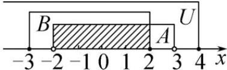

> [!faq]- 《专题1.3 集合的基本运算（高效培优讲义）》官方解析
>
> > [!success]- **【答案】** $\{x\mid x\leq -2$ 或 $2 < x\leq 4\}$ $\{x\mid x\leq 2$ 或 $3\leq x\leq 4\}$
>
> > [!note]- **【解析】**
> > $\{x\mid x\leq 2$ 或 $3\leq x\leq 4\}$ 利用数轴，分别表示出全集 $U$ 及集合A， $B$ ，如图：
> >
> > 
> >
> > 则 $\check{\mathfrak{Q}}_{\mathrm{U}}A = \{x\mid x\leq -2$ 或 $3\leq x\leq 4\}$ ，又 $A\cap B = \{x\mid -2 <   x\leq 2\}$ ，所以 $\check{\mathfrak{Q}}_{\mathrm{U}}(A\cap B) = \{x\mid x\leq -2$ 或 $2 <   x\leq 4\}$
> >
> > $\left(\check{\mathfrak{Q}}_{\cup}A\right)\cup B=\{x\mid x\leq2\quad3\leq x\leq4\}$ 或
