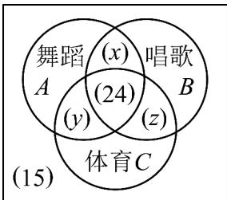
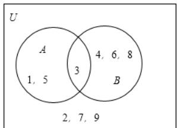
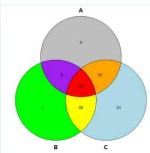
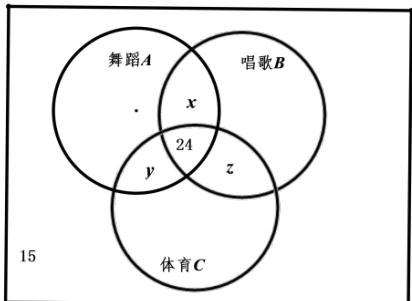

> [!faq]- 《专题1.3 集合的基本运算（高效培优讲义）》官方解析
>
> > [!success]- **【答案】** A
>
> > [!note]- **【分析】**
> > 作出韦恩图，将参加舞蹈、唱歌、体育课外活动的小学生分别用集合A、B、C表示，不妨设总人
> >
> > 数为 n，选择舞蹈和唱歌的人数为 x，选择舞蹈和体育的人数为 y，选择唱歌和体育的人数为 z，利用容斥原
> >
> > 理可求得 $n$ 的值，即为所求·
>
> > [!note]- **【解析】**
> > 如图所示，用 Venn 图表示题设中的集合关系，
> >
> > 不妨将参加舞蹈、唱歌、体育课外活动的小学生分别用集合A、B、C表示，
> >
> > $$
> > \text { 则 } \quad \operatorname{card} (A) = 6 3, \quad \operatorname{card} (B) = 8 9, \quad \operatorname{card} (C) = 4 7, \quad \operatorname{card} (A \cap B \cap C) = 2 4
> > $$
> >
> > 
> >
> > 不妨设总人数为 n ，选择舞蹈和唱歌的人数为 x ，选择舞蹈和体育的人数为 y ，选择唱歌和体育的人数为 z ，
> >
> > 则 $\operatorname{card}(A \cap B) = 24 + x$ ， $\operatorname{card}(A \cap C) = 24 + y$ ， $\operatorname{card}(B \cap C) = 24 + z$ ， $x + y + z = 46$
> >
> > 由三个集合的容斥关系公式得 $n-15=\operatorname{card}(A)+\operatorname{card}(B)+\operatorname{card}(C)$
> >
> > $$
> > \operatorname{card} (A \cap B) - \operatorname{card} (A \cap C) - \operatorname{card} (B \cap C) + \operatorname{card} (A \cap B \cap C)
> > $$
> >
> > $$
> > = 6 3 + 8 9 + 4 7 - (2 4 + x) - (2 4 + y) - (2 4 + z) + 2 4 = 1 5 1 - (x + y + z) = 1 0 5
> > $$
> >
> > 解得 n=120 ，故接受调查的小学生共有 120 人 .
> >
> > ## 方法技巧
> >
> > ## 1、原理
> >
> > 容斥原理指把包含于某内容中的所有对象的数目先计算出来，然后再把计数时重复计算的数目排斥出去，
> >
> > 使得计算的结果既无遗漏又无重复，这种计数的方法称容斥原理。
> >
> > ## 2、解释
> >
> > 由图可以直接看出各部分之间的关系
> >
> > 
> >
> > 由 Venn 图可知：(AUB = A+B - AnB)
> >
> > 
> >
> > 由 Venn 图可知：（AUBUC = A+B+C - AnB - BnC - CnA + AnBnC）
> >
> > ## 3、应用
> >
> > 两类：如果被计数的事物有A、B两类，那么，A类B类元素个数总和 $=$ 属于A类元素个数 $+$ 属于B类元素个
> >
> > 数—既是 A 类又是 B 类的元素个数。
> >
> > 三类：如果被计数的事物有A、B、C三类，那么，A类和B类和C类元素个数总和 $=$ A类元素个数 $+$ B类元素
> >
> > 个数+C类元素个数—既是A类又是B类的元素个数—既是A类又是C类的元素个数—既是B类又是C类的元
> >
> > 素个数+既是 A 类又是 B 类而且是 C 类的元素个数。
> >
> > 4、注意
> > - **①**：填图时，应从较小的区域填起②图中各个区域与集合运算之间的关系
> >
> > 形如：某小学对小学生的课外活动进行了调查·调查结果显示：参加舞蹈课外活动的有 $^{63}$ 人，参加唱歌课外
> >
> > 活动的有 $^{89}$ 人，参加体育课外活动的有 $^{47}$ 人，三种课外活动都参加的有 $^{24}$ 人，只选择两种课外活动参加的
> >
> > 有 $^{46}$ 人，不参加其中任何一种课外活动的有 $^{15}$ 人·问接受调查的小学生共有多少人？
> >
> > 【破解】
> >
> > 
> >
> > 如图所示，用韦恩图表示题设中的集合关系，不妨将参加舞蹈、唱歌、体育课外活动的小学生分别用集合
> >
> > $A,B,C$ 表示，
> >
> > 则 $card(A) = 63, card(B) = 89, card(C) = 47, card(A \cap B \cap C) = 24$
> >
> > 不妨设总人数为 $n$ ，韦恩图中三块区域的人数分别为 $x, y, z$
> >
> > $$
> > \text { 即 } c a r d (A \cap B) = 2 4 + x, c a r d (A \cap C) = y + 2 4, c a r d (B \cap C) = z + 2 4
> > $$
> >
> > $$
> > x + y + z = 4 6
> > $$
> >
> > ，由容斥原理：
> >
> > $$
> > n - 1 5 = \operatorname{card} (A) + \operatorname{card} (B) + \operatorname{card} (C) - \operatorname{card} (A \cap B) - \operatorname{card} (A \cap C) - \operatorname{card} (B \cap C) + \operatorname{card} (A \cap B \cap C)
> > $$
> >
> > $$
> > = 6 3 + 8 9 + 4 7 - (2 4 + x) - (2 4 + y) - (2 4 + z) + 2 4 \text {解得：} n = 1 2 0
> > $$
