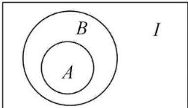
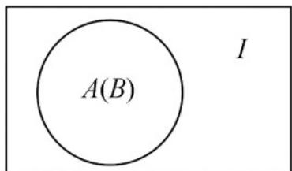

> [!faq]- 《专题1.4 充分条件与必要条件（高效培优讲义）》官方解析
>
> > [!success]- **【答案】** B
>
> > [!note]- **【解析】**
> > 由 $A \subseteq B$ 得Venn图：
> >
> > 
> >
> > 
> > - **对于①**：， $A \cap B = A$ 等价于 $A \subseteq B$ ，故①正确；
> > - **对于②**：， $A \cup B = A$ 等价于 $B \subseteq A$ ，故②错误；
> > - **对于③**：，
> >
> > $A \cap (\breve{\partial}_{l} B) = \varnothing$ 等价于 $A \subseteq B$ ，故③正确；
> > - **对于④**：，“ $x \in B$ ”是“ $x \in A$ ”的必要且不充分条件等价于 $A \ddot{U} B$ ，故④
> >
> > 错误·所以与 $A \subseteq B$ 等价的有①③，共 2 个.
