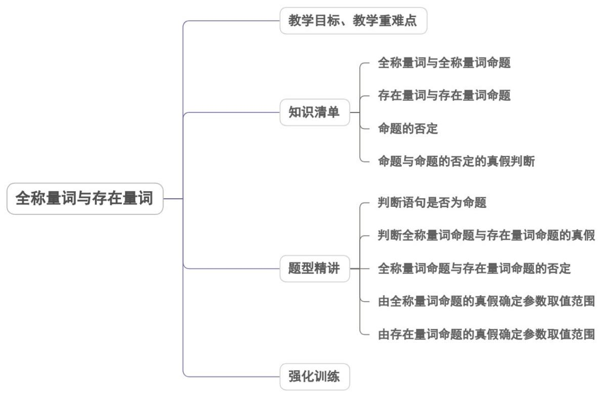

<!-- source-part:1 pages:1-37 -->

## 专题1.5 全称量词与存在量词

## 内容概览

## 教学目标、教学重难点

<table><tr><td>教学目标</td><td>1.理解全称量词与存在量词的含义,熟悉常见的全称量词和存在量词.2.了解含有量词的全称命题和特称命题的含义,并能用数学符号表示含有量词的命题及判断命题的真假性.3.能正确地对含有一个量词的命题进行否定,理解全称命题与特称命题之间的关系.</td></tr><tr><td>教学重难点</td><td>1.重点:全称命题,特称命题真假的判定及其否定.2.难点:由特称命题的真假确定参数的取值范围.</td></tr></table>

## 知识清单

## 知识点 01 全称量词与全称量词命题

1. 全称量词：一般地，“任意”“所有”“每一个”在陈述句中表示所述事物的全体，称为全称量词，用符号“∀”表示.

2. 全称量词命题：含有全称量词的命题，称为全称量词命题.

3. 全称量词命题的形式：对集合 $M$ 中的所有元素 $x$ ， $r(x)$ ，简记为：对 $\forall \in M, r(x)$ 。【即学即练】

1. 下列命题与“ $\forall x \in \mathbf{R}$ ， $x^2 + 1 - 1$ ”的表述意义一致的是（）

【答案】
A. 有且只有一个实数 $x$ ，使得 $x^2 + 1 < 1$ 成立
B. 有些实数 $x$ ，使得 $x^2 + 1 - 1$ 成立
C. 不存在实数 $x$ ，使得 $x^2 + 1 < 1$ 成立
D. 有无数个实数 $x$ ，使得 $x^2 + 1 - 1$ 成立

【答案】C

【分析】根据全称量词命题的描述方法即可得解·

【详解】与“ $\forall x \in \mathbf{R}$ ， $x^2 + 1 - 1$ ”表述一致的是“不存在实数 $x$ ，使得 $x^2 + 1 < 1$ 成立”。

故选：C.

2. 下列命题中是全称量词命题并且是真命题的是（）

【答案】
A. $\forall x \in R, x^{2} + 2x + 1 = 0$ B. $\exists x \in N, 2x$ 为偶数
C. 所有菱形的四条边都相等
D. 每个二次函数的图像都是轴对称图形

【答案】ACD

【分析】由全称命题的概念判断.

【详解】选项 ACD 是全称命题，选项 B 是特称命题，

A 中，由 $x^{2}+2x+1=(x+1)^{2}\quad0$ ，正确；

CD 均正确.

故选：ACD

## 知识点 02 存在量词与存在量词命题

1. 全称量词：一般地，“存在”“有”“至少有一个”在陈述句中表示所述事物的个体或部分，称为全存在量词，用符号“ヨ”表示.

2. 存在量词命题：含有存在量词的命题，称为存在量词命题.

3. 存在量词命题的形式：存在集合 $M$ 中的元素 $x$ ， $s(x)$ ，简记为：对 $\exists \in M, s(x)$ .

【即学即练】

1. 下列判断正确的是（）

【答案】
A. 方程组 $\left\{\begin{aligned}x+2y&=3\\ 2x+y&=3\end{aligned}\right.$ 的解集为 $\left\{1\right\}$

B．“四边形Ω是梯形”是“四边形Ω有一组对边平行”的充分不必要条件

C．若 $a \in \left\{6 - a, a^{2} - 6\right\}$ ，则 a 的取值集合为 $\{-2\}$

D. “ $\exists x \in \mathbf{N}, x^2 - 2 \notin \mathbf{N}$ ”是存在量词命题

【答案】BCD

【分析】求出方程组的解集判断 $^{A}$ ；利用充分不必要条件的定义判断 $^{B}$ ；由元素与集合的关系求出a判断 $^{C}$ ；

利用存在量词命题的定义判断 D.

【详解】对于 A，方程组 $\left\{\begin{aligned}x+2y&=3\\ 2x+y&=3\end{aligned}\right.$ 的解集为 $\left\{(1,1)\right\}$ ，A 错误；

对于 $^{B}$ ，梯形有一组对边平行，但有一组对边平行的四边形不一定是梯形， $^{B}$ 正确；

对于 C，当 a=3 时， $6-a=a^{2}-6=3$ ，由 $a^{2}-6=a(a\neq3)$ ，得 a=-2，C 正确；

对于 D， $\exists x\in N,x^{2}-2\notin N$ 是存在量词命题，D 正确的.

故选：BCD

2. 下列命题中是存在量词命题的是（）

【答案】
A．所有的素数都是奇数
B． $\forall x\in R,\left|x\right|+1$ 1
C．对任意一个无理数 $x$ ， $x^{2}$ 也是无理数
D．有一个偶数是素数

【答案】D

【分析】根据存在量词命题的概念即可判断·

【详解】对于 $^{A}$ 中含有“所有的”，该命题是全称量词命题；

对于 $^{B}$ 中含有“∀”，该命题是全称量词命题；

对于 $C$ 中含有“任意一个”，该命题是全称量词命题；

对于 $^{D}$ 中含有“有一个”，该命题是存在量词命题；

故选：D.

## 知识点 03 命题的否定

1. 一般地，对命题 $p$ 加以否定，就得到一个新的命题，记作“ $\neg p$ ”，读作“非 $p$ ”或 $p$ 的否定。

2. 如果一个命题是真命题，那么这个命题的否定是假命题，反之亦然。

一般地，全称量词命题“ $\forall x \in M, q(x)$ ”的否定是存在量词命题： $\exists x \in M, \neg q(x)$

一般地，存在量词命题“ $\exists x \in M, q(x)$ ”的否定是全称量词命题： $\forall x \in M, \neg q(x)$

【即学即练】

1. 命题“ $\forall x \in \mathbb{R}$ ， $x^2 - 2x + a > 0$ ”的否定是（）

【答案】
A. $\forall x \in \mathbb{R}$ ， $x^2 - 2x + a \leq 0$ B. $\exists x \in \mathbb{R}$ ， $x^2 - 2x + a > 0$ C. $\exists x \in \mathbb{R}$ ， $x^2 - 2x + a < 0$ D. $\exists x \in \mathbb{R}$ ， $x^2 - 2x + a \leq 0$

【答案】D

【分析】由全称的否定是特称，变符号，否定结论可得

【详解】命题“ $\forall x\in R,\quad x^{2}-2x+a>0$ ”的否定是 $\exists x\in R,\quad x^{2}-2x+a\leq0$

故选：D

2. 命题：“ $\forall x \in \mathbb{R}$ ， $3x^{2} - x + 8 < 0$ ”的否定是（）

【答案】

A. $\exists x \notin \mathbb{R}$ ， $3x^{2} - x + 8 = 0$ B. $\forall x \notin \mathbb{R}$ ， $3x^{2} - x + 8 < 0$ C. $\exists x \in \mathbb{R}$ ， $3x^{2} - x + 8 = 0$ D. $\forall x \in \mathbb{R}$ ， $3x^{2} - x + 8 = 0$

【答案】C

【分析】由全称命题的否定为特称命题即可求解·

【详解】“ $\forall x \in \mathbb{R}$ ， $3x^{2} - x + 8 < 0$ ”的否定是 $\exists x \in \mathbb{R}$ ， $3x^{2} - x + 8 = 0$ ，

故选：C

## 知识点 04 命题与命题的否定的真假判断

一个命题和它的否定不能同时为真命题，也不能同时为假命题，只能一真一假。

常见正面词语的否定举例如下：

<table><tr><td>正面词语</td><td>等于</td><td>大于(&gt;)</td><td colspan="2">小于(&lt;)</td><td>是</td><td>都是</td></tr><tr><td>否定</td><td>不等于</td><td>不大于(≤)</td><td colspan="2">不小于(≥)</td><td>不是</td><td>不都是</td></tr><tr><td>正面词语</td><td>至少有一个</td><td>至多有一个</td><td>任意的</td><td>所有的</td><td></td><td>至多有n个</td></tr><tr><td>否定</td><td>一个也没有</td><td>至少有两个</td><td>某个</td><td>某些</td><td></td><td>至少有n+1个</td></tr></table>

下列说法中，以下是真命题的是（ ）．
A．存在实数 $x_{0}$ ，使 $-2x_{0}^{2}+x_{0}+4=0$ B．所有的素数都是奇数

C．至少存在一个正整数，能被5和7整除.

$D$ .三条边都相等的三角形是等边三角形

【答案】ACD

【详解】选项 A：当 $x_{0}=\frac{1+\sqrt{33}}{4}$ 时， $-2x_{0}^{2}+x_{0}+4=0$ 成立. 判断正确；

选项 B: 2 是素数，但是 2 不是奇数·判断错误；

选项 C：正整数 35 和 70 能被 5 和 7 整除．判断正确；

选项 D：三条边都相等的三角形是等边三角形. 判断正确. 故选：ACD

2. 下列命题是假命题的为（ ）

【答案】
A．若 $\frac{1}{x}=\frac{1}{y}$ ，则 x=y
B．若 $x^{2}=1$ ，则 x=1
C．若 x=y，则 $\sqrt{x}=\sqrt{y}$ D．若 x<y，则 $x^{2}<y^{2}$

【答案】BCD

【详解】A 选项，若 $\frac{1}{x} = \frac{1}{y}$ ，则 x = y，A 正确.

B 选项，若 $x^{2}=1$ ，则 $x=\pm1$ ，B 错误.

$C$ 选项， $x = y <   0$ 时，不能得到 $\sqrt{x} = \sqrt{y}$ ， $C$ 错误

D 选项，x = -1, y = 1, x < y，但 $x^{2} = y^{2}$ ，D 错误. 故选：BCD

## 题型精讲

![[高中/课堂同步/题库/人教A版高中数学同步讲义(2026)/01_必修第一册/第一章 集合与常用逻辑用语/专题1.5 全称量词与存在量词（高效培优讲义）/题型01_判断语句是否为命题/题型01_判断语句是否为命题.md]]
![[高中/课堂同步/题库/人教A版高中数学同步讲义(2026)/01_必修第一册/第一章 集合与常用逻辑用语/专题1.5 全称量词与存在量词（高效培优讲义）/题型02_判断全称量词命题与存在量词命题的真假/题型02_判断全称量词命题与存在量词命题的真假.md]]
![[高中/课堂同步/题库/人教A版高中数学同步讲义(2026)/01_必修第一册/第一章 集合与常用逻辑用语/专题1.5 全称量词与存在量词（高效培优讲义）/题型03_全称量词命题与存在量词命题的否定/题型03_全称量词命题与存在量词命题的否定.md]]
![[高中/课堂同步/题库/人教A版高中数学同步讲义(2026)/01_必修第一册/第一章 集合与常用逻辑用语/专题1.5 全称量词与存在量词（高效培优讲义）/题型04_由全称量词命题的真假确定参数取值范围/题型04_由全称量词命题的真假确定参数取值范围.md]]
![[高中/课堂同步/题库/人教A版高中数学同步讲义(2026)/01_必修第一册/第一章 集合与常用逻辑用语/专题1.5 全称量词与存在量词（高效培优讲义）/题型05_由存在量词命题的真假确定参数取值范围/题型05_由存在量词命题的真假确定参数取值范围.md]]
![[高中/课堂同步/题库/人教A版高中数学同步讲义(2026)/01_必修第一册/第一章 集合与常用逻辑用语/专题1.5 全称量词与存在量词（高效培优讲义）/强化训练/强化训练.md]]
