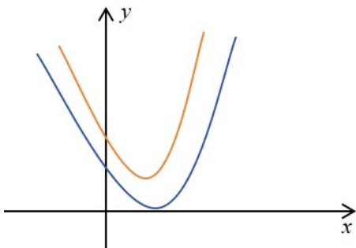
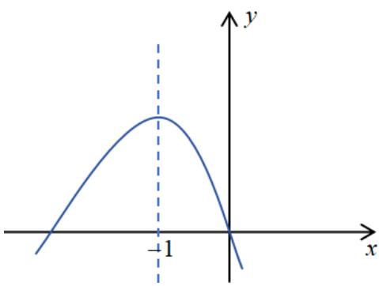
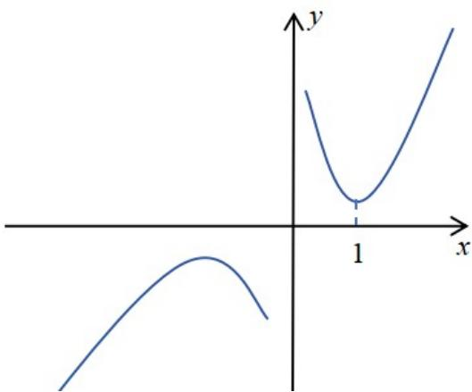

> [!faq]- 《专题1.5 全称量词与存在量词（高效培优讲义）》官方解析
>
> > [!success]- **【答案】** D
>
> > [!note]- **【解析】**
> > 由题意可知方程 $x^{2} - 2x + m = 0$ 有实数解，即 $\Delta = 4 - 4m\quad 0$ ，解得 $m\leq 1$
> >
> > ## 方法技巧
> >
> > 解题技巧：（等价转化 $^{+}$ 数形结合，分离参数 $^{+}$ 数形结合）
> >
> > 类型1：对于命题 $\mathfrak{p}$ ， $\exists x \in I, p(x, a) (a$ 为参数）为真，通过否定 $\hat{p} \forall x \in I, \hat{p}(x, a) (a$ 为参数）为假转化为恒成立问题，确定出 $\mathbf{a}$ 的取值范围 $\mathbf{A}$ ，最后取 $\mathbf{A}$ 的补集
> >
> > 类型2：对于命题 $\mathrm{p}$ ， $\exists x \in I, p(x, a) (a$ 为参数）为假，通过否定 $\neg p \forall x \in I, \neg p(x, a) (a$ 为参数）为假转化为恒成立问题，确定出a的取值范围：
> >
> > 形如1：已知命题 $p$ ： $\exists x\in \mathbf{R}$ ，使得 $ax^{2} + 2x + 1 <   0$ 成立为真命题，则实数 $a$ 的取值范围
> >
> > 针对此类 $x$ 可以取全体实数情况下，一元二次不等式求解参数取值范围应该用二次函数图象
> >
> > 第一步：等价转化 $\forall x\in R,$ 使得 $ax^{2} + 2x + 1$ 0恒成立
> >
> > 第二步：画出符合要求的图象写约束条件
> >
> > 
> >
> > $$
> > \Rightarrow \left\{ \begin{array}{c} a > 0 \\ \Delta \leq 0 \Rightarrow \Delta = b ^ {2} - 4 a c = 4 - 4 a \leq 0 \end{array} \Rightarrow a \quad 1 \right.
> > $$
> >
> > 第三步：求任意时 $a$ 集合的补集
> >
> > $a\quad 1\Rightarrow a <   1\therefore a\in (-\infty ,1)$
> >
> > 形如 2：命题“ $\exists x\in(1,2)$ ，使得 $ax^{2}+2x+1$ 0”是假命题，则a的取值范围为
> >
> > 针对此类 $X$ 只能取一部分实数情况下，一元二次不等式求解参数取值范围应该用参变分离及新的二次函数图象处理
> >
> > 第一步：等价转化 $\forall x\in (1,2)$ ，使得 $ax^{2} + 2x + 1 <   0$ 恒成立
> >
> > 第二步：参变分离画出新的二次函数图象写约束条件
> >
> > $\forall x \in (1,2)$ , 使得 $ax^2 + 2x + 1 < 0 \Rightarrow ax^2 < -2x - 1 \Rightarrow a < -\left(\frac{1}{x}\right)^2 - 2 \cdot \frac{1}{x}$
> >
> > 
> >
> > ∵ 恒成立故求 a 的最小值，定义域为 $\left(\frac{1}{2}, 1\right)$ 当 x = 1 时取最小故 y = -3
> >
> > $$
> > \therefore a \in (- \infty , - 3)
> > $$
> >
> > 形如 3：命题“ $\exists x\in(1,2)$ ，使得 $x^{2}+2ax+1$ 0”是假命题，则a的取值范围为
> >
> > 针对此类 $x$ 只能取一部分实数情况下，一元二次不等式求解参数取值范围应该用参变分离及对勾函数图象处理
> >
> > 第一步：等价转化 $\forall x\in (1,2)$ ，使得 $x^{2} + 2ax + 1 <   0$ 恒成立
> >
> > 第二步：参变分离画出对勾函数图象写约束条件
> >
> > 
> >
> > $\forall x \in (1,2)$ , 使得 $x^{2} + 2ax + 1 < 0 \Rightarrow 2ax < -x^{2} - 1 \Rightarrow 2a < -x - \frac{1}{x} = -\left(x + \frac{1}{x}\right)$
> >
> > $\because$ 恒成立故求 $a$ 的最小值，定义域为 $(1,2)$ 当 $x = 2$ 时取最小故 $y = -\frac{5}{2}$
> >
> > $$
> > \therefore a \in \left(- \infty , - \frac {5}{2}\right)
> > $$
