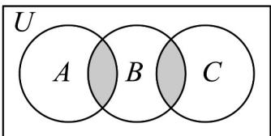

> [!faq]- 《第一章 集合与常用逻辑用语（高效培优单元测试·提升卷）》官方解析
>
> > [!success]- **【答案】** A．若 $\neg p$ 为假命题，则 p 为真命题 B．空集是任何集合的真子集 C. 命题： $p:\exists x\in R,x^{2}+x-1<0$ 则 $\neg p:\forall x\in R,x^{2}+x-1=0$ D．命题：“ $am^{2}<bm^{2}$ ”是“a<b”的充要条件
>
> > [!note]- **【分析】**
> > 由命题及其否定真假相反可判断 $^{A}$ ，由空集的概念可判断 $^{B}$ ，由特称命题的否定为全称命题可判
> >
> > 断 C，通过 m = 0 可得判断 D;
>
> > [!note]- **【解析】**
> > 对于 $^{A}$ ，由命题及其否定一定一真一件可知，故正确；
> >
> > 对于 $^{B}$ ：空集不是空集的真子集，故错误；
> >
> > 对于 C： $p:\exists x\in R,x^{2}+x-1<0$ ，则 $\neg p:\forall x\in R,x^{2}+x-1=0$ ，故正确；
> >
> > 对于 D，若 a < b，m = 0 时，则 $am^{2} < bm^{2}$ 不成立，故错误；
> >
> > 故选：AC
> >
> > 11. 图中阴影部分用集合符号可以表示为（）
> >
> > 【答案】
> >
> > 
> >
> > A. $B\cap (A\cup C)$ B. $C_U B\cap (A\cup C)$ C. $B\cap C_U(A\cup C)$ D. $(A\cap B)\cup (B\cap C)$
> >
> > 【答案】AD
> >
> > 【分析】在阴影部分区域内任取一个元素 $x$ ，分析 $x$ 与集合A、B、C的关系，利用集合的运算关系，逐
> >
> > 个分析各个选项，即可得出结论·
> >
> > 【详解】如图，在阴影部分区域内任取一个元素 x，则 $x \in A \cap B$ 或 $x \in B \cap C$ ，所以阴影部分所表示的集合
> >
> > 为 $(A \cap B) \cup (B \cap C)$ ，再根据集合的运算可知，阴影部分所表示的集合也可表示为 $B \cap (A \cup C)$ ，
> >
> > 所以选项 AD 正确，选项 BC 不正确·
> >
> > 故选 **AD**.
