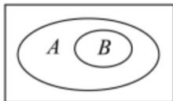
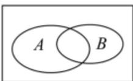
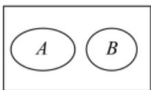

<!-- question-source:start -->
19.（17分）我们知道，如果集合 $A \subseteq S$ ，那么把 $S$ 看成全集时， $S$ 的子集 $A$ 的补集为 $\tilde{\mathfrak{Q}}_3 A = \{x | x \in S\}$ ，且

$x\notin A\}$ . 类似的，对于集合 A, B，我们把集合 $\left\{x\mid x\in A\right.$ ，且 $x\notin B\}$ 叫作集合 A 与 B 的差集，记作 A-B. 据此

回答下列问题:

(1)在图中用阴影表示出集合 $A - B$ (其中 $U$ 是全集， $A, B$ 为 $U$ 的子集);

(2)若 $A = \{1, 2, 3, 4\}$ , $B = \{3, 4, 5, 6\}$ , 求 $A - (A - B)$ ;

(3)若集合 $A = \{x\mid 0 <   ax - 1\leq 5\}$ ，集合 $B = \left\{x\Big| - \frac{1}{2} <  x\leq 2\right\}$ ，且 $A - B = \emptyset$ ，求实数 $a$ 的取值范围.
<!-- question-source:end -->

![[高中/课堂同步/题库/人教A版高中数学同步讲义(2026)/01_必修第一册/第一章 集合与常用逻辑用语/第一章 集合与常用逻辑用语（高效培优单元测试·提升卷）/四_解答题/questions/answers/Q00074897A1.md]]
