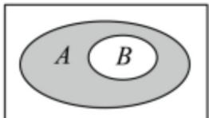
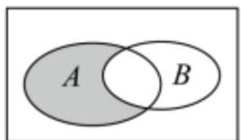
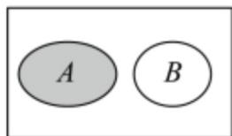

> [!faq]- 《第一章 集合与常用逻辑用语（高效培优单元测试·提升卷）》官方解析
>
> > [!success]- **【答案】** $^{(1)}$ 答案见解析 (2) $\{3,4\}$ (3) $a \in (-\infty, -12) \cup \{0\} \cup [3, +\infty)$ .
>
> > [!note]- **【分析】**
> > （1）将集合 A 中 B 的部分去掉涂色即可；
> >
> > (2) 根据差集的概念，求出 $A - B$ 的结果，进而再一次利用差集的概念求得 $A - (A - B)$ ；
> >
> > (3) 因为 $A - B = \varnothing$ ，得到 $A \subseteq B$ 。根据集合之间的包含关系，分类讨论即可。
>
> > [!note]- **【解析】**
> > （1）将集合 A 中 B 的部分去掉涂色即可；阴影部分如下所示：
> >
> > 
> >
> > 
> >
> > 
> >
> > (2) $A = \{1, 2, 3, 4\}$ ， $B = \{3, 4, 5, 6\}$ ，根据差集概念， $A - B = \{1, 2\}$
> >
> > 令 $C = \{1,2\}$ ，再根据差集概念得：
> >
> > $$
> > A - (A - B) = A - C = \{3, 4 \}
> > $$
> >
> > (3) 因为 $A - B = \varnothing$ ，所以 $A \subseteq B$ .
> >
> > 由 $0 < ax - 1 \leq 5$ 可得 $1 < ax \leq 6$ .
> >
> > 当 $a = 0$ 时， $ax = 0$ ，不等式 $1 < ax \leq 6$ 不成立，此时 $A = \varnothing$ ，满足 $A \subseteq B$
> >
> > 当 $a > 0$ 时， $A = \left\{x \mid \frac{1}{a} < x \leq \frac{6}{a}\right\}$ .
> >
> > 因为 $A \subseteq B$ ，所以 $\left\{\begin{aligned}\frac{1}{a}&-\frac{1}{2}\\ \frac{6}{a}&\leq2\end{aligned}\right.$
> >
> > 解 $\frac{1}{a} -\frac{1}{2}$ ，因为 $a > 0$ ，此不等式恒成立·
> >
> > 解 $\frac{6}{a} \leq 2$ ，两边同乘 $a$ 得 $6 \leq 2a$ ，即 $a = 3$ .
> >
> > 结合 a > 0 ，则 a 3 .
> >
> > 当 $a < 0$ 时， $A = \left\{x \mid \frac{6}{a} \leq x < \frac{1}{a}\right\}$ .
> >
> > 因为 $A \subseteq B$ ，所以 $\left\{\begin{aligned}\frac{6}{a} & > -\frac{1}{2}\\ \frac{1}{a} & \leq 2\end{aligned}\right.$
> >
> > 解 $\frac{6}{a} > -\frac{1}{2}$ ，两边同乘 $2a$ （不等号变向）得 $12 < -a$ ，即 $a < -12$
> >
> > 解 $\frac{1}{a} \leq 2$ ，两边同乘 $a$ （不等号变向）得 $1 \geq 2a$ ，即 $a \leq \frac{1}{2}$ ，
> >
> > 结合 $a < -12$ ，取 $a < -12$
> >
> > 综上， $a$ 的取值范围是 $a\in (-\infty , - 12)\cup \{0\} \cup [3, + \infty)$
