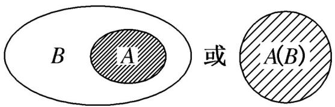
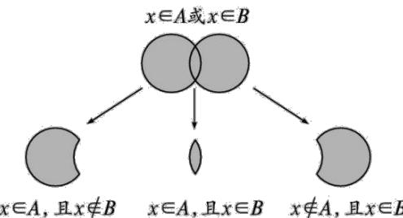
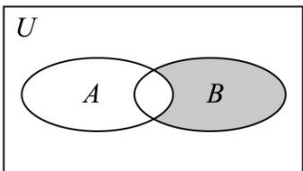
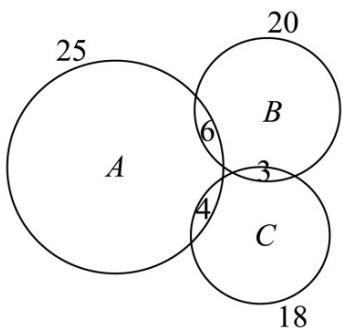

<!-- source-part:1 pages:1-50 -->

## 第一章 集合与常用逻辑用语

内容概览

## 教学目标、教学重难点

<table><tr><td>教学目标</td><td>1.元素与集合1 理解元素与集合的概念,熟练常用数集的概念及其记法.2 了解“属于”关系的意义.3了解有限集、无限集、空集的意义.2.集合的表示方法掌握集合的常用表示方法(列举法、描述法及相互转化).3.元素的性质理解集合元素的三个性质:确定性、无序性、互异性.4.理解集合之间包含与相等的含义,能识别给定集合的子集、真子集;5.理解与掌握空集的含义,在解题中把握空集与非空集合、任意集合的关系。6.理解充分条件、必要条件、充分必要条件的意义与具体要求.7.会判断命题成立的充分、必要、充分必要条件.</td></tr><tr><td>教学重难点</td><td>1.重点理解并集、交集、全集与补集的意义,会集合间的运算.2.难点理解全称量词与存在量词的含义,并能掌握全称量词命题与存在量词命题的概念,能用数学符号表示两种命题,能准确判断两类命题的真假,及判定方法.</td></tr></table>

## 知识清单

## 知识点 01 集合的表示方法与分类

## 1、常用数集及其符号

<table><tr><td>常用数集</td><td>自然数集</td><td>正整数集</td><td>整数集</td><td>有理数集</td><td>实数集</td></tr><tr><td>数学符合</td><td>N</td><td> $N^{*}$ 或 $N_{+}$ </td><td>Z</td><td>Q</td><td>R</td></tr></table>

## 2、集合的表示方法

(1) 自然语言法：用文字叙述的形式描述集合的方法叫做自然语言法

(2) 列举法：把集合的所有元素一一列举出来，并用花括号“{}”括起来表示集合的方法叫做列举法。注用列举法表示集合时注意：

①元素与元素之间必须用“，”隔开。

②集合中的元素必须是明确的.

③集合中的元素不能重复.

④集合中的元素可以是任何事物.

(3) 描述法定义：一般地，设 $A$ 表示一个集合，把集合 $A$ 中所有具有共同特征 $P(x)$ 的元素 $x$ 所组成的集合表示为 $\{x \in A \mid P(x)\}$ ，这种表示集合的方法称为描述法。有时也用冒号或分号代替竖线。

具体方法：在花括号内先写上表示这个集合元素的一般符号及取值(或变化)范围，再画一条竖线，在竖线后写出这个集合中元素所具有的共同特征。

(4) venn (韦恩图法):

在数学中，我们经常用平面上封闭曲线的内部代表集合，这种图形称为Venn图。

## 3、集合的分类

根据集合中元素的个数可以将集合分为有限集和无限集.

(1) 有限集: 含有有限个元素的集合是有限集, 如方程 $x^{2} = 4$ 的实数解组成的集合, 其中元素的个数为有限个, 故为有限集. 有限集通常推荐用列举法或描述法表示, 也可将元素写在 $venn$ 图中来表示.

(2) 无限集：含有无限个元素的集合是无限集，如不等式 $x - 1 < 0$ 的解组成的集合，其中元素的个数为无限个，故为无限集·通常用描述法表示。

【即学即练】

1．在整数集Z中，被5除所得余数为k的所有整数组成的一个集合称为“类”，记为 $\left[k\right]$ ，即 $\left[k\right]=\left\{5n+k|n\in Z\right\}$

$k = 0$ 、1、2、3、4，给出如下四个结论：① $2013 \in [3]$ ；② $-2 \in [2]$ ；③ $Z = [0] \cup [1] \cup [2] \cup [3] \cup [4]$ ；④若整数 $a$ 、 $b$ 属于同一“类”，则“ $a - b \in [0]$ ”，其中正确结论的个数为（ ）A.1 B.2 C.3 D.4

【答案】C

【详解】对于①， $Q2013=5\times402+3$ ，∴ $2013\in[3]$ ，结论①正确；

对于②， $-2=-5+3$ ， $\therefore-2\in[3]$ ，结论②错误；

对于③，对于任意一个整数，它除以 $^{5}$ 的余数可能是0、1、2、3、4，∴ $Z=\left[0\right]U\left[1\right]U\left[2\right]U\left[3\right]U\left[4\right]$ ，结论

③正确；

对于④，整数 $a$ 、 $b$ 属于同一“类”，设 $a$ 、 $b \in [k]$ ， $k = 0$ 、1、2、3、4，则存在 $m$ 、 $n \in Z$ ，使得 $a = 5m + k$ ， $b = 5n + k$ ， $\therefore a - b = (5m + k) - (5n + k) = 5(m - n) \in [0]$ ，结论④正确·故选C.

2. 有下列说法：其中正确的说法是（）

【答案】

(1) 0 与 $\{0\}$ 表示同一个集合

(2) 由 $1,2,3$ 组成的集合可表示为 $\{1,2,3\}$ 或 $\{3,2,1\}$ ;

(3) 方程 $\left(x-1\right)^{2}(x-2)=0$ 的所有解的集合可表示为 $\left\{1,1,2\right\}$ ;

(4) 集合 $\left\{x \mid 4 < x < 5\right\}$ 是有限集.
A. (1)、(4) B. (1)、(3)、(4) C. (2) D. (3)

【答案】C

【详解】对于（1），0是元素，不表示集合， $\{0\}$ 为集合，二者不一样，（1）错误；

对于（2），由集合元素的无序性知，（2）正确；

对于（3），方程 $\left(x - 1\right)^2 (x - 2) = 0$ 的所有解的集合可表示为 $\{1,2\}$ ，（3）错误；

对于（4），集合 $\left\{x\mid4<x<5\right\}$ 是无限集.

故选：C

## 知识点 02 元素与集合

1 元素与集合的关系

(1)属于(belong to): 如果 $a$ 是集合 $A$ 的元素, 就说 $a$ 属于 $A$ , 记作 $a \in A$ .

(2)不属于(not belong to): 如果 $b$ 不是集合 $A$ 的元素, 就说 $b$ 不属于 $A$ , 记作 $b \notin A$ .

2 集合元素的三大特性

(1) 确定性：给定的集合，它的元素必须是确定的，也就是说，给定一个集合，那么任何一个元素在不在这个集合中就确定了，我们把这个性质称为集合元素的确定性.

(2) 互异性（考试常考特点，注意检验集合的互异性）：一个给定集合中元素是互不相同的，也就是说，集合中的元素是不重复出现的，我们把这个性质称为集合元素的互异性.

(3) 无序性：集合中的元素是没有固定顺序的，也就是说，集合中的元素没有前后之分，我们把这个性质称为集合元素的无序性.

【即学即练】

1. 已知集合 $M = \{\mid x = 2k, k \in \mathbf{Z}\}, Q = \{\mid x = 2k + 1, k \in \mathbf{Z}\}, P = \{\mid x = 4k + 1, k \in \mathbf{Z}\}$ ，若 $m \in P, n \in Q$ ，则（）A. $m + n \in M$ B. $m + n \in Q$ C. $m + n \in P$ D. $m + n$ 不属于 $M, Q, P$ 中的任意一个

【答案】A

【详解】 $\because m\in P,n\in Q$

$\therefore m = 4k_{1} + 1, k_{1} \in \mathbf{Z}, n = 2k_{2} + 1, k_{2} \in \mathbf{Z},$ $\therefore m + n = 4k_{1} + 1 + 2k_{2} + 1 = 2(2k_{1} + k_{2} + 1), 2k_{1} + k_{2} + 1 \in \mathbf{Z},$ $\therefore m + n \in M.$

故选：A.

2．已知非空数集 $_{T}$ 满足：任意的 $x\in T$ ，则 $\frac{x-1}{x+1}\in T$ ，若集合 $_{T}$ 中含有4个元素，则这四个元素之积为（）

【答案】
A. -2
B. -1
C. 1
D. 2

【答案】C

【详解】由题意可得 $x \neq \frac{x - 1}{x + 1}$ ， $\frac{\frac{x - 1}{x + 1} - 1}{\frac{x - 1}{x + 1} + 1} = -\frac{1}{x} \in T$ ， $\frac{-\frac{1}{x} - 1}{-\frac{1}{x} + 1} = \frac{1 + x}{1 - x} \in T$ ， $\frac{\frac{1 + x}{1 - x} - 1}{\frac{1 + x}{1 - x} + 1} = x \in T$ ，则 $T = \left\{x, \frac{x - 1}{x + 1}, -\frac{1}{x}, \frac{1 + x}{1 - x}\right\}$ ， $x \cdot \frac{x - 1}{x + 1} \cdot \left(-\frac{1}{x}\right) \cdot \frac{1 + x}{1 - x} = 1$ 。

故选：C.

## 知识点 03 子集

1 子集：一般地，对于两个集合 $A$ ， $B$ ，如果集合 $A$ 中任意一个元素都是集合 $B$ 中的元素，我们就说这两个集合有包含关系，称集合 $A$ 为集合 $B$ 的子集

(1) 记法与读法：记作 $A \subseteq B$ (或 $B \supseteq A$ )，读作“A 含于 $B$ ”(或“ $B$ 包含 $A$ ”)

(2) 性质：①任何一个集合是它本身的子集，即 $A \subseteq A$ .

②对于集合 $A$ ， $B$ ， $C$ ，若 $A \subseteq B$ ，且 $B \subseteq C$ ，则 $A \subseteq C$

(3) venn 图表示：

2 集合与集合的关系与元素与集合关系的区别
符号“⊆”表示集合与集合之间的包含关系,而符号“∈”表示元素与集合之间的从属关系.

【即学即练】

1．若集合 $U$ 的三个子集 $A,B,C$ 满足 $\mathrm{A}_{\text{令}}B_{\text{令}}C$ ，则称 $\left(A,B,C\right)$ 为集合 $U$ 的一组“亲密子集”已知集合 $U = \{1,2,3\}$

则 $U$ 的所有“亲密子集”的组数为（ ）A.9 B.12 C.15 D.18

【答案】D
【详解】 $U=\left\{1,2,3\right\}$ 的所有子集有： $\varnothing,\left\{1\right\},\left\{2\right\},\left\{3\right\},\left\{1,2\right\},\left\{1,3\right\},\left\{2,3\right\},\left\{1,2,3\right\}$

（1）若 $A = \emptyset$ ， $B$ 为单元素集合， $C$ 为双元素集合，符合要求的有： $\varnothing_{\mathbb{S}_{\mathbb{R}}}\left\{1\right\}_{\mathbb{S}_{\mathbb{R}}}\left\{1,2\right\} ,\varnothing_{\mathbb{S}_{\mathbb{R}}}\left\{1\right\}_{\mathbb{S}_{\mathbb{R}}}\left\{1,3\right\} ,\varnothing_{\mathbb{S}_{\mathbb{R}}}\left\{2\right\}_{\mathbb{S}_{\mathbb{R}}}\left\{1,2\right\} ,\varnothing_{\mathbb{S}_{\mathbb{R}}}\left\{2\right\}_{\mathbb{S}_{\mathbb{R}}}\left\{2,3\right\} ,$ $\varnothing_{\mathbb{S}_{\mathbb{R}}}\left\{3\right\}_{\mathbb{S}_{\mathbb{R}}}\left\{1,3\right\} ,\varnothing_{\mathbb{S}_{\mathbb{R}}}\left\{3\right\}_{\mathbb{S}_{\mathbb{R}}}\left\{2,3\right\} ,$ 共6组；

(2) 若 $A = \emptyset$ ， $B$ 为单元素集合， $C$ 为三元素集合，符合要求的有： $\varnothing_{\mathbb{S}}\{1\}_{\mathbb{S}}\{1,2,3\}$ ， $\varnothing_{\mathbb{S}}\{2\}_{\mathbb{S}}\{1,2,3\}$ ， $\varnothing_{\mathbb{S}}\{3\}_{\mathbb{S}}\{1,2,3\}$ ，共3组；

(3) 若 $A = \varnothing$ ，B 为双元素集合，C 为三元素集合，符合要求的有：

$\varnothing_{\text{♀}}\left\{1,2\right\}_{\text{♀}}\left\{1,2,3\right\},\varnothing_{\text{♀}}\left\{1,3\right\}_{\text{♀}}\left\{1,2,3\right\},\varnothing_{\text{♀}}\left\{2,3\right\}_{\text{♀}}\left\{1,2,3\right\}$ ，共3组；

(4) 若 A 为单元素集合，B 为双元素集合，C 为三元素集合，符合要求的有：

$\{1\} _{\mathbb{S}}\{1,2\} _{\mathbb{S}}\{1,2,3\} _{\mathbb{S}}\{1\} _{\mathbb{S}}\{1,3\} _{\mathbb{S}}\{1,2,3\} _{\mathbb{S}}\{2\} _{\mathbb{S}}\{1,2\} _{\mathbb{S}}\{1,2,3\}$

$\{2\}\subsetneq\{2,3\}\subsetneq\{1,2,3\}$ ， $\{3\}\subsetneq\{1,3\}\subsetneq\{1,2,3\}$ ， $\{3\}\subsetneq\{2,3\}\subsetneq\{1,2,3\}$ ，共6组；

综上所述，满足要求的“亲密子集”一共有 $6+3+3+6=18$ 组.

故选：D.

2．已知集合 $A=\left\{(s,t)\left\|s\right|+|t|\leq2,s\in\mathbb{Z},t\in\mathbb{Z}\right\}$ ，若 $B\subseteq A$ ，且对任意的 $(a,b)\in B$ ， $(c,d)\in B$ ，均有 $ab + cd \leq ad + bc$ ，则 B 中元素个数的最大值为（）

【答案】C

【详解】因为集合 $A = \{(s,t)\big||s| + |t|\leq 2,s\in \mathbb{Z},t\in \mathbb{Z}\}$

所以 $A=\left\{(-2,0),(-1,0),(-1,1),(0,1),(0,2),(1,0),(1,1),(1,-1),(2,0)\right.$

$$
\left. \left(0, 0\right), \left(0, - 1\right), \left(0, - 2\right), \left(- 1, - 1\right) \right\}
$$

由 $ab + cd \leq ad + bc$ 得 $\big(b - d\big)(a - c) \leq 0$

所以 a-c 与 b-d 异号或其中至少有一个为 0，

又 $B \subseteq A$ ， $(a, b) \in B$ ， $(c, d) \in B$

所以满足条件的集合 $B = \left\{\left(0,0\right),\left(0,1\right),\left(0, - 1\right),\left(0, - 2\right),\left(0,2\right)\right\}$ 或

$$
B = \left\{\left(0, 0\right), (1, 0), (- 1, 0), (- 2, 0), (2, 0) \right\} _ {\text {或}}
$$

$$
B = \left\{\left(- 1, - 1\right), \left(- 1, 0\right), \left(0, - 2\right), \left(- 2, 0\right), \left(0, - 1\right) \right\} \text {或}
$$

$$
B = \left\{\big (0, 1 \big), \big (1, 0 \big), \big (0, 2 \big), \big (2, 0 \big), \big (1, 1 \big) \right\}
$$

所以集合 B 中元素个数的最大值为 5.

故选：C.

## 知识点 04 集合相等

一般地,如果集合 A 的任何一个元素都是集合 B 的元素,同时集合 B 的任何一个元素都是集合 A 的元素,那么集合 A 与集合 B 相等,记作 A = B.也就是说,若 $A \subseteq B$ ,且 $B \subseteq A$ ,则 A = B.

$A(B)$

(1) A = B 的 venn 图表示

(2) 若两集合相等，则两集合所含元素完全相同，与元素排列顺序无关

【即学即练】

1. 已知集合 $A = \{x \mid x = 2k, k \in \mathbb{Z}\}$ ， $B = \{x \mid x = 4m + 6n, m, n \in \mathbb{Z}\}$ 。则（）A. $A \cap B = \emptyset$ B. A 是 $B$ 的真子集C. $A = B$ D. $A \cup B = Z$

【答案】C

【详解】从 $B$ 中任取一个元素 $x = 4m + 6n = 2(2m + 3n)$ ，一定是偶数，所以 $B \subseteq A$ ，从A中任取一个元素 $x = 2k = 4(-k) + 6k$ ， $x \in B$ ，所以 $A \subseteq B$ ，

所以 A = B ，

故选：C

2. 下列说法正确的是（）

【答案】
A. 由 $^{1,2,3}$ 组成的集合可表示为 $\left\{1,2,3\right\}$ 或 $\left\{3,2,1\right\}$ B. $\varnothing$ 与 $\left\{0\right\}$ 是同一个集合
C. 集合 $\left\{\left|x^{2}-1\right|\right\}$ 与集合 $\left\{y\mid y=x^{2}-1\right\}$ 是同一个集合
D. 集合 $\left\{\left|x^{2}+5x+6=0\right|\right\}$ 与集合 $\left\{x^{2}+5x+6=0\right\}$ 是同一个集合

【答案】A

【详解】集合中的元素具有无序性，故 A 正确；

$\varnothing$ 是不含任何元素的集合， $\{0\}$ 是含有一个元素 0 的集合，故 B 错误；

集合 $\left\{x\mid y=x^{2}-1\right\}=R$ ，集合 $\left\{y\mid y=x^{2}-1\right\}=\left\{y\mid y-1\right\}$ ，故 C 错误；

集合 $\left\{x\mid x^{2}+5x+6=0\right\}=\left\{x\mid(x+2)(x+3)=0\right\}$ 中有两个元素 -2,-3，集合 $\left\{x^{2}+5x+6=0\right\}$ 中只有一个元素，为

方程 $x^{2} + 5x + 6 = 0$ ，故D错误.

故选：A.

## 知识点 05 真子集

如果集合 $A \subseteq B$ ，但存在元素 $x \in B$ ，且 $x \notin A$ ，我们称集合 $A$ 是集合 $B$ 的真子集；

(1) 记法与读法：记作 $A \ddot{U} B$ ，读作“A 真包含于 $B$ ”（或“ $B$ 真包含 $A$ ”）

(2) 性质: ①任何一个集合都不是它本身的真子集.

②对于集合 A, B, C, 若 $A \ddot{U} B$ , 且 $B \ddot{U} C$ , 则 $A \ddot{U} C$

(3) venn 图表示：

## 【即学即练】

1. 已知集合 $A = \left\{x \in \mathbb{Z} \mid \frac{3}{2 - x} \in \mathbb{Z}\right\}$ ，则 $A$ 子集的个数为（ ） A.2 B.4 C.8 D.16

【答案】D
【详解】由已知可得 $x \in Z, \frac{3}{2 - x} \in Z$ ，
所以 x = -1, 1, 3, 5，所以 $A = \left\{-3, -1, 1, 3\right\}$ ，
所以 A 子集的个数为 $2^{4} = 16$ 个，
故选：D.

2. 含有有限个元素的数集，定义“交替和”如下：把集合中的数按从小到大的顺序排列，然后从最大的数开始
交替地加减各数，例如 $\left\{4,6,9\right\}$ 的交替和是 $9-6+4=7$ ；而 $\left\{5\right\}$ 的交替和是 5，则集合 $M=\left\{1,2,3,4\right\}$ 的所有非空
子集的交替和的总和为（）
A. 12 B. 32 C. 80 D. 192

【答案】B

【详解】集合 $M = \{1,2,3,4\}$ 的所有非空子集为 $\{1\},\{2\},\{3\},\{4\},\{1,2\},\{2,3\},\{3,4\},\{1,3\},\{2,4\},\{1,4\}$ , $\{1,2,3\},\{2,3,4\},\{1,2,4\},\{1,3,4\},\{1,2,3,4\}$

所以交替和的总和为 $1 + 2 + 3 + 4 + (2 - 1) + (3 - 2) + (4 - 3) + (3 - 1) + (4 - 2) + (4 - 1)$

$+ (3 - 2 + 1) + (4 - 3 + 2) + (4 - 2 + 1) + (4 - 3 + 1) + (4 - 3 + 2 - 1) = 32$

故选：B

## 知识点 06 空集

我们把不含任何元素的集合，叫做空集，记作：∅

规定：空集是任何集合的子集，即 $\varnothing \subseteq A$ ；

性质：（1）空集只有一个子集，即它的本身， $\varnothing \subseteq \varnothing$

(2) $A \neq \emptyset$ ，则 $\varnothing \ddot{\cup} A$

<table><tr><td></td><td> $\emptyset$ 和0</td><td> $\emptyset$ 和{0}</td><td> $\emptyset$ 和{∅}</td></tr><tr><td>相同点</td><td>都表示无</td><td>都是集合</td><td>都是集合</td></tr><tr><td>不同点</td><td> $\emptyset$ 表示集合;0是实数</td><td> $\emptyset$ 不含任何元素{0}含有一个元素0</td><td> $\emptyset$ 不含任何元素{∅}含有一个元素,该元素为: $\emptyset$ </td></tr><tr><td>关系</td><td>0∉∅</td><td> $\emptyset$ Ü{0}</td><td> $\emptyset$ Ü{∅}或者 $\emptyset \in\{\emptyset\}$ </td></tr></table>

## 【即学即练】

1．已知六个关系式① $\varnothing\in\{\varnothing\}$ ；② $\varnothing\subset\{\varnothing\}$ ；③ $\{0\}\supset\varnothing$ ；④ $0\notin\varnothing$ ；⑤ $\varnothing=\{0\}$ ；⑥ $\varnothing\neq\{\varnothing\}$ ，它们中关系表

达正确的个数为（ ）A.3 B.4 C.5 D.6

【答案】C

【详解】根据元素与集合、集合与集合关系：

$\varnothing$ 是 $\{\varnothing\}$ 的一个元素，故 $\varnothing \in \{\varnothing\}$ ，①正确；

$\varnothing$ 是任何非空集合的真子集，故 $\varnothing\subset\{\varnothing\}$ 、 $\{0\}\supset\varnothing$ ，②③正确；

$\varnothing$ 没有元素，故 $0 \notin \varnothing$ ，④正确；且 $\varnothing \neq \{0\}$ 、 $\varnothing \neq \{\varnothing\}$ ，⑤错误，⑥正确；

所以①②③④⑥正确.

故选：C

2．设非空集合 $S=\left\{x\mid m\leq x\leq l\right\}$ 满足：当 $x\in S$ 时，有 $x^{2}\in S$ ，给出如下四个命题：

①若 $m = 1$ ，则 $S = \{1\}$ ；②若 $m = -\frac{1}{2}$ ，则 $\frac{1}{4} \leq l \leq 1$ ；③若 $l = \frac{1}{2}$ ，则 $-\frac{\sqrt{2}}{2} \leq m \leq 0$ ；④若 $l = 1$ ，则 $-1 \leq m \leq 0$ 或

$m = 1$ ；其中正确的命题个数是（ ）A.1 B.2 C.3 D.4

【答案】D

【详解】∵非空集合 $S=\left\{x\mid m\leq x\leq l\right\}$ 满足：当 $x\in S$ 时，有 $x^{2}\in S$

$$
m \in S, l \in S
$$

则 $m^2 \in S$ ， $l^2 \in S$ ，且 $m^2 \quad m$ ， $l^2 \leq l$

即 $m \leq 0$ 或 $m = 1, 0 \leq l \leq 1$ 且 $m \leq l$

① 当 m=1 时，有 $l=1$ ，所以 $s=\{1\}$ ，故正确；

② 当 $m = -\frac{1}{2}$ 时， $m^{2} = \frac{1}{4} \in S$ ，所以 $\frac{1}{4} \leq l \leq 1$ ，故正确；

③当 $l=\frac{1}{2}$ 时， $m^{2}\in S$ ，所以 $m^{2}\leq\frac{1}{2}$ ，所以 $-\frac{\sqrt{2}}{2}\leq m\leq0$ ，故正确；

④当 $l = 1$ 时，可知 $-1 \leq m \leq 0$ 或 $m = 1$ ，故正确；

## 知识点 07 并集与交集

## 1、并集

(1) $A \cup B$ 仍是一个集合, $A \cup B$ 由所有属于集合 $A$ 或属于集合 $B$ 的元素组成.

(2)并集符号语言中的“或”与生活中的“或”字含义有所不同.生活中的“或”是只取其一,并不兼存;而并集中的“或”连接的并列成分之间不一定是互斥的,“ $x \in A$ 或 $x \in B$ ”包括下列三种情况:① $x \in A$ ,且 $x \notin B$ ;② $x \notin A$ ,且 $x \in B$ ;③ $x \in A$ ,且 $x \in B$ .可用下图所示形象地表示.

## 2、交集

(1) $A \cap B$ 仍是一个集合, $A \cap B$ 由所有属于集合 $A$ 且属于集合 $B$ 的元素组成.

(2)对于“ $A \cap B = \{x \mid x \in A 且 x \in B\}$ ”,包含以下两层意思:① $A \cap B$ 中的任一元素都是A与B的公共元素;②A与B的公共元素都属于 $A \cap B$ ,这就是文字定义中“所有”二字的含义,如 $A = \{1, 2, 3, 4\}$ , $B = \{2, 3, 4, 5\}$ ,则 $A \cap B = \{2, 3, 4\}$ ,而不是 $\{2\}$ 或 $\{3\}$ 或 $\{4\}$ .

(3)并不是任意两个集合总有公共元素,当集合 A 与集合 B 没有公共元素时,不能说集合 A 与集合 B 没有交集,而是 $A \cap B = \varnothing$ .

(4)当 $A = B$ 时, $A \cap B = A$ 和 $A \cap B = B$ 同时成立.

## 【即学即练】

1. 已知集合 $A = \{x \mid x < -1$ 或 $x - 3\}$ ， $B = \{x \mid ax + 1 \leq 0\}$ ，若 $A \cap B = B$ ，则实数 $a$ 的取值范围是（）A. $\left[-\frac{1}{3}, 1\right)$ B. $\left[-\frac{1}{3}, 1\right]$ C. $(- \infty, -1) \cup [0, +\infty)$ D. $\left[-\frac{1}{3}, 0\right) \cup (0, 1)$

【答案】A

【详解】因为 $A \cap B = B$ ，则 $B \subseteq A$ ，且集合 $A = \{x | x < -1, x, 3\}$ ， $B = \{x | ax + 1 \leq 0\}$

当 $a = 0$ 时，则 $B = \emptyset \subseteq A$ ，合乎题意；

当 $a > 0$ 时，则 $B = \{x\mid ax + 1\leq 0\} = \left\{x\middle |x\leq -\frac{1}{a}\right\}$

因为 $B \subseteq A$ ，则 $-\frac{1}{a} < -1$ ，解得 $0 < a < 1$ ；

当 $a < 0$ 时， $B = \left\{x \mid ax + 1 \leq 0\right\} = \left\{x \mid x - \frac{1}{a}\right\}$

因为 $B \subseteq A$ ，则 $-\frac{1}{a} 3$ ，解得 $a - \frac{1}{3}$ ，此时， $-\frac{1}{3} \leq a < 0$ 。

综上所述，实数 a 的取值范围是 $\left[-\frac{1}{3},1\right)$ .

故选：A.

2. 判断下列命题为真命题的个数（）

【答案】

① 0 是 $\{0,1,2,3\}$ 的真子集；

② $(A\cap B)\subset A\subset (A\cup B)$

③如果集合 $A$ 是集合 $B$ 的子集，那么集合 $B$ 就不是集合 $A$ 的子集；

④如果 $a \in \mathbf{Z}$ ，那么 $a^2$ 除以4的余数为0或1. A.0个 B.1个 C.2个 D.3个

【答案】B

【详解】对于①，因为0是集合 $\left\{0,1,2,3\right\}$ 中的元素，所以 $0\in\left\{0,1,2,3\right\}$ ，故①错误；

对于②，当 A = B 时， $A \cap B = A$ ，此时 $A \cap B$ 不是 A 的真子集，故②错误；

对于③，当 A = B 时， $A \subseteq B$ ，且 $B \subseteq A$ ，故③错误；

对于④，∵ $a \in Z$ ，当 $a = 2k$ ， $k \in Z$ 时，则 $a^{2} = 4k^{2}$ 除以 4 的余数为 0，

当 $a = 2k - 1, k \in \mathbb{Z}$ 时，则 $a^2 = (2k - 1)^2 = 4(k^2 - k) + 1$ 除以4的余数为1，

综上， $a^{2}$ 除以 4 的余数为 0 或 1，故④正确.

所以真命题个数为 1.

故选：B.

## 知识点 08 全集与补集

全集：在研究某些集合的时候，它们往往是某个给定集合的子集，这个给定的集合叫做全集，常用 $U$ 表示，全集包含所有要研究的这些集合.

补集：设 $U$ 是全集， $A$ 是 $U$ 的一个子集（即 $A \subseteq U$ ），则由 $U$ 中所有不属于集合 $A$ 的元素组成的集合，叫做 $U$ 中子集 $A$ 的补集，记作 $C_U A$ ，即 $C_U A = \{x | x \in U \text{ 且 } x \notin A\}$ .

补集的性质： $A\cup C_U A = U$ ， $A\cap C_U A = \emptyset$ ， $C_U(C_U A) = A$

【即学即练】

1. 设全集 $U = \{\sharp \sqrt{x} < 3, x \in \mathbf{Z}\}$ ，集合 $A = \{0, 2, 4, 6, 8\}$ ，则 $\tilde{\mathfrak{Q}}_U A$ 中元素的个数为（）A.3 B.4 C.5 D.6

【答案】B

【详解】根据题给条件： $\sqrt{x} < 3, x \in \mathbf{Z}$ 可知 $\left\{ \begin{array}{ll}x & 0\\ \sqrt{x} < 3 \end{array} \right.$ ，所以 $0\leq x < 9,x\in \mathbf{Z}$

即 $U = \{0,1,2,3,4,5,6,7,8\}$

集合 $A=\{0,2,4,6,8\}$ 则 $\tilde{\partial}_{U}A=\{1,3,5,7\}$ ，元素个数为 4.

故选：B.

2. 设全集 $U = \mathbb{R}$ ， $A = \{x \mid -5 \leq x < 4\}$ ， $B = \{x \mid x - 2\}$ ，则图中阴影部分表示的集合为（）

【答案】

A. $\{x|x\quad 4\}$ B. $\{x|x\leq 4\}$ C. $\{x|x\leq -2\}$ D. $\{x|x > -2\}$

【答案】A

【详解】由图可知阴影部分表示的集合为 $\left(\tilde{\mathfrak{Q}}_U A\right) \cap B$

因为 $A = \{x\mid -5\leq x <   4\}$ ，所以 $\tilde{\mathfrak{Q}}_U A = \left\{x\mid x <   - 5\right.$ 或 $x\quad 4\} ,$ 所以 $\left(\tilde{\mathfrak{Q}}_U A\right)\cap B = \left\{x\mid x\quad 4\right\}$

所以图中阴影部分表示的集合为 $\left\{x\mid x\quad4\right\}$

故选：A.

## 知识点 09 德摩根律与容斥原理

1、德摩根律

(1) $C_U(A \cap B) = (C_U A) \cup (C_U B)$

(2) $C_U(A \cup B) = (C_U A) \cap (C_U B)$

2、容斥原理

一般地，对任意两个有限集 $A, B$

$$
\operatorname{card} (A \cup B) = \operatorname{card} (A) + \operatorname{card} (B) - \operatorname{card} (A \cap B)
$$

进一步的：

$$
\operatorname{card} (A \cup B \cup C) = \operatorname{card} (A) + \operatorname{card} (B) + \operatorname{card} (C) - \operatorname{card} (A \cap B) - \operatorname{card} (A \cap C) - \operatorname{card} (B \cap C) + \operatorname{card} (A \cap B \cap C)
$$

## 【即学即练】

1.学业水平测试按照考生原始成绩从高分到低分分为A，B，C，D，E五个等级，某班共有41名学生且

全部选考物理、化学两科，这两科的学业水平测试成绩如图所示·该班学生中，这两科等级均为A的学生共有

$^{10}$ 人·这两科中只有一科等级为 $^{A}$ 的学生，其另外一科等级一定为 $^{B}$ . 则该班（）

<table><tr><td>等级科目</td><td>A</td><td>B</td><td>C</td><td>D</td><td>E</td></tr><tr><td>物理</td><td>15</td><td>16</td><td>9</td><td>1</td><td>0</td></tr><tr><td>化学</td><td>13</td><td>19</td><td>7</td><td>2</td><td>0</td></tr></table>

A. 物理化学等级都是 $B$ 的学生至多有12人

B．物理化学等级都是 B 的学生至少有 5 人

C．这两科只有一科等级为 B 且最高等级为 B 的学生至多有 $^{19}$ 人

D．这两科只有一科等级为 B 且最高等级为 B 的学生至少有 2 人

【答案】C

【详解】两科等级均为 A 的学生有 10 人，

因为仅有一科等级为 A 的学生，其另外一科等级为 B，

所以物理等级为 A，化学等级为 B 的有人 15 - 10 = 5 人；

化学等级为 A，物理等级为 B 的有人 13 - 10 = 3；

对于 A，物理等级为 B 的共有 16 人，则化学等级也为 B 的至多有 16 - 3 = 13 人，A 错误；

对于 B，物理等级为 B 的共有 16 人，则化学等级也为 B 的至少有 16 - 3 - 7 - 2 = 4 人，B 错误；

对于 C，两科只有一科等级为 B 且最高等级为 B 的学生至多有 $7 + 2 + 9 + 1 = 19$ 人，C 正确；

对于 D，两科只有一科等级为 B 且最高等级为 B 的学生至少有 19 - 5 - 13 = 1 人，D 错误.

故选：C.

2. “运动改造大脑”，为了增强身体素质，某班学生积极参加学校组织的体育特色课堂，课堂分为球类项目 $A$ 、

径赛项目 B、其他健身项目 C. 该班有 25 名同学选择球类项目 A，20 名同学选择径赛项目 B，18 名同学选择其

他健身项目 $C$ ；其中有6名同学同时选择 $A$ 和 $B,4$ 名同学同时选择 $A$ 和 $C$ ，3名同学同时选择 $B$ 和 $C$ .若全班同

学每人至少选择一类项目且没有同学同时选择三类项目，则这个班同学人数是（）
A. 51    B. 50    C. 49    D. 48

【答案】B

【详解】

由题意， $\operatorname{card}(A) = 25$ ， $\operatorname{card}(B) = 20$ ， $\operatorname{card}(C) = 18$ ， $\operatorname{card}(A \cap B) = 6$

$$
\operatorname{card} (A \cap C) = 4 \quad \operatorname{card} (B \cap C) = 3
$$

因为全班同学每人至少选择一类项目且没有同学同时选择三类项目，

所以这个班同学人数是

$$
\operatorname{card} (A \cup B \cup C) = \operatorname{card} (A) + \operatorname{card} (B) + \operatorname{card} (C) - \operatorname{card} (A \cap B) - \operatorname{card} (A \cap C) - \operatorname{card} (B \cap C)
$$

$$
= 2 5 + 2 0 + 1 8 - 6 - 4 - 3 = 5 0
$$

故选：B.

## 知识点 10 充分条件与必要条件

1、充分条件与必要条件

一般地，“若 $p$ ，则 $q$ ”为真命题，就说 $p$ 是 $q$ 的充分条件， $q$ 是 $p$ 的必要条件。记作： $p \Rightarrow q$

在逻辑推理中“ $p \Rightarrow q$ ”的几种说法

(1)“如果 p, 那么 q”为真命题.

(2) $p$ 是 $q$ 的充分条件.

(3) $q$ 是 $p$ 的必要条件.

(4) $p$ 的必要条件是 $q$ .

(5) $q$ 的充分条件是 $p$ .

这五种说法表示的逻辑关系是一样的,说法不同而已..

## 2、从集合的角度理解充分与必要条件

若 $p$ 以集合 $A$ 的形式出现， $q$ 以集合 $B$ 的形式出现，即 $p: A = \{x \mid p(x)\}$ ， $q: B = \{x \mid q(x)\}$ ，则

(1) 若 $A \subseteq B$ ，则 $p$ 是 $q$ 的充分条件；

(2) 若 $B \subseteq A$ ，则 $p$ 是 $q$ 的必要条件；

(3) 若 $A \subsetneq B$ ，则 $p$ 是 $q$ 的充分不必要条件；

(4) 若 $B \subsetneq A$ ，则 $p$ 是 $q$ 的必要不充分条件；

(5) 若 $A = B$ ，则 $p$ 是 $q$ 的充要条件；

(6) 若 $A \subsetneq B$ 且 $B \subsetneq A$ ，则 $p$ 是 $q$ 的既不充分也不必要条件.

## 【即学即练】

1. 已知集合 $A = \left\{1, 4, \sqrt{m}\right\}, B = \left\{1, m\right\}$ ，则“ $m = 4$ ”是“ $A \cup B = A$ ”的（）

【答案】
A．充分不必要条件
B．必要不充分条件
C．充要条件
D．既不充分也不必要条件

【答案】A

【详解】若 $A \cup B = A$ ，则 $B \subseteq A$ 。

①若 m=4 ，则 $\sqrt{m}=2$ ，则 $A=\{1,4,2\}, B=\{1,4\}$ ，满足 $B\subseteq A$ ；

②若 $m = \sqrt{m}$ ，则 $m = 0$ 或 $m = 1$

$m=0$ 时， $A=\{1,4,0\},B=\{1,0\}$ ，满足 $B\subseteq A$ ；

$m = 1$ 时，与元素的互异性相矛盾，故舍去

综上所述，若 $A \cup B = A$ ，m = 0 或 m = 4，

所以“ $m = 4$ ”是“A $\cup B = A$ ”的充分不必要条件.

故选:A.

2. 设 $M = \{1, 2\}, N = \{a^{2}\}$ ，则“ $a = 1$ ”是“ $N \subseteq M$ ”的（）

【答案】

A．充分不必要条件

B．必要不充分条件

C．充要条件

D．既不充分又不必要条

件

【答案】A

【详解】若“ $a = 1$ ”，则有 $N = \{1\}$ ，可推出“ $N \subseteq M$ ”成立，

若“ $N \subseteq M$ ”，则有 $a^2 = 1$ 或 $a^2 = 2$ ，解得 $a = \pm 1$ 或 $a = \pm \sqrt{2}$ ，推不出“ $a = 1$ ”

所以“ $a = 1$ ”是“ $N\subseteq M$ ”的充分不必要条件，

故选：A

## 知识点 11 全称量词与全称量词命题

概念:短语“所有的”“任意一个”在逻辑中通常叫做全称量词,并用符号“∀”表示.含有全称量词的命题,叫做全称量词命题.

表示:全称量词命题“对 M 中任意一个 x, $p(x)$ 成立”可用符号简记为 $\forall x \in M, p(x)$ .

对全称量词与全称量词命题的理解

(1)从集合的观点看,全称量词命题是陈述某集合中的所有元素都具有某种性质的命题.注意:全称量词表示的数量可能是有限的,也可能是无限的,由题目而定.

(2)常见的全称量词还有“一切”“任给”等.

(3)一个全称量词命题可以包含多个变量,如“ $\forall x,y\in R,x^{2}+(y-2)^{2}\quad0$ ”.

(4)全称量词命题含有全称量词,有些全称量词命题中的全称量词是省略的,理解时需把它补充出来.例如,命题“平行四边形的对角线互相平分”应理解为“所有的平行四边形的对角线都互相平分”.

【即学即练】

1. 命题“任意实数 $x$ ，都有 $x^{2} - 3x - 5 \leq 0$ ”的否定是（）

【答案】
A. $\exists x \in \mathbf{R}, x^{2} - 3x - 5 \leq 0$ B. $\exists x \in \mathbf{R}, x^{2} - 3x - 5 > 0$ C. $\forall x \in \mathbf{R}, x^{2} - 3x - 5 = 0$ D. $\forall x \in \mathbf{R}, x^{2} - 3x - 5 > 0$

【答案】B

【详解】命题“任意实数 $x$ ，都有 $x^{2} - 3x - 5 \leq 0$ ”的否定是： $\exists x \in \mathbf{R}, x^{2} - 3x - 5 > 0$

故选：B.

2. 已知命题 $p: \forall x \in R, x^2 + x + a \neq 0$ ，若命题 $p$ 是假命题，则实数 $a$ 的取值范围是（）A. $a \leq \frac{1}{4}$ B. $a < \frac{1}{4}$ C. $a < -\frac{1}{4}$ 或 $a > 0$ D. $a \leq -\frac{1}{4}$ 或 $a = 0$

【答案】A

【详解】因为命题 p 是假命题，

可得： $\exists x\in R,x^2 +x + a = 0$ 为真命题；

可得： $\Delta=1-4a\quad0$

解得： $a \leq \frac{1}{4}$ ，

故选：A

## 知识点 12 存在量词与存在量词命题

概念:短语“存在一个”“至少有一个”在逻辑中通常叫做存在量词,用符号“∃”表示.含有存在量词的命题,叫做存在量词命题.

表示:存在量词命题“存在M中的元素x,p(x)成立”,可用符号简记为 $\exists x\in M,p(x)$ .

对存在量词与存在量词命题的理解

(1)从集合的观点看,存在量词命题是陈述某集合中有(存在)一些元素具有某种性质的命题.

(2)常见的存在量词还有“有些”“有一个”“对某个”“有的”等.

(3)含有存在量词的命题,不管包含的程度多大,都是存在量词命题.

(4)一个存在量词命题可以包含多个变量,如“ $\exists x,y\in R,x^{2}=(y-2)^{2}$ ”.

(5)含有存在量词“存在”“有一个”等的命题,或虽没有写出存在量词,但其意义具备“存在”“有一个”等特征的命题都是存在量词命题.

【即学即练】

1. 已知命题“ $\forall x \in \{x - 6 \leq x \leq -4\}, mx > 24$ ”是假命题的一个充分不必要条件是（）

【答案】
A. $m \leq -4$ B. $m = -4$ C. $m < -6$ D. $m = -6$

【答案】B

【详解】命题“ $\forall x \in \{x - 6 \leq x \leq -4\}, mx > 24$ ”是假命题，则其否定“ $\exists x \in \{x - 6 \leq x \leq -4\}, mx \leq 24$ ”是真命题。当 $x \in [-6, -4]$ 时，若 $m = 0$ ，则 $mx = 0 \leq 24$ ，满足条件。若 $m > 0$ ，则 $y = mx$ 在 $[-6, -4]$ 上单调递增， $y = mx$ 的最小值为 $-6m$ ，

要使 $\exists x\in \{x - 6\leq x\leq -4\} ,mx\leq 24$ 成立，则 $-6m\leq 24$ ，即 $m = -4$ ，则 $m > 0$

若 $m < 0$ ，则 $y = mx$ 在 $[-6, -4]$ 上单调递减， $y = mx$ 的最小值为 $-4m$

要使 $\exists x\in \{x - 6\leq x\leq -4\} ,mx\leq 24$ 成立，则 $-4m\leq 24$ ，即 $m = -6$ ，则 $-6\leq m <   0$

综上，当原命题为假时 m 的取值范围是 m -6，

下面判断各个选项：

选项 A： $m \leq -4$ ， $m \leq -4$ 不能推出 m -6，且 m -6 也不能推出 $m \leq -4$ ，

所以 $m < -4$ 既不是充分条件也不是必要条件，

选项 B：m -4，m -4 能推出 m -6，但 m -6 不能推出 m -4，

所以 m -4 是充分不必要条件，

选项 C：m<-6，m<-6 不能推出 m -6，且 m -6 不能推出 m<-6

所以 $m < -6$ 是既不是充分条件也不是必要条件，

选项 D：范围就是 m -6，为充要条件.

故选：B.

2. 命题：“ $\exists x > 0$ ， $x^2 - 2x > 0$ ”的否定是（）

【答案】

$$
\mathrm{A} \quad , \forall x > 0, x ^ {2} - 2 x > 0
$$

$$
\mathrm{B} \quad \forall x > 0, x ^ {2} - 2 x \leq 0
$$

$$
\mathrm{C} \quad \exists x \leq 0, x ^ {2} - 2 x > 0
$$

$$
\mathrm{D} \quad \exists x \leq 0, x ^ {2} - 2 x \leq 0
$$

【答案】B

【详解】依据题意，先改变量词，然后否定结论，

可得命题 $\exists x > 0$ ， $x^{2} - 2x > 0$ 的否定是：

$\forall x > 0 \quad x^{2} - 2x \leq 0$

故选：B

## 题型精讲

![[高中/课堂同步/题库/人教A版高中数学同步讲义(2026)/01_必修第一册/第一章 集合与常用逻辑用语/第一章 集合与常用逻辑用语（高效培优讲义）/题型01_集合的含义与表示/题型01_集合的含义与表示.md]]
![[高中/课堂同步/题库/人教A版高中数学同步讲义(2026)/01_必修第一册/第一章 集合与常用逻辑用语/第一章 集合与常用逻辑用语（高效培优讲义）/题型02_集合间的基本关系/题型02_集合间的基本关系.md]]
![[高中/课堂同步/题库/人教A版高中数学同步讲义(2026)/01_必修第一册/第一章 集合与常用逻辑用语/第一章 集合与常用逻辑用语（高效培优讲义）/题型03_集合的基本运算/题型03_集合的基本运算.md]]
![[高中/课堂同步/题库/人教A版高中数学同步讲义(2026)/01_必修第一册/第一章 集合与常用逻辑用语/第一章 集合与常用逻辑用语（高效培优讲义）/题型04_韦恩图及其应用/题型04_韦恩图及其应用.md]]
![[高中/课堂同步/题库/人教A版高中数学同步讲义(2026)/01_必修第一册/第一章 集合与常用逻辑用语/第一章 集合与常用逻辑用语（高效培优讲义）/题型05_集合的新定义问题/题型05_集合的新定义问题.md]]
![[高中/课堂同步/题库/人教A版高中数学同步讲义(2026)/01_必修第一册/第一章 集合与常用逻辑用语/第一章 集合与常用逻辑用语（高效培优讲义）/题型06_充分条件与必要条件的判断/题型06_充分条件与必要条件的判断.md]]
![[高中/课堂同步/题库/人教A版高中数学同步讲义(2026)/01_必修第一册/第一章 集合与常用逻辑用语/第一章 集合与常用逻辑用语（高效培优讲义）/题型07_充分条件与必要条件的探求与应用/题型07_充分条件与必要条件的探求与应用.md]]
![[高中/课堂同步/题库/人教A版高中数学同步讲义(2026)/01_必修第一册/第一章 集合与常用逻辑用语/第一章 集合与常用逻辑用语（高效培优讲义）/题型08_全称量词命题与存在量词命题的真假判断/题型08_全称量词命题与存在量词命题的真假判断.md]]
![[高中/课堂同步/题库/人教A版高中数学同步讲义(2026)/01_必修第一册/第一章 集合与常用逻辑用语/第一章 集合与常用逻辑用语（高效培优讲义）/题型9_全称量词命题与存在量词命题的否定/题型9_全称量词命题与存在量词命题的否定.md]]
![[高中/课堂同步/题库/人教A版高中数学同步讲义(2026)/01_必修第一册/第一章 集合与常用逻辑用语/第一章 集合与常用逻辑用语（高效培优讲义）/题型10_根据命题的真假求参数/题型10_根据命题的真假求参数.md]]
![[高中/课堂同步/题库/人教A版高中数学同步讲义(2026)/01_必修第一册/第一章 集合与常用逻辑用语/第一章 集合与常用逻辑用语（高效培优讲义）/强化训练/强化训练.md]]
