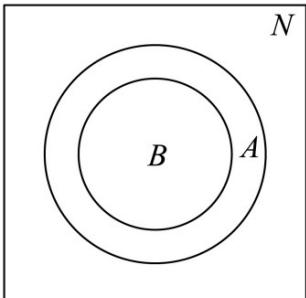

> [!faq]- 《第一章 集合与常用逻辑用语（高效培优讲义）》官方解析
>
> > [!success]- **【答案】** B
>
> > [!note]- **【解析】**
> > 由 $A = \{x|x = 3k,k\in \mathbf{N}\}$ ，当 $k = 2n,n\in \mathrm{N}$ ， $A = \{x|x = 6n,n\in \mathrm{N}\}$ ，所以 $A = B$ 当 $k = 2n + 1,n\in \mathrm{N}$ ， $A = \{x|x = 6n + 3,n\in \mathrm{N}\}$ ，所以 $B\subseteq A$ ，所以 $A\cup B = A$ ，故A错误； $B\cap (\check{\mathfrak{Q}}_U A) = \emptyset$ ，故B正确；由 $B\subseteq A$ ，所以 $B\cup \check{\mathfrak{Q}}_U A\neq U$ ，故C错误；
> >
> > 因为 $B \subseteq A$ ，所以 $A \cap (\breve{\partial}_{U} B) \neq A$ ，故 D 错误.
> >
> > 故选：B.
> >
> > 
> >
> > 6. 命题“ $\exists x \in [1,2]$ ， $2ax + 2 - a > 0$ ”为假命题的一个充分不必要条件为（）
> >
> > 【答案】
> > A. $(- \infty, -2)$ B. $(- \infty, -2]$ C. $(- \infty, 2)$ D. $(- \infty, 2]$
> >
> > 【答案】A
> >
> > 【详解】由命题“ $\exists x\in[1,2]$ ， $2ax+2-a>0$ ”为假命题，则由“ $\forall x\in[1,2]$ ， $2ax+2-a\leq0$ ”为真命题，
> > 则 $a \leq \left(\frac{-2}{2x-1}\right)_{\min}$ ，因 $1 \leq x \leq 2$ ，所以 $-2 \leq \frac{-2}{2x-1} \leq -\frac{2}{3}$ ，所以可得 $a \leq -2$ ，
> >
> > 所以原命题为假命题的一个充分不必要条件是 a < -2，故 A 正确.
> >
> > 故选 **A**.
