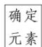

> [!faq]- 《第一章 集合与常用逻辑用语（高效培优讲义）》官方解析
>
> > [!success]- **【答案】** C
>
> > [!note]- **【解析】**
> > 因为 $A=\{x\mid3x+2<11\}=\{x\mid x<3\}$ ， $B=\{1,2,3\}$ ，所以 $A\cap B=\{1,2\}$ ，所以 $A\cap B$ 的非空真子集的个数为 $2^{2}-2=2$ 。
> >
> > 故选：C.
> >
> > $$
> > M = \{x \in \mathrm{N} | 1 \leq x \leq 1 8 \}
> > $$
> >
> > $$
> > A \cup B \cup C = M
> > $$
> >
> > 集合 $P$ 中元素最大值与最小值之和称为 $P$ 的特征数，记作 $X(P)$ 。则 $X(A) + X(B) + X(C)$ 的最大值与最小值之和（ ）.
> >
> > A. 116 B. 132 C. 126 D. 114
> >
> > 【答案】D
> >
> > 【详解】因为 A, B, C 满足: ① 每个集合都恰有 6 个元素;
> > - **②**：$A \cup B \cup C = M$
> >
> > 所以 $A, B, C$ 一定各包含6个不同数值，
> >
> > 集合 A, B, C 中元素的最小值分别是 1, 2, 3，最大值是 18, 13, 8，
> >
> > 特征数的和 $X(A) + X(B) + X(C)$ 最小，如： $A = \{1, 14, 15, 16, 17, 18\}$ ，特征数为 $X(A) = 19$ ；
> >
> > $B=\left\{2,9,10,11,12,13\right\}$ ，特征数为 $X(B)=15$ ；
> >
> > $C=\left\{3,4,5,6,7,8\right\}$ ，特征数为 $X(C)=11$ ；
> >
> > 则 $X(A)+X(B)+X(C)$ 最小，最小值为 $19+15+11=45$ ；
> >
> > 当集合 A, B, C 中元素的最小值分别是 1, 6, 11，最大值是 18, 17, 16 时，
> >
> > 特征数的和 $X(A)+X(B)+X(C)$ 最大，
> >
> > 如： $A=\left\{1,2,3,4,5,18\right\}$ ，特征数为 $X(A)=19$ ；
> >
> > $B=\left\{6,7,8,9,10,17\right\}$ ，特征数为 $X(B)=23$ ；
> >
> > $C=\left\{11,12,13,14,15,16\right\}$ ，特征数为 $X(C)=27$ ；
> >
> > 则 $X(A) + X(B) + X(C)$ 最大，最大值为 $19 + 23 + 27 = 69$
> >
> > 故 $X(A)+X(B)+X(C)$ 的最大值与最小值的和为 $45+69=114$ .
> >
> > 故选：D.
> >
> > ## 方法技巧
> >
> > ## 1、集合基本运算的方法技巧
> >
> > 
> >
> > 确定集合中的元素及其满足的条件,如函数的定义域、值域,一元二次不等式的解集等
> >
> > 根据元素满足的条件解方程或不等式,得出元素满足的最简条件,将集合清晰表示出来
> >
> > 运算求解
> > 利用交集或并集的定义求解,必要时可应用数轴或 Venn 图来直观解决
> >
> > ## 2、数形结合常使集合间的运算更简捷、直观
> >
> > 对离散的数集间的运算或抽象集合间的运算，可借助韦恩(Venn)图实施；对连续的数集间的运算，常利用数轴进行；对点集间的运算，则往往通过坐标平面内的图形求解。这些在本质上都是数形结合思想的体现和运用。
> >
> > ## 3、集合运算中参数问题的求解策略
> >
> > 集合运算中的求参数问题，首先要会化简集合，因为在高考中此类问题常与不等式等知识综合考查，以体现综合性，其次注意数形结合(包括用数轴、韦恩(Venn)图等)及端点值的取舍.
> >
> > 具体步骤如下：(1)化简所给集合；(2)用数轴表示所给集合；(3)根据集合端点的大小关系列出不等式(组)；(4)解不等式(组)；(5)检验.
