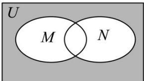

> [!faq]- 《第一章 集合与常用逻辑用语（高效培优讲义）》官方解析
>
> > [!success]- **【答案】**  A. $\{x\mid -1\leq x\leq 4\}$ B. $\{x\mid -1\leq x < 1\}$ C. $\{x\mid x\leq 1\quad x > 2\}$ D. $\{x\mid -1\leq x\leq 2\}$
>
> > [!note]- **【解析】**
> > 由题意得，阴影部分可表示为 $\breve{\mathfrak{Q}}_{U}(M\cup N)$
> >
> > 因为 $M = \{x\mid x <   - 1$ 或 $x > 2\} ,N = \{x\mid 1\leq x\leq 4\}$
> >
> > 则 $M\cup N = \left\{x\mid x <   - 1\quad x\quad 1\right\}$ 或
> >
> > 且 $U = \mathbf{R}$ ，所以 $\tilde{\mathfrak{Q}}_U(MUN) = \{x\mid -1\leq x <   1\}$
> >
> > 故选 **B**.
