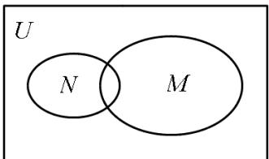
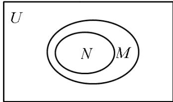
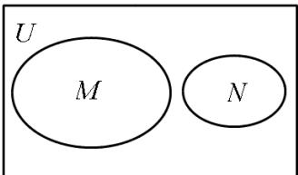
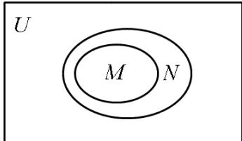

> [!faq]- 《专题1_2_集合间的基本关系_高效培优讲义_》官方解析
>
> > [!success]- **【答案】** A.  B  C  D 
>
> > [!note]- **【解析】**
> > 化简集合，判断集合 $M, N$ 没有包含关系，即可得出答案
> >
> > 【详解】∵ $M = \{-1,0\}$ , $N = \{\{x(x-1)=0\} = \{0,1\}$ ，∴ 集合 M, N 没有包含关系
> >
> > 故选 **A**
