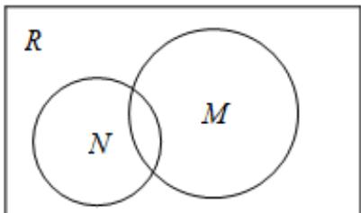
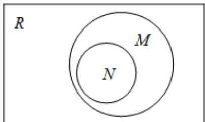
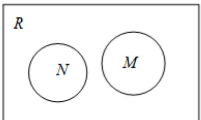
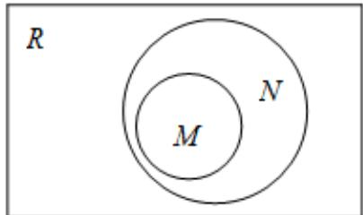

> [!faq]- 《专题1_2_集合间的基本关系_高效培优讲义_》官方解析
>
> > [!success]- **【答案】** A  B C   D 
>
> > [!note]- **【分析】**
> > 先求集合 $N$ ，再判断集合间的关系
>
> > [!note]- **【解析】**
> > $N=\{x\in R\mid x^{2}=x\}=\{0,1\}$ ， $M=\{x\mid x\in R$ 且 $0\leq x\leq1\}$ ，∴N？M.
> >
> > 故选： $B$
