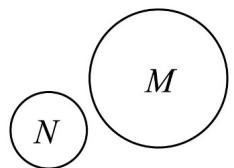
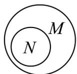

## 题型02 韦恩图及其应用

【典例1】下列Venn图能正确表示集合 $M = \{0,1,2\}$ 和 $N = \{x|x^2 - 2x = 0\}$ 关系的是（）A. N M B. N M C. N M D. M N

【答案】B

【分析】确定集合 M，N 的关系，然后选择合适的图象即可·

【详解】 $N=\left\{x\mid x^{2}-2x=0\right\}=\left\{0,2\right\}$ ，又 $M=\{0,1,2\}$

所以 $N \square M$ ，选项 B 符合，

故选：B.

## 方法技巧

Venn是集合的又一种表示方法，使用方便，表达直观，可迅速帮助我们分析问题、解决问题，但它不能作

为严密的数学工具使用.

![[高中/课堂同步/题库/人教A版高中数学同步讲义(2026)/01_必修第一册/第一章 集合与常用逻辑用语/讲义/专题1_2_集合间的基本关系_高效培优讲义_/题型02_韦恩图及其应用_sec_08/questions/Q00067656.md]]
![[高中/课堂同步/题库/人教A版高中数学同步讲义(2026)/01_必修第一册/第一章 集合与常用逻辑用语/讲义/专题1_2_集合间的基本关系_高效培优讲义_/题型02_韦恩图及其应用_sec_08/questions/Q00067657.md]]
![[高中/课堂同步/题库/人教A版高中数学同步讲义(2026)/01_必修第一册/第一章 集合与常用逻辑用语/讲义/专题1_2_集合间的基本关系_高效培优讲义_/题型02_韦恩图及其应用_sec_08/questions/Q00067658.md]]
