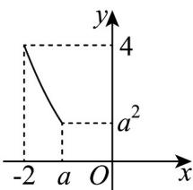
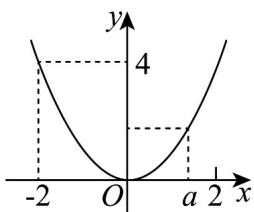
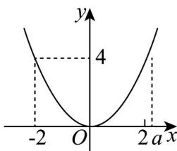

> [!faq]- 《专题1_2_集合间的基本关系_高效培优讲义_》官方解析
>
> > [!success]- **【答案】** $(- \infty, -2) \cup \left[\frac{1}{2}, 3\right]$
>
> > [!note]- **【分析】**
> > 利用一次函数的单调性求解值域即集合 B，按照 $-2 \leq a \leq 0$ 、 $0 \leq a \leq 2$ 、a > 2 和 a < -2 四种情况分类
> >
> > 讨论，根据 $C \subseteq B$ 列不等式求解实数 $a$ 的取值范围即可
>
> > [!note]- **【解析】**
> > 由 $y = 2x + 3$ 在 $[-2, a]$ 上是增函数，得 $-1 \leq y \leq 2a + 3$ ，
> >
> > 即 $B = \left\{y - 1 \leq y \leq 2a + 3\right\}$
> >
> > 作出 $z = x^{2}$ 的图像，该函数定义域右端点 x = a 有三种不同情况，如图所示：
> >
> > 
> >
> > 
> >
> > 
> > - **①**：当 $-2 \leq a < 0$ 时， $a^2 \leq z \leq 4$ ，即 $C = \left\{z \mid a^2 \leq z \leq 4\right\}$
> >
> > 要使 $C \subseteq B$ ，必须且只需 $2a + 3 \quad 4$ ，得 $^a \frac{1}{2}$ ，与 $-2 \leq a < 0$ 矛盾.
> > - **②**：当 $0 \leq a \leq 2$ 时， $0 \leq z \leq 4$ ，即 $C = \{z | 0 \leq z \leq 4\}$
> >
> > 要使 $C \subseteq B$ ，由图可知：必须且只需 $\left\{ \begin{array}{ll} 2a + 3 & 4, \\ 0 \leq a \leq 2, \end{array} \right.$ 解得 $\frac{1}{2} \leq a \leq 2$
> > - **③**：当 $a > 2$ 时， $0 \leq z \leq a^2$ ，即 $C = \left\{z \mid 0 \leq z \leq a^2\right\}$
> >
> > 要使 $C \subseteq B$ ，必须且只需 $\left\{ \begin{array}{l} a^2 \leq 2a + 3, \\ a > 2, \end{array} \right.$ 解得 $2 < a \leq 3$ 。
> > - **④**：当 a < -2 时， $A = \varnothing$ ，此时 $B = C = \varnothing$ ，则 $C \subseteq B$ 成立。
> >
> > $$
> > (- \infty , - 2) \cup \left[ \frac {1}{2}, 3 \right]
> > $$
> >
> > 故答案为： $(-∞,-2)∪\left[\frac{1}{2},3\right]$
