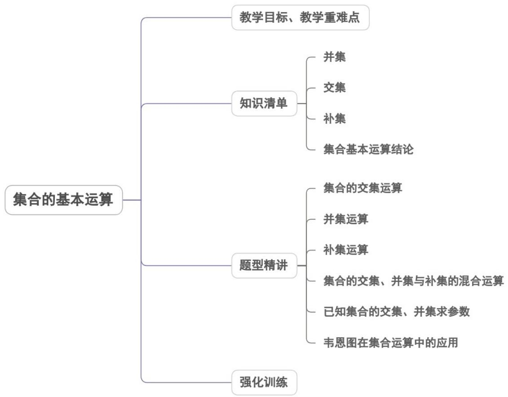

## 专题1.3 集合的基本运算

## 内容概览

## 教学目标、教学重难点

<table><tr><td>教学目标</td><td>1.理解并、交集全集的含义,会求简单的并、交集补集;2.借助Venn图理解、掌握并、交补集的运算性质;3.根据并、交集运算的性质求参数问题.4.理解给定集合中一个子集的补集的含义,并会求给定子集的补集.</td></tr><tr><td>教学重难点</td><td>1.重点</td></tr></table>

会用 Venn 图、数轴进行集合的运算．
