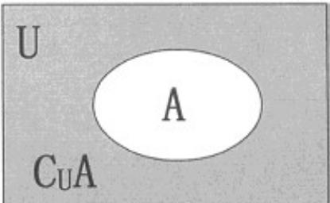

## 知识点 03 集合的补集

全集：一般地，如果一个集合含有我们所研究问题中所涉及的所有元素，那么就称这个集合为全集，通常记

作 $U$

补集：对于全集 $U$ 的一个子集 $A$ ，由全集 $U$ 中所有不属于集合 $A$ 的所有元素组成的集合称为集合 $A$ 相对于全

集 $U$ 的补集(complementary set)，简称为集合 $A$ 的补集，记作： $C_U A$ ，即 $C_U A = \{x | x \in U \text{且} x \notin A\}$ 补集的

Venn图表示：

（1）理解补集概念时，应注意补集 $C_U A$ 是对给定的集合 $A$ 和 $U(A \subseteq U)$ 相对而言的一个概念，一个确定的

集合 $A$ ，对于不同的集合 $U$ ，补集不同.

(2) 全集是相对于研究的问题而言的，如我们只在整数范围内研究问题，则 $Z$ 为全集；而当问题扩展到实

数集时，则 $R$ 为全集，这时 $Z$ 就不是全集。

(3) $C_U A$ 表示 $U$ 为全集时 $A$ 的补集，如果全集换成其他集合（如 $R$ ）时，则记号中“ $U$ ”也必须换成相应的

集合（即 $C_R A$ ）

【即学即练】

1. 已知集合 $U = \{1,2,3,4,5\}, A = \{1,2\}, B = \{x \mid x = 2n + 1, n \in \mathbf{N}\}$ ，则 $\left(\tilde{\mathfrak{Q}}_U A\right) \cap B =$ （ ）A．{1} B．{3,5} C．{1,3,5} D．{1,3,4,5}

【答案】B

【分析】由集合的基本运算即可求解·

【详解】因为集合 $U = \{1, 2, 3, 4, 5\}$ , $A = \{1, 2\}$ , $B = \{x \mid x = 2n + 1, n \in N\}$

所以 $\check{Q}_{U}A=\left\{3,4,5\right\}$ ， $\left(\check{Q}_{U}A\right)\cap B=\{3,5\}$ .

故选：B.

2. 设全集 $M = \{1, 2, 3, 4\}$ ， $A = \{1, 3\}$ ， $B = \{2\}$ ，则 $A \cup (\tilde{\mathfrak{O}}_M B)$ 等于（）

【答案】
A. $\{1, 2, 3, 4\}$ B. $\{1, 3, 4\}$ C. $\{1, 3, 5\}$ D. $\{1, 3\}$

【答案】B

【分析】直接利用并集与补集的混合运算求解得答案.

【详解】∵全集 $M=\left\{1,2,3,4\right\}$ ， $B=\left\{2\right\}$

$$
\therefore \tilde {\mathfrak {Q}} _ {M} B = \{1, 3, 4 \} \text {, 又} A = \{1, 3 \}
$$

则 $A \cup (\breve{\mathfrak{D}}_M B) = \{1, 3, 4\}$

故选：B.
