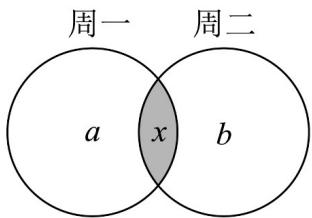

> [!faq]- 《专题1_3_集合的基本运算_高效培优讲义_》官方解析
>
> > [!success]- **【答案】** C
>
> > [!note]- **【分析】**
> > 根据集合的交集、并集运算求解即可·
>
> > [!note]- **【解析】**
> > 设仅第一天开车人数为 a ，仅第二天开车人数为 b ，两天都开车人数为 x ，
> >
> > 
> >
> > 则由图知 $a + x + b + x = 14 + 10$ ， $a + b + x = 20$
> >
> > 两式相减得 x = 4 ， $a + b = 16$ .
> >
> > 故选 **C**.
