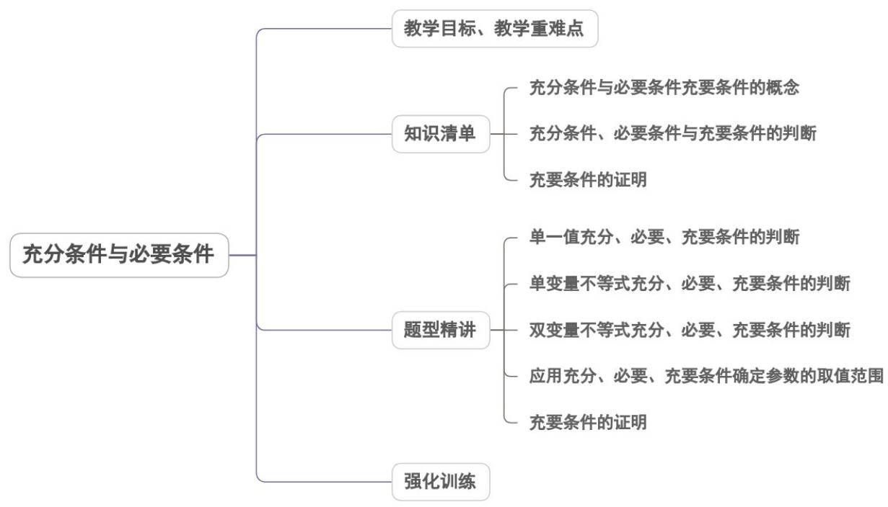

## 专题1.4 充分条件与必要条件

## 内容概览

## 教学目标、教学重难点

<table><tr><td>教学目标</td><td>1.理解充分条件、必要条件与充要条件的意义.2.结合具体命题掌握判断充分条件、必要条件、充要条件的方法.3.能够利用命题之间的关系判定充要关系或进行充要性的证明.</td></tr><tr><td>教学重难点</td><td>1.重点:充分条件与必要条件概念的概念的理解;必要条件的理解;充分条件、必要条件的判断方法.2.难点:会证明充要条件的关系,能够利用命题之间的关系判定充要关系.</td></tr></table>
