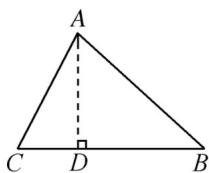
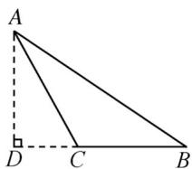

> [!faq]- 《专题1_4_充分条件与必要条件_高效培优讲义_》官方解析
>
> > [!success]- **【答案】** B
>
> > [!note]- **【解析】**
> > 记边 $a, b, c$ 所对的角分别为 $A, B, C$ 。根据题意 $a \leq b \leq c$ ，则 $C \subseteq B \subseteq A$ ，故证明如下：必要性，在 $\mathrm{V}ABC$ 中，假设 $C$ 是锐角，作 $AD \perp BC$ ， $D$ 为垂足，如图1。显然 $AB^2 = AD^2 + DB^2 = AC^2 - CD^2 + (CB - CD)^2 = AC^2 - CD^2 + CB^2 + CD^2 - 2CB \cdot CD = AC^2 + CB^2 - 2CB \cdot CD < AC^2 + CB^2$ ，即 $c^2 < a^2 + b^2$ 。充分性，在 $\mathrm{V}ABC$ 中，因为 $a^2 + b^2 > c^2$ ，所以不是直角。假设为钝角，如图2，作 $AD \perp BC$ ，交 $BC$ 的延长线于点 $D$ 。则 $AB^2 = AD^2 + BD^2 = AC^2 - CD^2 + (BC + CD)^2 = AC^2 - CD^2 + BC^2 + CD^2 + 2BC \cdot CD = AC^2 + BC^2 + 2BC \cdot CD > AC^2 + BC^2$ ，即 $c^2 > b^2 + a^2$ ，与 $a^2 + b^2 > c^2$ 矛盾。
> >
> > 故 C 为锐角，则 A，B 都为锐角，即 VABC 为锐角三角形。
> >
> > 
> > 图1
> >
> > 
> > 图2
