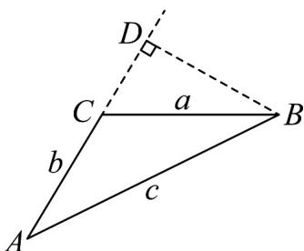
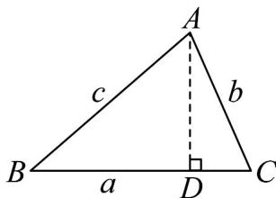

> [!faq]- 《专题1_4_充分条件与必要条件_高效培优讲义_》官方解析
>
> > [!success]- **【答案】** $a^{2}+b^{2}>c^{2}$ ，证明见解析
>
> > [!note]- **【分析】**
> > VABC 为锐角三角形的充要条件为 $a^{2} + b^{2} > c^{2}$ ·作出图形，根据勾股定理计算化简分别证明充分性和
> >
> > 必要性即可·
>
> > [!note]- **【解析】**
> > VABC 为锐角三角形的充要条件为 $a^{2} + b^{2} > c^{2}$ .
> >
> > 证明：充分性：若 $a^2 + b^2 > c^2$ ，则VABC不是直角三角形
> >
> > 若 VABC 为钝角三角形，因为 $a \leq b \leq c$ ，则 $\angle C > 90^{\circ}$ .
> >
> > 过点 B 作 AC 的延长线的垂线，垂足为 D（如图（1）），
> >
> > 由勾股定理知
> >
> > $$
> > c ^ {2} = B D ^ {2} + (b + C D) ^ {2} = B D ^ {2} + C D ^ {2} + b ^ {2} + 2 \cdot C D \cdot b = a ^ {2} + b ^ {2} + 2 \cdot C D \cdot b > a ^ {2} + b ^ {2}
> > $$
> >
> > 故 VABC 为锐角三角形，充分性成立.
> >
> > 必要性：过点 A 作边 BC 的垂线，垂足为 $D(\text{如图}^{(2)})$ ，
> >
> > 由勾股定理知，
> >
> > $$
> > c ^ {2} = A D ^ {2} + B D ^ {2} = A D ^ {2} + (a - C D) ^ {2} = b ^ {2} - C D ^ {2} + (a - C D) ^ {2}
> > $$
> >
> > $$
> > = a ^ {2} + b ^ {2} - 2 \cdot C D \cdot a <   a ^ {2} + b ^ {2}
> > $$
> >
> > 故必要性成立·
> >
> > 故 VABC 为锐角三角形的充要条件为 $a^{2} + b^{2} > c^{2}$ .
> >
> > 
> > 图(1)
> >
> > 
> > 图(2)
