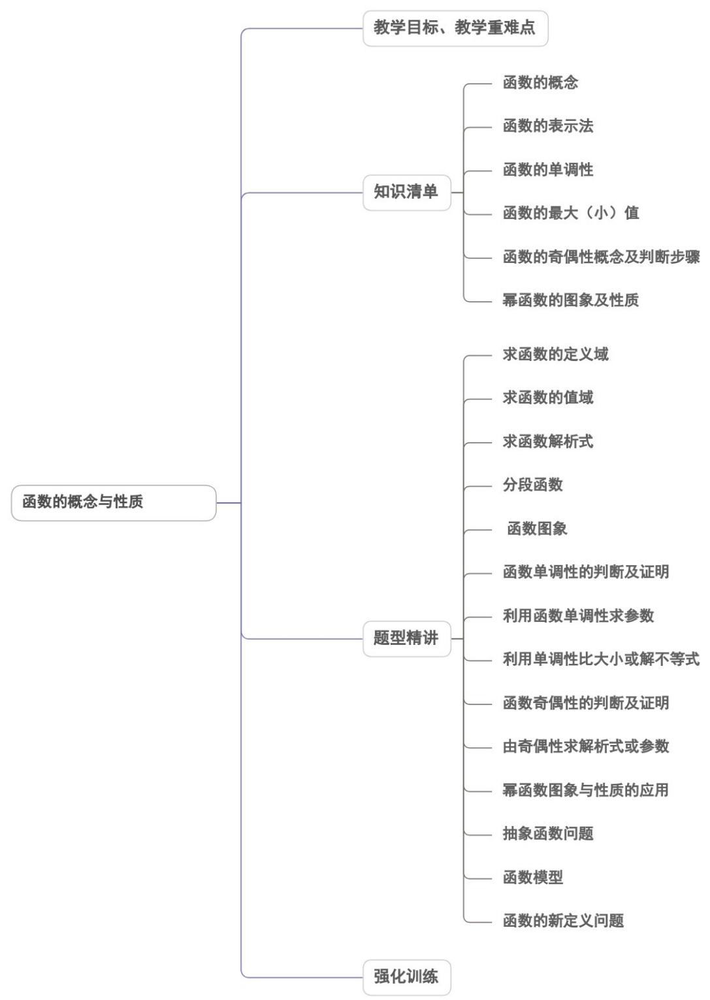

<!-- source-part:1 pages:1-50 -->

## 第一章 集合与常用逻辑用语

内容概览

## 教学目标、教学重难点

<table><tr><td>教学目标</td><td>1.元素与集合1 理解元素与集合的概念,熟练常用数集的概念及其记法.2 了解“属于”关系的意义.3了解有限集、无限集、空集的意义.2.集合的表示方法掌握集合的常用表示方法(列举法、描述法及相互转化).3.元素的性质理解集合元素的三个性质:确定性、无序性、互异性.4.理解集合之间包含与相等的含义,能识别给定集合的子集、真子集;5.理解与掌握空集的含义,在解题中把握空集与非空集合、任意集合的关系。6.理解充分条件、必要条件、充分必要条件的意义与具体要求.7.会判断命题成立的充分、必要、充分必要条件.</td></tr><tr><td>教学重难点</td><td>1.重点理解并集、交集、全集与补集的意义,会集合间的运算.2.难点理解全称量词与存在量词的含义,并能掌握全称量词命题与存在量词命题的概念,能用数学符号表示两种命题,能准确判断两类命题的真假,及判定方法.</td></tr></table>

![[高中/课堂同步/题库/人教A版高中数学同步讲义(2026)/01_必修第一册/第一章 集合与常用逻辑用语/讲义/第一章_集合与常用逻辑用语_高效培优讲义_/知识清单_sec_01/知识清单_sec_01.md]]
![[高中/课堂同步/题库/人教A版高中数学同步讲义(2026)/01_必修第一册/第一章 集合与常用逻辑用语/讲义/第一章_集合与常用逻辑用语_高效培优讲义_/知识点_01_集合的表示方法与分类_sec_02/知识点_01_集合的表示方法与分类_sec_02.md]]
![[高中/课堂同步/题库/人教A版高中数学同步讲义(2026)/01_必修第一册/第一章 集合与常用逻辑用语/讲义/第一章_集合与常用逻辑用语_高效培优讲义_/知识点_02_元素与集合_sec_03/知识点_02_元素与集合_sec_03.md]]
![[高中/课堂同步/题库/人教A版高中数学同步讲义(2026)/01_必修第一册/第一章 集合与常用逻辑用语/讲义/第一章_集合与常用逻辑用语_高效培优讲义_/知识点_03_子集_sec_04/知识点_03_子集_sec_04.md]]
![[高中/课堂同步/题库/人教A版高中数学同步讲义(2026)/01_必修第一册/第一章 集合与常用逻辑用语/讲义/第一章_集合与常用逻辑用语_高效培优讲义_/知识点_04_集合相等_sec_05/知识点_04_集合相等_sec_05.md]]
![[高中/课堂同步/题库/人教A版高中数学同步讲义(2026)/01_必修第一册/第一章 集合与常用逻辑用语/讲义/第一章_集合与常用逻辑用语_高效培优讲义_/知识点_05_真子集_sec_06/知识点_05_真子集_sec_06.md]]
![[高中/课堂同步/题库/人教A版高中数学同步讲义(2026)/01_必修第一册/第一章 集合与常用逻辑用语/讲义/第一章_集合与常用逻辑用语_高效培优讲义_/即学即练_sec_07/即学即练_sec_07.md]]
![[高中/课堂同步/题库/人教A版高中数学同步讲义(2026)/01_必修第一册/第一章 集合与常用逻辑用语/讲义/第一章_集合与常用逻辑用语_高效培优讲义_/知识点_06_空集_sec_08/知识点_06_空集_sec_08.md]]
![[高中/课堂同步/题库/人教A版高中数学同步讲义(2026)/01_必修第一册/第一章 集合与常用逻辑用语/讲义/第一章_集合与常用逻辑用语_高效培优讲义_/即学即练_sec_09/即学即练_sec_09.md]]
![[高中/课堂同步/题库/人教A版高中数学同步讲义(2026)/01_必修第一册/第一章 集合与常用逻辑用语/讲义/第一章_集合与常用逻辑用语_高效培优讲义_/知识点_07_并集与交集_sec_10/知识点_07_并集与交集_sec_10.md]]
![[高中/课堂同步/题库/人教A版高中数学同步讲义(2026)/01_必修第一册/第一章 集合与常用逻辑用语/讲义/第一章_集合与常用逻辑用语_高效培优讲义_/即学即练_sec_11/即学即练_sec_11.md]]
![[高中/课堂同步/题库/人教A版高中数学同步讲义(2026)/01_必修第一册/第一章 集合与常用逻辑用语/讲义/第一章_集合与常用逻辑用语_高效培优讲义_/知识点_08_全集与补集_sec_12/知识点_08_全集与补集_sec_12.md]]
![[高中/课堂同步/题库/人教A版高中数学同步讲义(2026)/01_必修第一册/第一章 集合与常用逻辑用语/讲义/第一章_集合与常用逻辑用语_高效培优讲义_/知识点_09_德摩根律与容斥原理_sec_13/知识点_09_德摩根律与容斥原理_sec_13.md]]
![[高中/课堂同步/题库/人教A版高中数学同步讲义(2026)/01_必修第一册/第一章 集合与常用逻辑用语/讲义/第一章_集合与常用逻辑用语_高效培优讲义_/即学即练_sec_14/即学即练_sec_14.md]]
![[高中/课堂同步/题库/人教A版高中数学同步讲义(2026)/01_必修第一册/第一章 集合与常用逻辑用语/讲义/第一章_集合与常用逻辑用语_高效培优讲义_/知识点_10_充分条件与必要条件_sec_15/知识点_10_充分条件与必要条件_sec_15.md]]
![[高中/课堂同步/题库/人教A版高中数学同步讲义(2026)/01_必修第一册/第一章 集合与常用逻辑用语/讲义/第一章_集合与常用逻辑用语_高效培优讲义_/即学即练_sec_16/即学即练_sec_16.md]]
![[高中/课堂同步/题库/人教A版高中数学同步讲义(2026)/01_必修第一册/第一章 集合与常用逻辑用语/讲义/第一章_集合与常用逻辑用语_高效培优讲义_/知识点_11_全称量词与全称量词命题_sec_17/知识点_11_全称量词与全称量词命题_sec_17.md]]
![[高中/课堂同步/题库/人教A版高中数学同步讲义(2026)/01_必修第一册/第一章 集合与常用逻辑用语/讲义/第一章_集合与常用逻辑用语_高效培优讲义_/知识点_12_存在量词与存在量词命题_sec_18/知识点_12_存在量词与存在量词命题_sec_18.md]]
![[高中/课堂同步/题库/人教A版高中数学同步讲义(2026)/01_必修第一册/第一章 集合与常用逻辑用语/讲义/第一章_集合与常用逻辑用语_高效培优讲义_/题型精讲_sec_19/题型精讲_sec_19.md]]
![[高中/课堂同步/题库/人教A版高中数学同步讲义(2026)/01_必修第一册/第一章 集合与常用逻辑用语/讲义/第一章_集合与常用逻辑用语_高效培优讲义_/题型01_集合的含义与表示_sec_20/题型01_集合的含义与表示_sec_20.md]]
![[高中/课堂同步/题库/人教A版高中数学同步讲义(2026)/01_必修第一册/第一章 集合与常用逻辑用语/讲义/第一章_集合与常用逻辑用语_高效培优讲义_/题型02_集合间的基本关系_sec_21/题型02_集合间的基本关系_sec_21.md]]
![[高中/课堂同步/题库/人教A版高中数学同步讲义(2026)/01_必修第一册/第一章 集合与常用逻辑用语/讲义/第一章_集合与常用逻辑用语_高效培优讲义_/题型03_集合的基本运算_sec_22/题型03_集合的基本运算_sec_22.md]]
![[高中/课堂同步/题库/人教A版高中数学同步讲义(2026)/01_必修第一册/第一章 集合与常用逻辑用语/讲义/第一章_集合与常用逻辑用语_高效培优讲义_/题型04_韦恩图及其应用_sec_23/题型04_韦恩图及其应用_sec_23.md]]
![[高中/课堂同步/题库/人教A版高中数学同步讲义(2026)/01_必修第一册/第一章 集合与常用逻辑用语/讲义/第一章_集合与常用逻辑用语_高效培优讲义_/题型05_集合的新定义问题_sec_24/题型05_集合的新定义问题_sec_24.md]]
![[高中/课堂同步/题库/人教A版高中数学同步讲义(2026)/01_必修第一册/第一章 集合与常用逻辑用语/讲义/第一章_集合与常用逻辑用语_高效培优讲义_/题型06_充分条件与必要条件的判断_sec_25/题型06_充分条件与必要条件的判断_sec_25.md]]
![[高中/课堂同步/题库/人教A版高中数学同步讲义(2026)/01_必修第一册/第一章 集合与常用逻辑用语/讲义/第一章_集合与常用逻辑用语_高效培优讲义_/题型_07_充分条件与必要条件的探求与应用_sec_26/题型_07_充分条件与必要条件的探求与应用_sec_26.md]]
![[高中/课堂同步/题库/人教A版高中数学同步讲义(2026)/01_必修第一册/第一章 集合与常用逻辑用语/讲义/第一章_集合与常用逻辑用语_高效培优讲义_/题型08_全称量词命题与存在量词命题的真假判断_sec_27/题型08_全称量词命题与存在量词命题的真假判断_sec_27.md]]
![[高中/课堂同步/题库/人教A版高中数学同步讲义(2026)/01_必修第一册/第一章 集合与常用逻辑用语/讲义/第一章_集合与常用逻辑用语_高效培优讲义_/题型_9_全称量词命题与存在量词命题的否定_sec_28/题型_9_全称量词命题与存在量词命题的否定_sec_28.md]]
![[高中/课堂同步/题库/人教A版高中数学同步讲义(2026)/01_必修第一册/第一章 集合与常用逻辑用语/讲义/第一章_集合与常用逻辑用语_高效培优讲义_/题型10_根据命题的真假求参数_sec_29/题型10_根据命题的真假求参数_sec_29.md]]
![[高中/课堂同步/题库/人教A版高中数学同步讲义(2026)/01_必修第一册/第一章 集合与常用逻辑用语/讲义/第一章_集合与常用逻辑用语_高效培优讲义_/强化训练_sec_30/强化训练_sec_30.md]]
