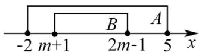

> [!faq]- 《第一章_集合与常用逻辑用语_高效培优讲义_》官方解析
>
> > [!success]- **【答案】** A. [2,3] B. [2,3) C. (-∞,3] D. (2,3]
>
> > [!note]- **【解析】**
> > 当 $B = \varnothing$ 时，满足 B 为 A 的真子集，此时 $m + 1 > 2m - 1$ ，解得 m < 2。
> >
> > 当 时，则 $\left\{ \begin{array}{l} m + 1 \leq 2m - 1, \\ m + 1 - 2, \\ 2m - 1 < 5 \end{array} \right.$ 或 $\left\{ \begin{array}{l} m + 1 \leq 2m - 1, \\ m + 1 > -2, \\ 2m - 1 \leq 5, \end{array} \right.$ 解得 $2 \leq m \leq 3$
> >
> > 综上， $m \leq 3$ ，即 m 的取值范围是 $(-∞, 3]$ .
> >
> > 
> >
> > 故选 **C**.
