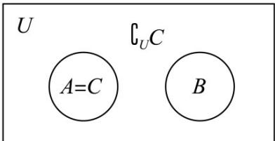

> [!faq]- 《第一章_集合与常用逻辑用语_高效培优讲义_》官方解析
>
> > [!success]- **【答案】** A．充分而不必要条件 B．必要而不充分条件 C．充要条件 D．既不充分也不必要条 件
>
> > [!note]- **【解析】**
> > 1. 判断充分性
> >
> > 已知 $B \subseteq \breve{\partial}_{U} C$ ，所以 $B \cap C = \varnothing$ 。
> >
> > 又因为 $A \subseteq C$ ，即 A 中的元素都在 C 中。而 B 中的元素都不在 C 中，
> >
> > 所以 A 和 B 没有公共元素，即 $A \cap B = \varnothing$ .
> >
> > 由此可知，当“存在集合 C 使得 $A \subseteq C$ ， $B \subseteq \breve{\partial}_{U} C$ ”时，能推出“ $A \cap B = \varnothing$ ”
> >
> > 所以“存在集合 C 使得 $A \subseteq C$ ， $B \subseteq \breve{\partial}_{U} C$ ”是“ $A \cap B = \varnothing$ ”的充分条件.
> >
> > 2. 判断必要性
> >
> > 已知 $A \cap B = \varnothing$ ，即 A 和 B 没有公共元素。此时取集合 $C = A$ ，
> >
> > 那么对于全集 $U$ ， $\partial_U C$ 就是由所有不属于A但属于 $U$ 的元素组成的集合.如图，
> >
> > 因为 A 和 B 没有公共元素，所以 B 中的元素都不属于 A，即 $B \subseteq \breve{Q}_{U} C$
> >
> > 同时 $A \subseteq A$ （即 $A \subseteq C$ ）. 所以当“ $A \cap B = \emptyset$ ”时，
> >
> > 能推出“存在集合 C 使得 $A \subseteq C$ ， $B \subseteq \breve{\partial}_{U} C$ ”，
> >
> > 所以“存在集合 C 使得 $A \subseteq C$ ， $B \subseteq \breve{Q}_{U} C$ ”是“ $A \cap B = \varnothing$ ”的必要条件.
> >
> > 则“存在集合 C 使得 $A \subseteq C$ ， $B \subseteq \partial_{U} C$ ”是“ $A \cap B = \varnothing$ ”的充分必要条件.
> >
> > 故选：C.
> >
> > 
