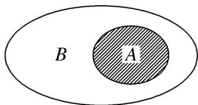

## 知识点 05 真子集

如果集合 $A \subseteq B$ ，但存在元素 $x \in B$ ，且 $x \notin A$ ，我们称集合 $A$ 是集合 $B$ 的真子集；

(1) 记法与读法：记作 $A \ddot{U} B$ ，读作“A 真包含于 $B$ ”（或“ $B$ 真包含 $A$ ”）

(2) 性质: ①任何一个集合都不是它本身的真子集.

②对于集合 A, B, C, 若 $A \ddot{U} B$ , 且 $B \ddot{U} C$ , 则 $A \ddot{U} C$

(3) venn 图表示：

