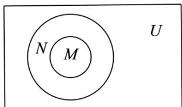

> [!faq]- 《第一章_集合与常用逻辑用语_高效培优讲义_》官方解析
>
> > [!success]- **【答案】** A. $M \cup N$ B. $\left(\check{\mathfrak{Q}}_U N\right) \cup \left(\check{\mathfrak{Q}}_U M\right)$ C. $M \cup \left(\check{\mathfrak{Q}}_U N\right)$ D. $N \cup \left(\check{\mathfrak{Q}}_U M\right)$
>
> > [!note]- **【解析】**
> > 由 $M \subseteq N \subseteq U$ 得当 $N \square U$ 时， $M \cup N = N \square U$ ，故选项A不正确；
> >
> > $\left(\check{\mathfrak{Q}}_U N\right) \cup \left(\check{\mathfrak{Q}}_U M\right) = \check{\mathfrak{Q}}_U (M \cap N) = \check{\mathfrak{Q}}_U M$ ，当 $M^1 \not\in E_{\text {时}}$ ， $\check{\mathfrak{Q}}_U M \square U$ ，故选项 B 不正确；
> >
> > 当 $M \mathbb{I} N$ 时， $M \cup (\check{\mathfrak{Q}}_U N) \mathbb{I} U$ ，故选项C不正确；
> >
> > 因为 $M \subseteq N \subseteq U$ ，所以 $N \cup (\breve{\partial}_{U} M) = U$ ，故选项 D 正确.
> >
> > 故选：D.
> >
> > 
