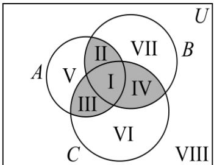

<!-- question-source:start -->
【变式3】如图，三个圆形区域分别表示集合 $A$ ， $B$ ， $C.$ 用集合 $U$ ， $A$ ， $B$ ， $C$ 表示图中I、II、III、IV、V、VI、

VII、VIII八个部分所表示的集合，不正确的是（）

A. 图形 I 表示的集合为 $A \cap B \cap C$ B. 图形Ⅲ表示的集合为 $A \cap C \cap (\check{\mathfrak{Q}}_{U} B)$ C. 图形V表示的集合为 $A \cap (\check{\mathfrak{Q}}_{U} B) \cap (\check{\mathfrak{Q}}_{U} C)$ D. 图形VIII表示的集合为 $B \cap (\check{\mathfrak{Q}}_{U} A) \cap (\check{\mathfrak{Q}}_{U} C)$
<!-- question-source:end -->

![[高中/课堂同步/题库/人教A版高中数学同步讲义(2026)/01_必修第一册/第一章 集合与常用逻辑用语/讲义/第一章_集合与常用逻辑用语_高效培优讲义_/题型04_韦恩图及其应用_sec_23/questions/answers/Q00067824A1.md]]
