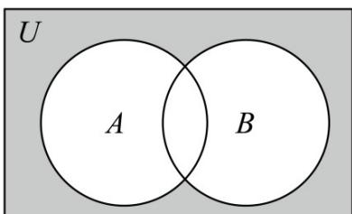

> [!faq]- 《第一章_集合与常用逻辑用语_高效培优讲义_》官方解析
>
> > [!success]- **【答案】**  A. $\{x|x\leq -1$ 或 $x = 3\}$ B. $\{x|x < - 1$ 或 $x = 3\}$ C. $\{x|x\leq 1\}$ D. $\{x|x\leq -1\}$
>
> > [!note]- **【解析】**
> > 由 $A = \{x|x^2 - 2x - 3 < 0\}$ 可得 $A = \{x| - 1 < x < 3\}$ ， $B = \{x|x - 1, 0\} = \{x|x, 1\}$ ，故 $A \cup B = \{x|x > -1\}$ ，进而 $\tilde{\mathbf{Q}}_{\mathbb{R}}(A \cup B) = \{x|x \leq -1\}$ .
> >
> > 故选 **D**
